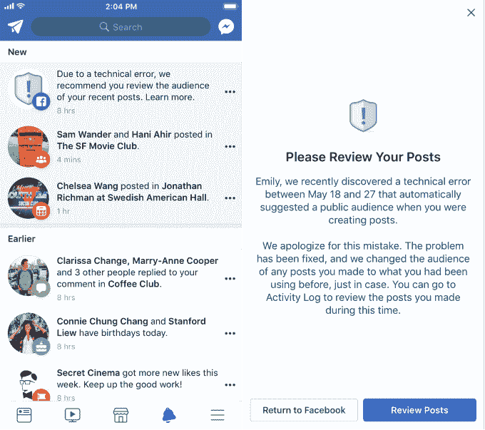

# 脸书提醒 1400 万人注意将状态编辑器更改为公共状态的隐私漏洞 

> 原文：<https://web.archive.org/web/https://techcrunch.com/2018/06/07/facebook-status-privacy-bug/>

# 脸书提醒 1400 万用户注意隐私漏洞，该漏洞会将作曲家状态更改为公共状态

脸书还面临着另一个隐私问题。5 月份的一个漏洞意外地将状态更新的建议隐私设置从用户设置的持续时间改为公共时间，这可能导致他们向整个世界发布敏感的仅限朋友的内容。脸书现在正在通知全球 1400 万可能受到该漏洞影响的人查看他们的状态更新，并在必要时更严格地锁定他们。

脸书的首席隐私官艾琳·伊根在给 TechCrunch 的一份声明中写道:

*我们最近发现了一个错误，当一些人在创建他们的脸书帖子时，它会自动建议公开发帖。我们已经修复了这个问题，从今天开始，我们让每个受影响的人都知道，并要求他们审查他们在这段时间发表的任何帖子。需要澄清的是，这个 bug 并没有影响到人们之前发布的任何内容，他们仍然可以像往常一样选择他们的受众。我们想要为这个错误道歉。*

 **[澄清:现有状态更新的隐私设置没有改变。作者的设置被更改了，因此当用户认为他们的作者仍然被设置为更私人的东西时，受影响的用户在 bug 期间发布的任何帖子都可能被公开共享。]

该漏洞在 5 月 18 日至 5 月 22 日期间一直活跃，但脸书直到 5 月 27 日才把人们的状态编辑器隐私设置恢复到问题发生前的状态。这是因为脸书在你的个人资料上建立了一个“特色项目”选项，突出显示照片和其他内容。这些特色项目是公开可见的，但脸书无意中将这一设置扩展到了这些用户的所有新帖子。

该问题现已修复，每个人的状态编辑器都已更改回缺陷前的默认隐私设置。关于这个 bug 的通知会指向一个关于这个问题的信息页面，其中有一个链接可以查看受影响的帖子。

脸书告诉 TechCrunch，它清楚地听到，它必须对其产品和隐私设置更加透明，尤其是当它搞砸的时候。此外，它还计划展示更多此类警报，以应对未来发现的任何其他隐私问题。

脸书依靠对其隐私功能的信任来保持人们的分享。如果用户担心他们的个人照片、敏感状态更新或其他内容可能泄露给公众，让他们尴尬或损害他们的声誉，他们会保持沉默。

随着剑桥分析丑闻之后所有其他问题的出现，这个漏洞表明脸书的隐私问题既有考虑不周的政策，也有技术上的疏忽。它移动得太快了，弄坏了什么东西。**