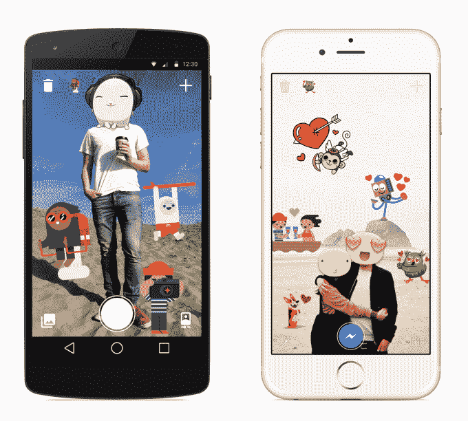
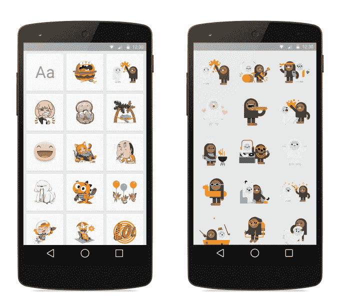
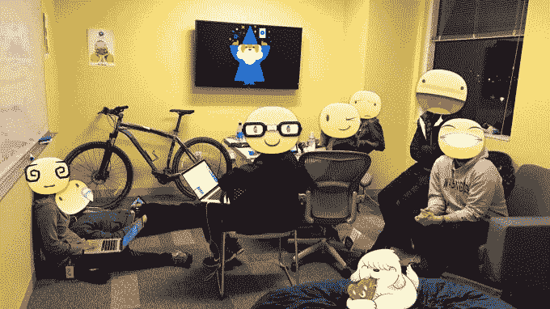

# 脸书推出单独的 Messenger“粘贴”应用程序，让你可以将图片粘贴到照片上

> 原文：<https://web.archive.org/web/https://techcrunch.com/2014/12/19/facebook-stickers-for-messenger/>

# 脸书推出了单独的 Messenger“粘贴”应用程序，可以让你在照片上粘贴图像

今天[脸书发布了](https://web.archive.org/web/20221225095105/http://newsroom.fb.com/news/2014/12/happy-holidays-from-messenger/)一款名为[信使](https://web.archive.org/web/20221225095105/https://www.facebook.com/mobile/messenger)的新应用，可以让你选择一张照片，调整大小并在上面粘贴脸书贴纸，然后发送给朋友。“贴纸和照片是人们在 Messenger 上最流行的两种表达方式。该公司告诉我，这是一个有趣的实验，看看人们如何将两者结合起来。它由脸书的创意实验室移动设计工作室开发，是 Messenger 的第一个配套应用程序。

[stacked For Messenger 在安卓](https://web.archive.org/web/20221225095105/https://play.google.com/store/apps/details?id=com.facebook.stickered)上可用~~即将登陆 iOS~~[现在 iOS 也有](https://web.archive.org/web/20221225095105/https://itunes.apple.com/th/app/id952560049?mt=8)。它与[一起推出了一个大的速度提升和 Messenger](https://web.archive.org/web/20221225095105/https://techcrunch.com/2014/12/19/fastbook-messenger/) 上新的动画发送/发送/交付/阅读回执。

脸书也在尝试 Snapchat 风格的相框，你可以把它放在照片上。在新年前夕，Messenger 中的[自拍相机](https://web.archive.org/web/20221225095105/https://techcrunch.com/2014/04/28/facebook-messenger-video/)可以让你在照片上添加一个新年主题的相框，类似于你从实体照片亭机器中获得的东西。Snapchat 在 7 月发布了覆盖图形或你所在地点名称的“过滤器”，事实证明它们很受欢迎。脸书之前已经从 Snapchat 抄袭了 [的功能](https://web.archive.org/web/20221225095105/https://techcrunch.com/2012/12/21/facebook-poke-app/)和[的设计](https://web.archive.org/web/20221225095105/https://techcrunch.com/2014/06/12/snapchatssenger/)，所以看到它计划在 Messenger 中进行过滤器/框架实验并不奇怪。

Messenger 今天推出的其他更新包括如下所示的假日贴纸包和一个将 Android 上的聊天头像变成小雪球的动画。

使用 sticked ed for Messenger[更正:不是“贴纸”]您首先可以点击相机按钮来拍摄或选择一张照片。然后你可以从数百张脸书贴纸中选择，移动它们，倾斜和调整它们的大小，然后把它们固定在你的照片上。点击 Messenger 图标，你会快速切换到 Messenger 应用程序，在那里你可以选择将你的小作品发送给哪些朋友。

多亏了 Snapchat，在照片上画画在过去几年变得流行起来。脸书在 6 月份紧跟潮流，发布了短暂的照片分享应用程序 [Slingshot](https://web.archive.org/web/20221225095105/https://techcrunch.com/2014/06/17/facebook-slingshot/) ，然后在 9 月份为 Android 版 Messenger 中的照片添加了[覆盖文本和图画](https://web.archive.org/web/20221225095105/http://www.androidpolice.com/2014/09/07/facebook-messenger-update-adds-text-and-doodle-editing-for-local-photos/)。

脸书告诉我，这款应用的创意源自脸书在洛杉矶开展的一场商业和广告牌广告活动，旨在推广 Messenger，让人们在现实生活中与贴纸互动。这让脸书更加努力地思考人们可以通过叠加获得的乐趣。

【YouTube = https://www . YouTube . com/watch？v=hMJvw-RfTEI]

Stickered 并没有试图直接赚钱，至少现在还没有。但如果它能在竞争激烈的聊天领域锁定 Messenger，它可能会让人们更多地整体使用脸书，包括社交网络显示广告的新闻源。

虽然有些人有文字表达的能力，但其他人更喜欢用图像来表达他们的观点。像 Stickered 这样的工具可能会让 Messenger 在聊天应用大战中占据优势，同时让其最大的竞争对手 SMS 看起来更加古老。

[*安卓上的 Messenger*](https://web.archive.org/web/20221225095105/https://play.google.com/store/apps/details?id=com.facebook.stickered)

