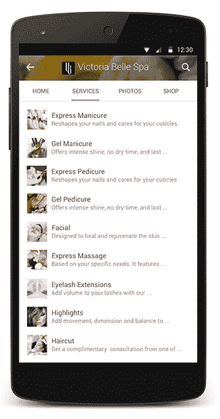

# 脸书为商业页面配备了移动商店，用于购物和服务

> 原文：<https://web.archive.org/web/https://techcrunch.com/2015/09/08/facebook-storefronts/>

喜欢≠美元。脸书希望网页能为 4500 万使用它们的小企业赚钱。所以今天[脸书正在升级页面](https://web.archive.org/web/20230306013414/https://www.facebook.com/business/news/pages-updates),用一个标签移动布局，让他们显示店面“部分”,用户可以在那里“购买”产品或查看企业提供的“服务”列表。该公司还在商业页面上呼吁采取行动，比如“现在就打电话”、“发送信息”和“联系我们”，在封面图片下更大、更丰富多彩、更突出。

“商店”部分将包括由脸书与 Shopify 合作的[支持的购买按钮，因此用户可以在不离开社交网络的情况下结账。脸书也在测试链接到企业传统网站的购买按钮。](https://web.archive.org/web/20230306013414/https://techcrunch.com/2015/06/10/never-leave/)

这些变化是自 2012 年以来对 Pages 做出的最大改变。它们基于脸书最近宣布的针对企业的新消息功能和针对快速响应公司的徽章。今天的更新可能会使脸书网页成为一种实用工具，而不仅仅是一种商业存在。

首席运营官·雪莉·桑德伯格在脸书的第二个门洛帕克办公室召开了新闻发布会，他说“小企业无小事”但她解释说，建立移动商务体验既艰难又昂贵，尤其是对小企业而言。这就是桑德伯格谈到中小企业利用脸书轻松、免费地开展移动业务的原因。

脸书希望公司依靠他们的脸书页面，而不是建立一个完整的移动网站或应用程序。这就是为什么它开始为不同类型的企业建立专门的部门。

Boba Guys 咖啡馆的联合创始人 Andrew Chau 告诉我，他是通过脸书的一个网页而不是一个网站开始网上业务的，因为在那里可以获得“最多的眼球”。他说，他告诉人们“看看我们在脸书的表现”，而不是“下载我们的应用”，因为“他们不会这么做”。人们不一定想要一个完整的应用程序，只是为了他们当地的茶叶店。

该战略类似于微信在中国的商业平台。微信让商家创建“官方账号”，用户可以方便地关注和购买，而不是建立一个应用程序，让人们下载，然后让他们使用。

这个方向的第一步是新的部门、商店和服务。通常情况下，企业必须不断地发布他们的产品或服务，以使它们立即出现在他们的页面上。现在，他们将有一个突出的，专门的部分，在那里他们可以出售自己的产品和服务。

这些部分将有自己的标签，而不是隐藏在页面中，这使得它们更容易被找到，尤其是在移动设备上。在主页/登录页/主选项卡上，脸书将显示一组来自企业其他选项卡的亮点。这种跨平台的优化对于一个企业来说很难独自完成，但是脸书让它自动发生。

如果企业的服务需要协商或深度定制，可以使用“消息购买”按钮，触发客户和企业之间的即时消息对话，以便他们可以讨论细节。

此前，脸书宣布用户可以向页面发送信息寻求支持，90%的情况下在 5 分钟内做出回复的用户将在其页面上获得“非常积极响应”的荣誉徽章。虽然这可能看起来是非常困难的指标，但脸书说，50 万页很快就可以获得徽章。

为了帮助提供这种社交客户服务，Pages 可以编写已保存的回复，在发送之前，他们可以快速个性化客户的姓名或情况。页面管理员也可以回复帖子或留言。这有助于公司私下保持对客户的支持，而不是成为他们页面上的公共景观，这可能会损害他们的品牌。

如果脸书在这方面取得成功，它将看到中小型企业将移动流量导向他们的网页，而不是他们的网站。这不仅使脸书对用户更有用，而且它将成为让企业为推广这些页面的广告付费的门户。

当我向脸书的产品营销总监 Benji Shomair 询问这个策略时，他告诉我“页面是免费的。我们在平台上的业务越多，他们从脸书页面上产生的价值就越多……我们的业务可能会在更大范围内受益。”当我再次问这是否意味着这些工具可以促进广告销售时，他承认“有可能，是的。我同意。”

一般的精品店老板或水管工不应该学习如何开发应用程序。现在他们没有了。