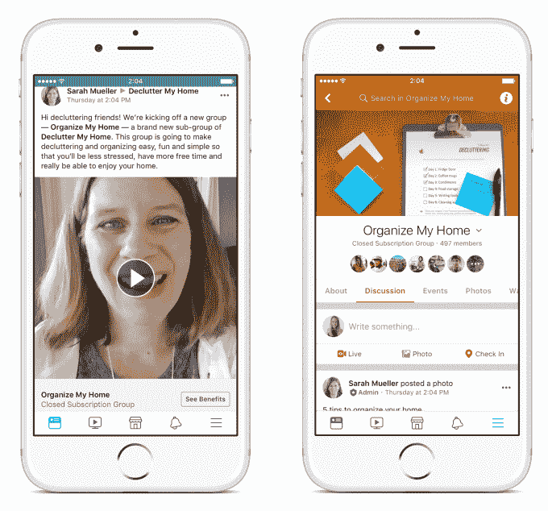
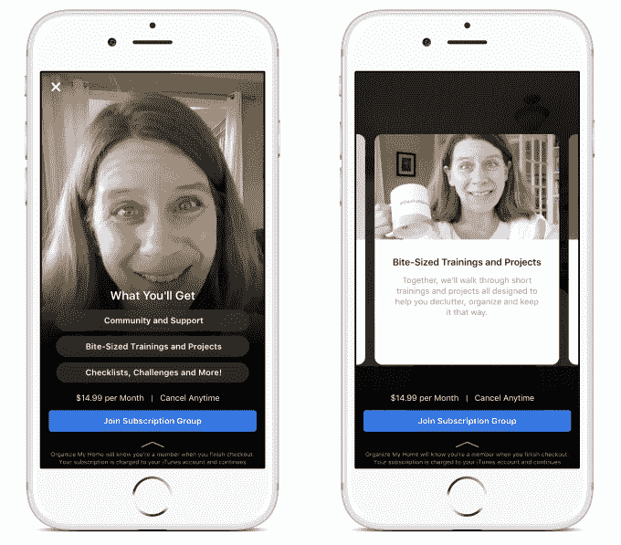

# 脸书测试对独家内容收费的“订阅团体”

> 原文：<https://web.archive.org/web/https://techcrunch.com/2018/06/20/facebook-subscription-groups/>

脸书开始允许群组管理员每月收取 4.99 至 29.99 美元的费用，以访问充满独家帖子的特殊子群组。一系列精心挑选的育儿、烹饪和“组织我的家”团体将首先有机会产生一个对其成员开放的订阅组。

在测试期间，脸书不会提成，但是因为这项功能是通过 iOS 和 Android 支付的，所以这些操作系统在用户第一年的订阅中会得到 30%的提成，之后是 15%。但如果脸书最终真的要求收入分成，它可能最终会开始将这个已经拥有超过 10 亿用户的团体功能货币化。

订阅组的想法最初来自管理员。“与其说是为了赚钱，不如说是为了投资他们的社区，”脸书集团的产品经理 Alex Deve 说。“活动将会产生资金，这一事实有助于他们创造更高质量的内容。”一些管理员告诉脸书，他们实际上想把订阅费重新投入到他们的小组在离线时一起做的活动中。

用户可能在群组的专属版本中获得的内容包括视频教程、技巧列表和管理员自己直接提供的支持。例如，Sarah Mueller 的 Declutter My Home Group 推出了一个每月 14.99 美元的 Organize My Home 订阅组，它将教成员如何通过清单和视频指南保持整洁。“成长和飞翔的父母”组织正在催生一个大学入学和支付订阅组织，只需 29.99 美元就能获得大学顾问的帮助。预算烹饪:食谱和膳食计划将推出 9.99 美元的膳食计划中央高级订阅组，提供每周膳食计划、不同杂货店的购物清单等。

但测试的目的实际上是想弄清楚管理员会发布什么，以及成员是否认为它有价值。“他们有自己的想法。我们想看看这将如何发展，”Deve 说。

下面是订阅组的工作方式。首先，用户必须在一个更大的组中，管理员可以访问订阅选项，并发布邀请成员查看。他们会看到预览卡，上面概述了他们将获得哪些独家内容以及价格。如果他们想加入，并且他们已经是一个更大的自由团体的成员，他们马上被收取月费。

他们将在每月的那一天收到账单，如果他们取消，他们仍然可以访问，直到他们的账单周期结束。这阻止了任何人加入一个群组，在没有支付全价的情况下抓取所有内容。整个系统有点类似于订阅赞助平台 Patreon，但中心是一个小组及其管理员，而不是一些明星创作者。

早在 2016 年，[脸书曾短暂测试过分组展示广告](https://web.archive.org/web/20230316161016/https://techcrunch.com/2016/10/10/facebook-group-ads/)，但现在表示从未推广过。然而，该公司表示，管理员希望通过订阅以外的其他方式从团体中获得收入，并正在考虑这种可能性。脸书在这方面没有更多的分享，但也许有一天它会从组内展示的广告中提供收入分成。

在订阅、广告收入分成、小费、赞助内容和植入式广告之间——[所有这些都是脸书正在测试的](https://web.archive.org/web/20230316161016/https://techcrunch.com/2018/06/19/facebook-brand-collabs/)——创作者突然之间有了很多赚钱的选择。虽然我们花了过去几十年的时间在消费互联网上搜罗免费内容，但创造力不可能永远是一项热爱的工作。让创作者赚钱可以帮助他们将激情转化为职业，并投入更多时间制作人们喜欢的东西。