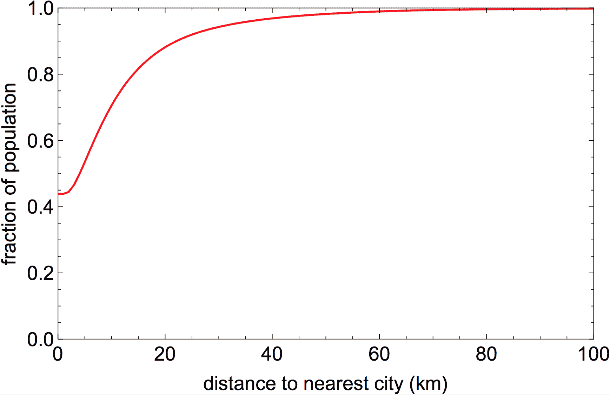
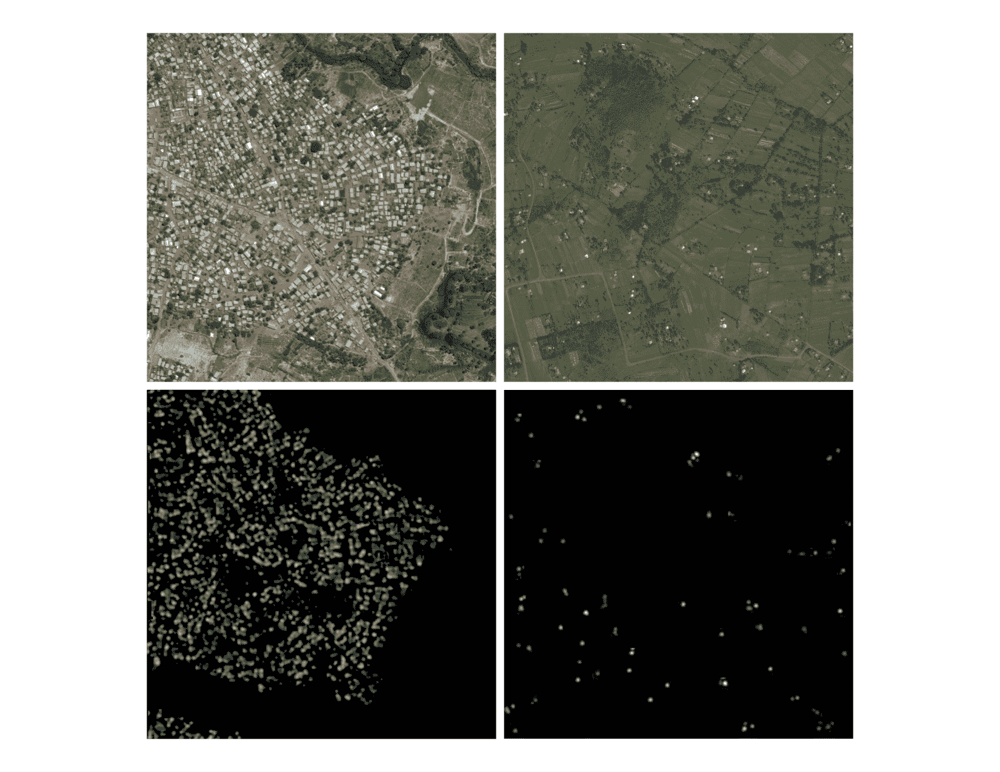

# 脸书支持非政府组织发布新兴市场人口数据 

> 原文：<https://web.archive.org/web/https://techcrunch.com/2016/11/15/facebook-supports-ngos-with-release-of-emerging-markets-population-data/>

# 脸书支持非政府组织发布新兴市场人口数据

从火箭到飞机，脸书的连接实验室已经在一些实验上两面下注，将互联网接入带到地球的遥远角落。

该小组根据人口密度大致划分了连接性挑战，使用机器学习来精确定位现有数据集网格之外的人口中心。今天，脸书发布了五个国家的人口数据集，为非营利组织和非政府组织解决严峻的全球挑战提供了可能性。

99%的人口居住在城市 40 英里以内。

连接基础设施的选址是一个重要问题。这是因为卫星可以将互联网传播到比飞机大得多的区域，就像[脸书的 Aquila 项目。](https://web.archive.org/web/20230111090307/https://techcrunch.com/2015/03/26/facebooks-aquila-drone-will-beam-down-internet-access-with-lasers/)脸书最初担心新兴市场人口密度不足带来的挑战。但是，在分析 23 个市场的图像时，研究人员发现 99%的人口居住在距离城市 40 英里以内。

“对于中东和非洲这样的地区，地图分辨率太低，无法做出定量决策，”脸书 CX 实验室负责人雅艾尔·马奎尔说。“我们与数据科学人员合作，思考如何系统地处理来自全球空间的图像。”

脸书使用大型计算集群[处理了 146 亿张图像，以识别和标记这些人口中心。](https://web.archive.org/web/20230111090307/https://code.facebook.com/posts/1676452492623525/connecting-the-world-with-better-maps/)

顶部显示来自数字地球影像的城市和农村人口，下方显示脸书的分析结果。

机器学习和计算机视觉自动化了跨大范围地理区域标记单个结构的过程。然后，这些结构被用来估计人口。这些数据已经被红十字会用于抗击马拉维的疟疾。除了马拉维，脸书还与哥伦比亚大学和世界银行合作发布了南非、加纳、海地和斯里兰卡的数据集。

显示新兴市场人口在城市中心聚集程度的新数据令脸书感到鼓舞，因为这意味着这些地区的连接解决方案只需要跨越很短的距离就可以连接绝大多数居民。这可以减轻该公司将卫星送入轨道以提供大规模农村连接的压力。脸书之前发射连接卫星的尝试以 SpaceX 猎鹰 9 号火箭着火而告终。

“对卫星连接的强调较少，但这当然是对未来而不是现在的陈述，”Maguire 指出。“阿奎拉还需要几年时间，现在卫星已经出现了。我们确实认为他们有一个角色可以扮演。”

新的粒度数据集现在可以在哥伦比亚大学的[国际地球科学信息网络中心网站上获得。](https://web.archive.org/web/20230111090307/https://ciesin.columbia.edu/data/hrsl)