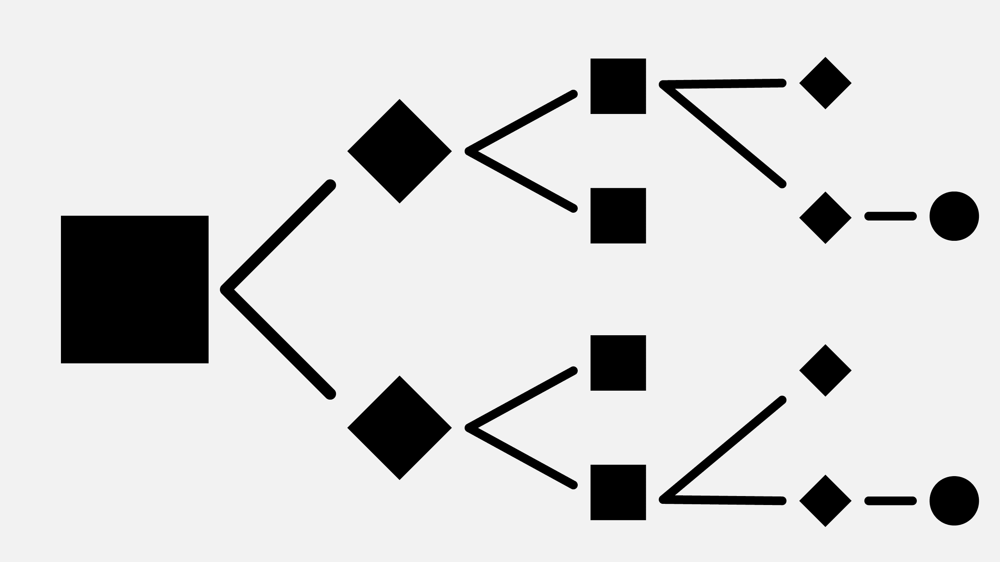

# 脸书教机器与人类谈判 

> 原文：<https://web.archive.org/web/https://techcrunch.com/2017/06/14/facebook-teaches-machines-to-negotiate-with-humans/>

尽管在讨论对话式人工智能时，脸书很少与苹果、微软和亚马逊一起被提及，但该公司已经发表了大量论文，强调了对对话系统的浓厚兴趣。随着 Siri、Cortana 和 Alexa 的出现，对话变得越来越困难——它需要的不仅仅是良好的语音识别，以向用户提供杀手级的体验。作为旁观者，脸书一直在应对自然语言理解和文本生成等重大挑战。今天，脸书人工智能研究团队又增加了一篇论文，将谈判带入了对话(所有双关语都是有意的)。

脸书的团队将博弈论与深度学习结合在一起，让机器能够与人类谈判。通过将游戏人工智能中更常用的展示技术应用于对话场景，脸书能够创造出能够进行复杂谈判的机器。

首先，脸书想象了一个谈判场景。亚马逊的机械土耳其人被赋予一个明确的价值函数，并被告知用自然语言谈判，通过分割一罐随机物品——五本书、三顶帽子和两个球——来实现回报最大化。游戏的上限是十轮对话，规则规定，如果超过这个限制，任何人都不会得到任何奖励。

因为每个代理人都有不同的隐藏偏好，所以两人必须进行对话，以确定哪些对象应该给哪个代理人。在互动过程中，机器自然而然地采用了许多常见的谈判策略——比如错误地强调一件低价值的物品，试图在以后将其作为更有价值的谈判筹码。

在引擎盖下，脸书的展示技术采用了决策树的形式。决策树是许多智能系统的重要组成部分。它们允许我们从现在模拟未来的状态来做决定。想象一个井字游戏，在游戏的任何一点，都有一个有限的选项集(你可以在棋盘上放置“X”的地方。

在这种情况下，每一步都有一个期望值。人类通常不会以明确的方式考虑这个值，但是如果你在玩游戏时分解你的决策过程，你实际上是在头脑中简化这个数学。

像井字游戏这样的游戏足够简单，完全可以用决策树来解决。更复杂的游戏，如围棋和象棋，需要策略和启发来减少状态的总数(这是一个几乎不可想象的可能状态的数量)。但是，与 dialog 相比，即使是国际象棋和围棋也相对简单。

对话不是从一组有限的结果中得出的。这意味着对于任何问题，都有无限多种可能的人类反应。为了对对话进行建模，研究人员必须付出额外的努力，将不确定性问题限制在合理的大小和范围内。选择对协商方案进行建模使这成为可能。语言本身可以存在于无限多种状态中，但它的意图通常围绕简单的结果(我要么接受，要么拒绝)。

但是，即使在一个有限的世界里，让机器以可信的方式与人类互动仍然很困难。为了达到这一目的，脸书用两个人之间的谈判来训练它的模型。一旦完成，机器就被设置成使用强化学习来相互协商。在每轮谈话结束时，代理会收到奖励以指导改进。

FAIR 的研究人员迈克尔·刘易斯和德鲁夫·巴特拉向我解释说，他们的算法在防止个人做出错误决定方面比确保个人做出最佳决定更好。这仍然很重要——团队告诉我想象一个日历应用程序，它不试图为每个人安排最佳时间的会议，而是试图确保会议实际发生。

与许多研究一样，这项技术的应用不一定像本文模拟的场景那样清晰。工程师经常利用机器之间的对抗关系来改善结果——想想看，通过让一台机器生成数据来欺骗另一台“看门人”机器，使用生成性对抗网络来生成训练数据。

半合作、半敌对的关系，就像教练和运动员之间的关系，可能是一个有趣的下一个前沿领域——进一步连接博弈论和机器学习。

脸书已经从这个研究项目中开源了它的代码。如果你感兴趣，你可以在这里阅读关于这项工作的更多细节。