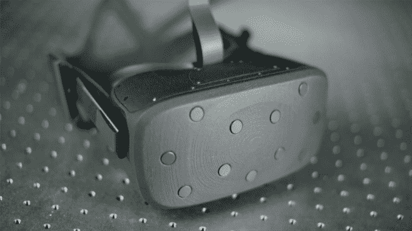
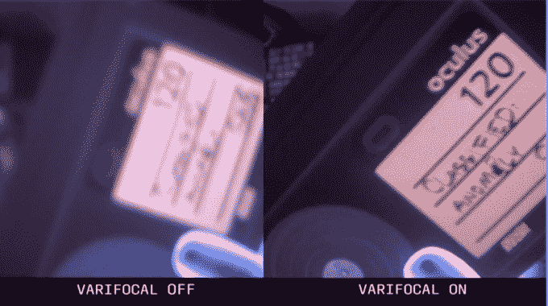

# 脸书用 Oculus“半穹顶”原型进行重大 VR 显示器升级 

> 原文：<https://web.archive.org/web/https://techcrunch.com/2018/05/02/facebook-teases-major-vr-display-upgrades-with-oculus-half-dome-prototype/>

# 脸书用 Oculus 的“半穹顶”原型进行主要的虚拟现实显示升级

在过去的几年里，VR 头戴设备的硬件升级已经相当陈旧了；可能会有分辨率的提高，或者增加眼球追踪或新的控制器，但大多数进步似乎都是在软件方面。脸书正在关注他们最新的内部 VR 头戴式耳机原型中一些更基本的显示问题，他们在 F8 的第二天展示了这些原型。

oculus“Half Dome”将专注于让用户在耳机内一次看到更多他们的环境，同时也做出一些复杂的改变，允许他们在对象之间转移焦点。

该原型将把视野从 100 度提高到 140 度，让用户能够看到他们周围更多的视觉世界。更令人印象深刻的是，脸书在没有创造出更笨重的设计的情况下实现了这一点——原型保持了现有 Rift 耳机的大小，这要归功于他们“镜头的持续进步”在将重心转移到让耳机变得更小之前，该公司似乎正在解决一些基本的显示问题。

在景深方面，现有的耳机没有给用户多种焦距。这意味着，如果有人给你一些阅读的东西或另一个你需要看清楚的物体，他们会把焦点放在离用户两米左右的地方。这是 Magic Leap 声称他们已经用显示技术解决的主要问题之一，尽管目前还不清楚他们的研究成果实际上是如何成为最终产品的。

Oculus 表示，他们已经能够通过物理移动耳机内部的屏幕来实现可变焦距，以适应不同的景深。该公司表示，它的工作原理类似于相机的自动对焦功能，但不会给用户带来任何噪音或振动。

Oculus 在研究方面已经谈到了很多类似这样的显示器的进步，但这表明他们在不增加当前 Oculus 硬件体积的情况下，与集成该技术的耳机有多接近。虽然 Oculus 已经将公众注意力集中在独立耳机的原型上，但“Half Dome”展示了一些重大变化，这些变化将移动最高端 VR 耳机显示器上的表盘。

