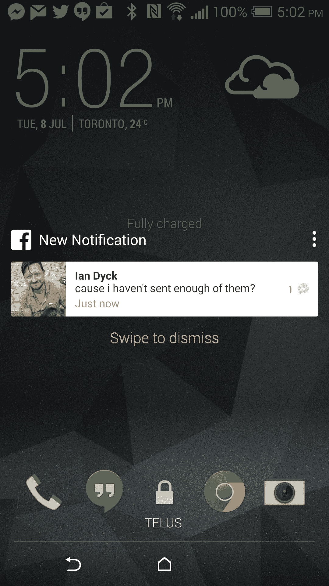

# 脸书测试 Android L 型锁屏通知 

> 原文：<https://web.archive.org/web/http://techcrunch.com/2014/07/08/facebook-tests-android-l-style-lock-screen-notifications/>

# 脸书测试安卓 L 风格锁屏通知

Android 用户的脸书测试组的新更新短暂地启用了锁屏通知，至少对于新的消息活动，在今天稍后的更新似乎禁用了该功能。这些通知看起来非常类似于谷歌今年在 I/O 上展示的[锁屏通知](https://web.archive.org/web/20230129072103/http://www.technobuffalo.com/2014/06/25/google-making-big-changes-to-notifications-in-android-l/)，这是 Android L 即将推出的新功能之一，是谷歌移动操作系统的下一个重大更新。脸书已经向 TechCrunch 证实，该更新发布给了“一小群测试人员”

不过，更新并不要求安装 Android L 才能工作，因为我是在使用运行 Android 4.4.2 和 Sense 6 的 HTC One M8 时遇到这一新功能的。它具有一个带有查看选项的设置扩展器，在解锁设备后，点击通知本身会直接带你到脸书应用程序。正如通知本身所指示的，滑动将消除通知并保持设备锁定。来自多个消息发送者的多个通知在视觉上一个堆叠在另一个之上。

我只能看到消息通知，因为我的 FB 帐户在测试期间的活动类型，但其他 FB 活动也包括在新的测试功能中。脸书经常在 Android 上测试新功能，但并不总是能发布。据推测，一旦 Android L 成为生产软件，它将不再需要，但脸书仍然可以通过提供锁屏通知来获得用户注意力优势，不管 Android 手机用户在他们的设备上安装了什么版本的 Android 手机。