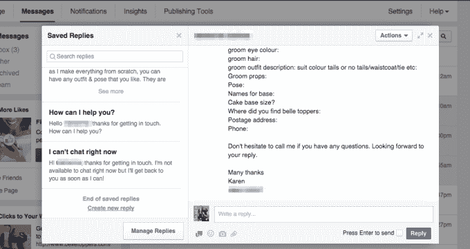

# 脸书测试“已保存的回复”，这是一个让页面用固定消息回复客户的工具

> 原文：<https://web.archive.org/web/https://techcrunch.com/2015/06/02/facebook-tests-saved-replies-a-tool-that-lets-pages-respond-to-customers-with-canned-messages/>

脸书正在测试一个名为“保存的回复”的新功能，该功能将允许业务页面所有者在通过脸书与他们的客户交流时，能够写入、保存并重新使用录音信息。新增功能将为企业节省处理客户服务咨询和通过网站回复其他客户反馈的时间。

该功能现在通过脸书页面上的消息传递界面提供给选定的一组企业主，提供了一个简单的工具，让页面管理员创建一个新的回复，保存起来以备后用，甚至搜索他们的回复列表以找到他们需要的回复。后一个选项对于那些回复列表较长且不想滚动查找每一个回复的人尤其有用。

我们被告知，企业最初会得到几个示例回复，他们可以使用现成的或定制的回复，或者他们可以简单地创建自己的回复。设置完成后，要使用保存的回复，您只需从列表中单击它，它就会自动出现在电子邮件的正文中。您也可以从“邮件回复”框中访问该选项，在该框中，一个新选项允许您单击一个小图标，以“已保存的回复”进行回复。

*上图:页面所有者保存回复界面*

同样方便的是，回复本身可以使用自动填充占位符来个性化，例如，类似于您在表单电子邮件中使用的占位符。有一些个性化选项，允许您插入一个人的名字或姓氏、管理员的名字或姓氏以及网站网址。

“已保存的回复”目前似乎还在有限的测试中，因为一家可以使用该选项的企业告诉我们，他们没有得到脸书关于该功能推出的通知。相反，当他们打开电子邮件准备回复客户时，这个选项就出现了。我们采访的其他几个页面管理员报告说，他们还没有在自己的页面上看到这个功能。

当然，对于脸书来说，在更大规模的公开展示之前，在更小的用户群中测试一个新功能并不罕见。

[gallery ids="1166210，1166211，1166212，1166213"]

保存的回复首先被博客 [MyTechSkool](https://web.archive.org/web/20230404155954/http://www.mytechskool.com/2015/06/facebook-tests-saved-replies-for-brand-fan-pages/) 发现，还有其他几个人在[社交](https://web.archive.org/web/20230404155954/https://twitter.com/3D_Cam/status/605692700227010561) [媒体](https://web.archive.org/web/20230404155954/https://twitter.com/fergpose/status/605640087703920640)，[包括](https://web.archive.org/web/20230404155954/https://twitter.com/benobriensmith/status/605711267425320960) [推特](https://web.archive.org/web/20230404155954/https://twitter.com/bellecaketopper/status/605734003694518272)上发布了关于它的帖子。我们已经向脸书询问了关于功能集和已保存回复的更多细节，如果公司有回应，我们将会更新。一些页面管理员说，他们还没有在手机上看到这个选项，但这可能是因为目前它太新了。

虽然今天较大的企业可能会利用专业的服务台平台，如 Zendesk 或 Freshdesk，来处理通过脸书发起的客户服务消息，但新的保存回复功能可能会对较小的企业更有用，包括初创公司、家庭企业和夫妻店，他们今天经常保留一个标准回复列表，并将其复制和粘贴到消息中。

多年来，脸书一直在为商业用户慢慢升级其社区管理和页面管理工具，通过自动化原本需要更多手动工作的任务来帮助他们节省时间。例如，几年前，[脸书为页面所有者推出了关键字审核阻止列表功能](https://web.archive.org/web/20230404155954/http://www.adweek.com/socialtimes/keyword-moderation-profanity-blocklist/256856)，帮助他们减少了打击垃圾邮件的时间，并审核和删除了其他不需要的内容(例如，亵渎性的、攻击性的等)。)评论。

*图片致谢:[MyTechSkool](https://web.archive.org/web/20230404155954/http://i0.wp.com/www.mytechskool.com/wp-content/uploads/2015/06/saved-replies-personalize.png?resize=599%2C494)；[Belletoppers.com](https://web.archive.org/web/20230404155954/http://www.belletoppers.com/)*