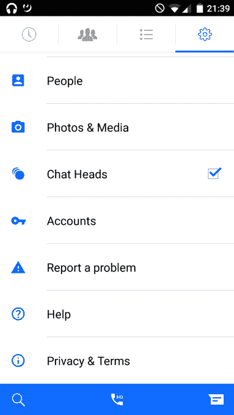
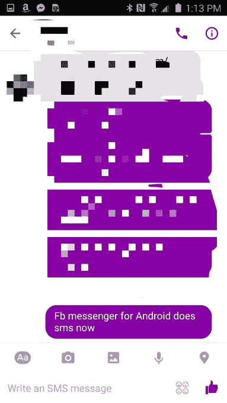
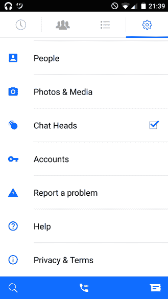

# 脸书测试 Messenger 中的短信集成，推出多账户支持

> 原文：<https://web.archive.org/web/https://techcrunch.com/2016/02/11/facebook-tests-sms-integration-in-messenger-launches-support-for-multiple-accounts/>

脸书表示，他们正在测试一种方法，让用户在移动设备的 Messenger 应用程序中接收、阅读和回复基于短信的对话。如果广泛推广，这项功能将是可选的，它可能有助于用户远离他们的默认短信应用，并看到他们增加花在 Facebook Messenger 上的时间。

此外，还增加了对多个帐户使用 Messenger 的支持，这是一个专为那些共享设备的人设计的功能。

社交网络证实短信测试正在进行中，此前有报道称 Messenger 似乎恢复了短信支持。

正如[博客 Android Police 指出的，](https://web.archive.org/web/20230404065145/http://www.androidpolice.com/2016/02/11/facebook-messenger-might-soon-get-sms-integration-multiple-accounts-and-a-blue-action-bar/)一些用户看到了一个新的短信设置面板，允许他们将 Messenger 用作短信客户端。

当在启用该选项的情况下在 Messenger 中给朋友发短信时，文本输入框中的提示会显示“编写短信”该博客还称，以短信形式发送的信息将显示为紫色气泡，而不是 Messenger 通常的蓝色。

虽然今天的许多年轻用户可能不记得了，但 Facebook Messenger 最初是作为短信替代应用以及与脸书朋友快速聊天的一种方式。然而，[在 2013 年末，该公司对其应用程序](https://web.archive.org/web/20230404065145/https://techcrunch.com/2013/10/29/facebook-messenger-phone-number/)进行了全面检查，并为用户增加了一种通过电话号码向非好友发送信息的方式。这些消息是通过收件人的 Messenger 应用程序发送的。

与此同时，脸书取消了实际发送短信的选项，称该功能“吸引力不大”事实上，该公司可能想强制采用 Messenger 这一点它做得很好，也是通过在 2014 年从默认的脸书应用中移除功能。

该公司表示，脸书现在可能正在考虑让 Messenger lines 恢复短信支持，这符合该公司此前宣布的 2016 年[愿景声明，其中包括让电话号码消失的计划。](https://web.archive.org/web/20230404065145/https://techcrunch.com/2016/01/07/beyond-messaging/#.s2agxy:eJp8)

正如 TechCrunch 的 Josh Constine 当时指出的那样，Messenger 在美国遥遥领先于其他通讯应用，它唯一真正的竞争对手是 SMS 和 iMessage。

迄今为止，该公司已经取得了几项重大进展，以帮助人们过渡到不再使用手机的原生短信应用，包括推出了[功能，让任何人都可以向脸书上的任何人发送消息请求，](https://web.archive.org/web/20230404065145/https://techcrunch.com/2015/10/27/facebook-message-requests/)功能消除了知道某人电话号码的需要。

众所周知，“消息请求”功能也为手机短信体验带来了隐私——虽然您可以在“过滤请求”文件夹中查看这些请求以及发件人的更多信息，但消息的发件人永远不会知道您是否查看了他们的消息。

该功能还允许在脸书上建立不同类型的社交联系——那些可以给你发信息，但不是你的脸书“朋友”的人

然而，要真正消灭短信，脸书似乎已经意识到，它将(再次)允许人们使用 Messenger 作为他们的短信客户端。所有的铃铛和哨子-包括 gif，照片和视频支持，语音通话，[隐藏的国际象棋游戏！](https://web.archive.org/web/20230404065145/http://www.engadget.com/2016/02/07/facebook-messenger-chess/)等。–如果您的朋友没有安装该应用程序，这还不够。你可能还是会给他们发短信。

当然，谷歌在安卓系统上也做了同样的事情，将手机短信应用程序变成默认的短信客户端。然而，最近几天，该公司一直在收回其实施计划。用户已经注意到，该公司的[集成短信的 Hangouts 应用程序一直要求用户切换回谷歌的常规短信应用程序](https://web.archive.org/web/20230404065145/http://arstechnica.com/gadgets/2016/01/google-hangouts-7-0-for-android-asks-users-to-stop-using-it-for-sms/)。

显然，脸书正采取相反的方式。

公司发言人证实了短信测试，称:

> 在 Messenger，我们一直在努力为人们创造与他人无缝交流的新方式。目前，我们正在测试人们轻松将所有对话(从短信和 Messenger)集中到一个地方的能力。这是一个非常简单的方法，只需在一个应用程序中获取、查看和回复您的所有短信。通过选择在 Messenger 中访问您的 SMS 消息，它们将与 Messenger 提供的所有其他增强功能一起使用。

据我们所知，测试目前仅在美国的少数 Android 用户中进行。

不幸的是，由于这项功能需要更深层次的操作系统集成，iOS 用户不太可能选择使用 Messenger 发送短信。

## 新功能:支持 Messenger 上的多个帐户

短信支持并不是 Messenger 的唯一变化——脸书还宣布支持应用程序中的多个帐户。

直到今天，Messenger 还没有为用户提供一种简单的方式来切换帐户，这意味着那些共享设备的人经常会安装，然后卸载 Messenger，以便私下使用该应用程序。

现在，Android 版 Messenger 有了一个名为“帐户”的新部分，可以让你在应用程序上添加和删除帐户。这些也可以有密码保护，这样只有账户持有人才能阅读他们的信息。其他人只会看到消息已收到的通知，而不会看到其内容。

一位发言人也证实了这一点，他说:“数百万人与他们的家人和朋友分享手机。到目前为止，人们还没有一种简单的方法可以从共享设备上访问他们的个人 Messenger 帐户。为了解决这个问题，我们在 Android 上推出了一项功能，允许多人从一部手机登录并使用 Messenger。”

与 SMS 选项不同，此功能在全球范围内均可使用。