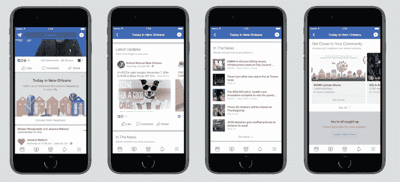

# 脸书正在测试其应用程序的城市特定部分，以提升当地新闻和事件 

> 原文：<https://web.archive.org/web/https://techcrunch.com/2018/01/10/facebook-today-in/>

# 脸书正在测试其应用程序的城市特定部分，以提升当地新闻和事件

为了提高信噪比，脸书可能会本地化。该公司正在测试其应用程序的一个新领域，名为“Today In”，由特定城市的活动、公告和当地新闻组成。

对于其新的本地中心，[脸书](https://web.archive.org/web/20221210053425/https://beta.techcrunch.com/topic/company/facebook/)正从一小批测试市场开始。这些最初的城市是路易斯安那州的新奥尔良；华盛顿奥林匹亚；蒙大拿州比林斯；纽约宾汉姆顿；伊利诺伊州的皮奥里亚和阿肯色州的小石城。测试市场的用户将能够通过核心脸书应用程序右下角的菜单按钮(三条水平线)访问该功能。

脸书的[新闻合作伙伴](https://web.archive.org/web/20221210053425/https://www.facebook.com/facebookmedia/get-started/facebook-journalism-project)团队是这项实验的先锋，他们雇佣人类策展人和机器学习来填充新栏目的内容。(让我们希望他们更重视前者。)

此举是脸书新闻项目倡议的一部分，该公司于 2017 年 1 月宣布了一项计划，旨在建立当地新闻合作伙伴关系，以及其他目标。该倡议旨在改善脸书与出版商之间的不稳定关系，尽管随着 2017 年的进展，其“支持新闻业和新闻素养”的使命无疑变得至关重要。

虽然这不是脸书第一次尝试让脸书的经验更加关注本地，但这一小批针对具体城市的推广活动，以及至少某种实际操作的策划努力，表明脸书正试图谨慎行事。Today In 隐藏在应用程序的某个角落里，并不突出，不足以被设计成新闻提要的替代品或任何如此激进的东西——但这有点可惜。推动脸书成为当地社区的专用工具(想想像 [Marketplace](https://web.archive.org/web/20221210053425/https://beta.techcrunch.com/tag/facebook-marketplace/) 这样的公用事业驱动的附加物)肯定是该平台未来不那么反乌托邦的愿景，至少与坚持到底相比是如此。

阅读当地头条新闻，然后发现一个乐队在表演，这听起来像是一个彻头彻尾的令人振奋的焦点转移，从观看脸书大量混乱的数字公民无休止地表达到他们的算法策划的空白中。不幸的是，大幅缩小世界上最大的社交网络的范围可能不会像吸引用户那样吸引股东和广告商。