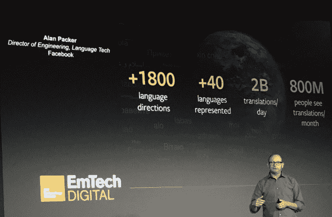

# 脸书抛弃必应，8 亿用户现在可以看到它自己的人工智能文本翻译

> 原文：<https://web.archive.org/web/https://techcrunch.com/2016/05/23/facebook-translation/>

机器学习正在完成脸书跨越语言障碍连接世界的使命。脸书现在每天提供 20 亿次文本翻译。脸书可以在 1800 个方向上翻译 40 种语言，比如从法语到英语。每月有 8 亿用户，几乎是脸书用户的一半，看到翻译。

这都是基于脸书自己的机器学习翻译系统。2011 年，它开始与微软 Bing 合作，为翻译提供支持，但此后一直在努力过渡到自己的系统。2015 年 12 月，脸书终于完成了转变，现在只使用自己的翻译技术。

点击脸书帖子上的“查看翻译”按钮，机器学习人工智能会立即用你的语言向你展示外文文本

脸书大学语言技术工程主任艾伦·帕克今天在三藩市举行的麻省理工学院技术评论的 EmTech Digital 会议上透露了这一进展。会议重点关注人工智能、机器学习和其他解析数据的前沿方法。

[更新:在他的演讲之后，我和 Packer 坐在一起，他告诉我关于脸书抛弃 Bing 翻译的事情。这篇文章已经更新，增加了他的信息。]

早些时候，Pinterest 的产品负责人 Jack Chou 透露，在推出视觉搜索功能六个月后，Pinterest 每个月都有 1.3 亿次视觉搜索。该产品由一个四人小组开发，允许人们使用源图像而不仅仅是文本进行搜索。Pinterest 现在还有来自 2000 万商家的 5000 万个可购买的 pin。

脸书不仅能够翻译，而且能够理解文本和图像的内容，这可能会大大提高新闻提要的相关性。帕克解释说，如果脸书可以理解一个帖子是在请求推荐巴黎的酒店，它可以向它知道最近访问过巴黎的朋友推荐一个特定的朋友，或者建议对推荐的公共帖子进行相关搜索。

脸书是在线翻译的早期先驱，建立了一个众包工具，让世界各地的用户将其界面的文本翻译成当地语言。2011 年，脸书[开始使用自动化系统](https://web.archive.org/web/20230309155612/http://www.adweek.com/socialtimes/bing-translate-pages/269761)翻译用户在新闻订阅中的帖子和评论。

去年，[脸书收购了 Wit.ai](https://web.archive.org/web/20230309155612/https://techcrunch.com/2015/01/05/facebook-wit-ai/) ，这是一家利用对文本和语音中自然语言的理解来开发新用户界面的初创公司。谷歌和微软/Skype 也一直在积极寻求翻译工具，以跨越国界团结世界。

艾伦·帕克，脸书大学语言技术工程主任，

脸书最初转向必应是因为“我们没有自己的技术，但看到了其中的价值。我们做了一笔交易，打开了它，得到了大量的使用，”帕克告诉我。问题是，Bing 是为翻译更恰当的网站文字而设计的，而不是人类相互交流的方式。Packer 说 Bing“在俚语、习语和隐喻方面做得不好。我们真的需要根据自己的数据进行训练。”

因此，脸书着眼于最需要翻译的语言，并着手开发比微软做得更好的技术版本。“我们进行了自己的内部测试。当我们可以证明它比 Bing(特定语言到语言的翻译)更好时，我们会关闭 Bing，用我们自己的服务取代它。

现在，该翻译已全面推出 1800 种不同的翻译排列。当脸书确信其翻译完美时，它会默认自动显示翻译，并提供“查看原文”选项，只有当它认为可能有错误时，才会显示可选的“查看翻译”按钮。

Packer 告诉我，从反垃圾邮件和政策执行到 Instagram 等收购，脸书的其他团队正在考虑如何整合翻译。

自这张 2011 年的截图以来，脸书的翻译后功能已经取得了重大进展，并找到了大量的受众

动机很明显，有社会意识，有利可图。脸书的使命是让世界更加开放和互联。我问 Packer 翻译在其中起了什么作用，他说，“翻译团队的任务是消除语言障碍，使世界更加开放和互联。”

虽然他没有具体的数字，但 Packer 说，使用翻译产品会让用户“有更多的朋友，更多朋友的朋友，接触更多的概念和文化。”该公司知道它对用户越来越重要，因为“当我们为一些人关闭它时，他们发疯了！”脸书用户可以联系的世界各地的人越多，他们在社交网络上花费的时间就越长，他们看到的创收广告就越多。

我们正在迅速接近一个人工智能拥有者和不拥有者的时代。不具备解析其内容或信息含义的工程能力的科技巨头将无法有效地向用户提供这些内容或信息。像谷歌、脸书和微软这样的公司可以蓬勃发展，而其他更缺乏资金和资源来投资研究的公司却步履蹒跚。