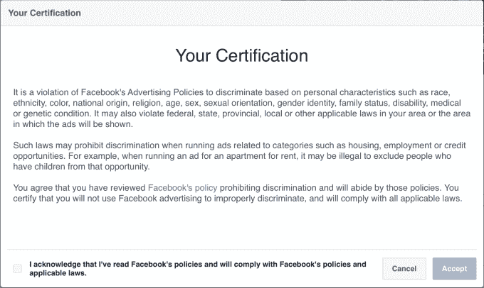

# 脸书更新其广告政策和工具以防范歧视性做法 

> 原文：<https://web.archive.org/web/https://techcrunch.com/2017/02/08/facebook-updates-its-ad-policies-and-tools-to-protect-against-discriminatory-practices/>

脸书在 11 月宣布，它将阻止广告商通过以住房、就业和信贷机会为重点的广告竞争来锁定用户，以回应一份发现脸书的工具可能被用来投放歧视性广告的报告。今天，该社交网络提供了关于此事的最新进展，披露了自首次发布公告以来采取的行动，以及新广告政策和相关工具的细节。

得益于脸书的用户数据宝库，其网站上的广告商已经能够通过各种因素，如年龄、地点、性别、宗教等，来锁定用户。多年来，这些微定位功能已经在许多方面得到了应用，包括最近在美国总统选举中，通过为他们自己的利益定制政治广告来[接触小众受众](https://web.archive.org/web/20221207055713/https://www.bloomberg.com/news/articles/2016-10-27/inside-the-trump-bunker-with-12-days-to-go)。

然而，脸书[在去年秋天受到了攻击](https://web.archive.org/web/20221207055713/https://beta.techcrunch.com/2016/10/28/facebook-ethnic-affinity/)，因为同样的广告定位功能被用来根据用户的“种族相似性”——意思是种族——在广告活动中包括或排除用户。Propublica 的报告当时指出，在住房和就业广告中排除某些种族使该公司违反了反歧视法，包括 1968 年的公平住房法和 1964 年的民权法。

社交网络[回应](https://web.archive.org/web/20221207055713/https://beta.techcrunch.com/2016/11/11/facebook-sort-of-disables-ethnic-affinity-targeting/)称，它将禁用涉及住房、就业或信贷的种族亲和广告定位。

脸书说，它会见了政策制定者和民权领袖，以收集关于需要做什么的反馈，并已作出了一些改变。

该公司的新[广告政策](https://web.archive.org/web/20221207055713/https://www.facebook.com/policies/ads/)现在更加明确地禁止歧视，阐明广告商不能基于“个人属性，如种族、民族、肤色、国籍、宗教、年龄、性别、性取向、性别认同、家庭状况、残疾、医疗或基因状况”歧视人们，该公司今天[在一篇关于新政策和特点](https://web.archive.org/web/20221207055713/http://newsroom.fb.com/news/2017/02/improving-enforcement-and-promoting-diversity-updates-to-ads-policies-and-tools/)的博客文章中解释道。

此外，脸书现在从其广告政策页面链接到[一个新的教育部分](https://web.archive.org/web/20221207055713/https://www.facebook.com/policies/ads/prohibited_content/discriminatory_practices)，该部分提供更多信息以及来自政府机构和专门打击歧视的民权团体等地方的其他教育资源。

除了明确说明不要做什么，脸书表示，它还开始测试新的执法工具，这将有助于识别违反其政策的广告。

具体来说，这些工具将识别住房、就业和信贷机会广告，并确定它们是否包括或排除多元文化广告细分市场，多元文化广告细分市场由有兴趣查看与非洲裔美国人、亚裔美国人和美国西班牙裔社区相关的内容的人组成。如果广告事实上包括或不包括这些部分，脸书说它将不批准该广告。

信息性消息将警告广告客户违规，因此他们可以在需要时纠正问题。在假阳性的情况下，广告商也可以点击按钮进行人工审查。

发布住房、就业和信贷广告，但以脸书上的其他受众群体为目标的广告商，也将被要求点击一个按钮，以证明他们理解最新的反歧视政策。

这样做会弹出一个窗口，广告客户必须通读政策细节，然后同意遵守其条款。他们必须选中一个框，然后单击“接受”继续。

该公司表示，在创建新政策和工具的过程中，它与几个团体进行了合作，并在帖子中对以下人员表示感谢:

> *纽约州总检察长埃里克·施奈德曼(Eric t . schneider man)；国会黑人核心小组成员包括 Cedric Richmond 主席、G.K. Butterfield 众议员、Yvette D. Clarke 众议员、Emanuel Cleaver II 众议员和 Robin Kelly 众议员；国会拉美裔党团和女主席米歇尔·卢汉·格里沙姆；众议员 David N. Cicilline，国会同性恋、双性恋和变性者平等核心小组联合主席；美国公民自由联盟；公民权利和人权领导会议；民主中心&技术；全美有色人种协进会法律辩护基金；全国公平住房联盟；布鲁金斯学会；并且好转。*

此外，许多组织向脸书施压，要求有机会与该公司进一步合作，探讨如何利用广告技术来促进服务不足社区的包容和机会，以及防止歧视性使用。

“我们相信我们的广告产品能够为各种背景的人创造机会，因此我们致力于与这些团体合作实现这一目标，”脸书在提到这些要求时说。然而，它没有提供任何信息，说明目前它可能在这方面采取的下一步措施。