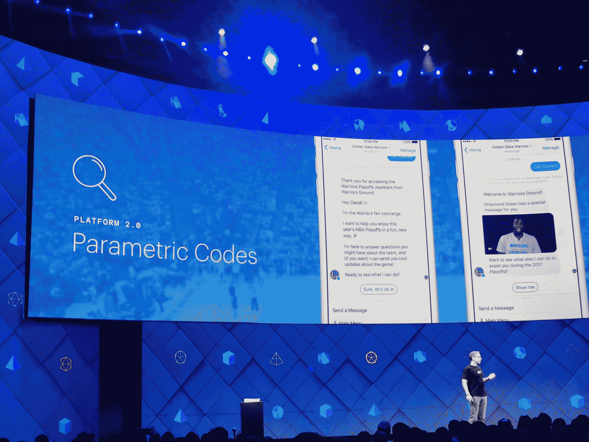

# 脸书更新 Messenger，支持二维码、通过 M 送餐等等 

> 原文：<https://web.archive.org/web/https://techcrunch.com/2017/04/18/facebook-updates-messenger-with-support-for-qr-codes-food-delivery-through-m-and-more/>

# 脸书更新了 Messenger，支持二维码、通过 M 送餐等功能

脸书今天将为其 Messenger 平台推出几项新功能。其中包括更新其 M 虚拟助手，现在可以帮助你通过 delivery.com 订购食物，推出 Messenger 码，基本上是你可以扫描到 Messenger 的二维码，以及更好地支持游戏机器人和即时游戏。

今年早些时候，M 虚拟助手增加了对建议的支持，但通过这次更新，它现在可以识别你何时与你的朋友谈论晚餐，并建议向 delivery.com 下单。脸书说，这种体验也包括集体订购和支付。这项新功能现已在美国各地由 delivery.com 提供服务。

【T2

Facebook Messenger 也有一个游戏标签(今天推出)。这个标签现在也可以访问游戏机器人和丰富的游戏玩法(即回合制游戏)。脸书说，在过去的 90 天里，总共有超过 15 亿人在 Messenger 上玩游戏。

至于二维码，这种体验几乎是你所期待的。你将能够在音乐会、篮球比赛或其他活动中扫描这些二维码，扫描后，一个信使机器人会弹出来为你提供更多信息。虽然二维码从未真正流行起来(至少在美国)，脸书坦率地承认，这看起来确实是一种有趣的使用方式，可能只会让它们更受欢迎一点。

对于企业来说，脸书显然也在推出生成这些代码的工具。这些企业现在还可以与不同的开发人员合作，提供不同的 Messenger 体验。例如，这意味着一个企业可以同时拥有购物和客户服务机器人，不同的供应商和开发者可以分别管理它们。

在他们的脸书页面上，这些企业现在也获得了智能回复的支持，这是由 Wit.ai 机器人引擎提供的。通过他们，他们可以回答客户经常问他们的常见问题(如营业时间、路线、电话号码等。).

除此之外，脸书今天[还宣布](https://web.archive.org/web/20230131050751/https://techcrunch.com/2017/04/18/facebook-bot-discovery/)对其群组机器人进行重大更新，并使机器人发现变得更加容易。

【T2