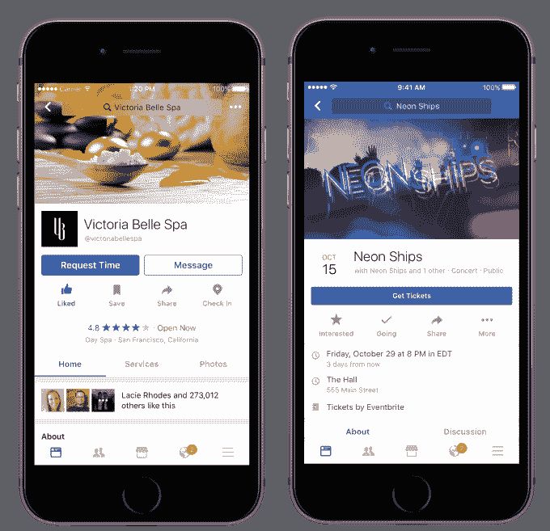
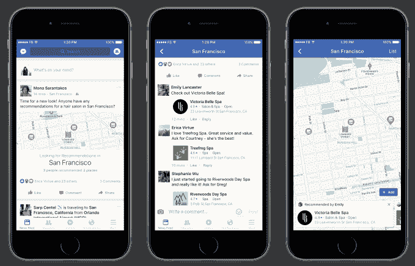
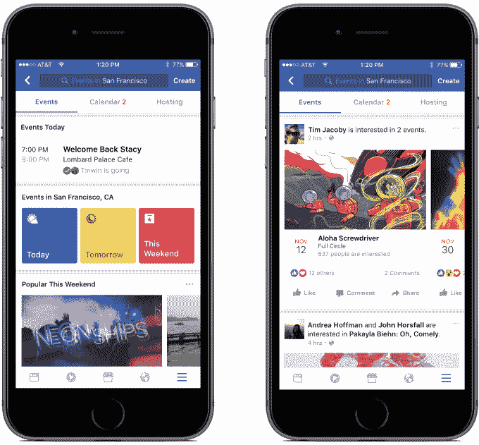

# 脸书拥抱食品订购和票务的实用性

> 原文：<https://web.archive.org/web/https://techcrunch.com/2016/10/19/facebook-utility/>

脸书希望您参与到您的社区中，而不仅仅是谈论它，今天将推出一系列新功能。从脸书页面，你现在可以通过 Delivery.com 和 Slice 订购食物，通过 [MyTime](https://web.archive.org/web/20230304205109/http://www.mytime.com/blog/announcing-our-new-facebook-integration/) 请求预约，获得专业服务报价，或者在不离开脸书的情况下通过 Ticketmaster 和 EventBrite 购买电影票和活动门票。

这是脸书寻求[让黄页活起来的最新进展。](https://web.archive.org/web/20230304205109/https://techcrunch.com/2015/09/08/facebook-storefronts/)本地购票功能可能特别强大，因为每月有 6.5 亿人使用脸书的活动功能，但他们总是不得不登录其他地方购买门票。减少这种摩擦可以让脸书在寻找广告高转化率目的地的活动推广者中更受欢迎。

如果你想让你的朋友建议在你的城市或旅行时做什么，你可以使用新的推荐功能。当脸书的人工智能检测到你正在写状态更新向朋友寻求建议时，它会自动出现。如果你打开推荐，一个大的建议请求会出现在新闻提要中，来自朋友的评论会被添加到地图和推荐书签中，以便于浏览。现在，对于“我应该去东京的什么地方？”这个问题，征求和管理答案会容易得多。或者“旧金山最好吃的玉米煎饼是什么？”

最后，脸书带来了其新的独立活动应用的精华，回到其主应用的活动标签中。现在，您将默认看到一个事件发现内容提要，包括来自朋友的 RSVPs，以及浏览今天、明天或本周末活动的方式。你可以切换到一个更传统的完整日历来记录你即将要做的事情。这个想法是为了揭示什么样的聚会、音乐会、艺术展览、聚会等等可能就在你身边发生。

所有这些经验将于今天在美国开始推广。如果他们表现出色，脸书可能会将其推广到其他地区。开发人员可以[申请访问](https://web.archive.org/web/20230304205109/https://developers.facebook.com/blog/post/2016/10/19/rich-experiences-facebook-pages/)这个脸书页面实用平台。

这是关于窃取一些目前流向谷歌、Yelp、Fandango、当地新闻和移动点餐应用的流量。脸书认为，在朋友建议的推动下，便捷的浏览体验可以胜过需要大量打字且不了解自己身份的移动搜索体验。

当然，这将需要用户难以改变的行为。但这将为脸书提供有利可图的数据，说明你从哪里购买什么。如果脸书知道你经常购买某个地方的音乐会门票或者点某类食物，它可以更好地把广告对准你。

脸书越是成为您了解企业并与之互动的地方，它就越能实现其将您与不止是人联系起来的目标，企业也越有可能通过付费来提高他们在社交网络上的知名度。