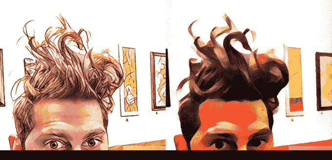
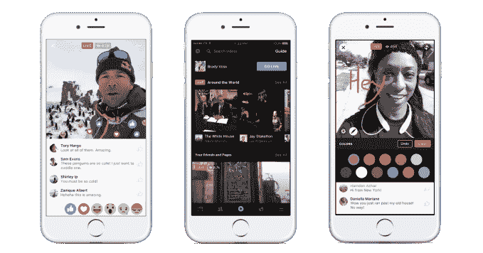

# 脸书演示了艺术主题的视频滤镜，称它让 2M 选民注册了 

> 原文：<https://web.archive.org/web/https://techcrunch.com/2016/10/25/facebook-video-filters/>

在今天的 WSJDLive 大会上，两位非扎克的脸书领导人有很多东西要展示和讲述，他们展示了潜在的产品，给脸书贴上了科技公司而非媒体公司的标签，并吹捧该公司在选民登记方面的成功。

如果你喜欢普里斯马，你会喜欢脸书的烹饪。脸书首席产品官克里斯·考克斯[演示了一个未发布的实时视频过滤器原型，它可以让你的视频看起来像是由著名艺术家文森特·梵高画的。考克斯表示，这部电影是基于一篇德国学术论文，内容是关于](https://web.archive.org/web/20221218151632/https://twitter.com/geoffreyfowler/status/791028529571897344)[风格转移](https://web.archive.org/web/20221218151632/http://www.genekogan.com/works/style-transfer.html)，该论文采用卷积神经网络来引入莫奈或伦勃朗等艺术家的风格，并将其立即应用到视频中。

该功能与一款名为 Prisma 的应用[惊人地相似，它将艺术滤镜应用于](https://web.archive.org/web/20221218151632/https://techcrunch.com/2016/06/24/prisma-uses-ai-to-turn-your-photos-into-graphic-novel-fodder-double-quick/)[照片和视频](https://web.archive.org/web/20221218151632/https://techcrunch.com/2016/10/06/prisma-adds-art-filtered-video-gifs-coming-next/)。TechCrunch 报道称，Prisma 的欧洲创始人最近来到脸书在门洛帕克的办公室，尽管我们听说那只是一次友好的访问，而不是一次并购会议。

考克斯说，视频过滤器没有附加到脸书的任何产品上，但演示显示了他们如何与脸书直播合作。马克·扎克伯格将很快分享更多关于视频过滤器的信息。然而，脸书说，“这是一种发生在设备上的实时风格转换，所以风格可以在视频拍摄时应用到视频中。”

更新 10/26:今天马克·扎克伯格发布了一个新风格转移视频滤镜的视频演示，他说“我用一种叫做“风格转移”的新人工智能技术在我的手机上拍摄了这个关于野兽的印象派视频。这个想法是你向人工智能展示一幅画，然后它以那种风格实时绘制你的照片或视频。期待这个早日到手！”

Live 已经有了几个基本的彩色滤镜来增强弱光或者将视频变成黑白。但是，提供更强大的功能，彻底改变镜头，可以帮助用户减少在镜头前的害羞和自我意识。考克斯说，脸书预测，在五年内，70%的消费者互联网流量将是视频。这就是为什么脸书将视频更深地融入分享、新闻订阅和 Messenger 中的发布内容。

脸书现场已经包括基本的颜色过滤器

在谈话中，考克斯和脸书·首席运营官·雪莉·桑德伯格还讨论了脸书如何将自己视为一家技术公司。批评者坚持认为，它越来越需要对哪些图片或冒犯性但有新闻价值的内容做出编辑决策，这使它成为一家媒体公司。脸书周五表示，人们越来越愿意展示有新闻价值的图片内容，而不是对其进行审查。

桑德伯格说，脸书必须在抵制仇恨言论和攻击性内容与成为一个开放的“所有想法的平台”之间取得平衡:

> “脸书是所有思想的平台。人们可以在脸书上分享他们关心的事情，这真的是我们使命的核心…我们也想成为一个真正安全的社区。你知道在脸书没有暴力、恐怖主义和仇恨的容身之地……但这两件事可能会发生冲突，因为一个人的自由表达可能会成为另一个人的仇恨。
> 
> 随着我们的发展，我们知道人们在脸书分享更多有新闻价值的内容。这是我们想要确保实现的，但这可能很难。[以著名的战争恐怖照片中的越南裸体儿童为例，该照片最初被脸书撤下，但后来又被修复]
> 
> 我们将为我们的社区标准破例。没有比为了新闻价值而裸露儿童更好或更明显的例子了。我们也在作为一种服务发展。我们开始是一个只为大学提供的服务，现在我们在世界各地拥有 17 亿人，所以我们正在对话，特别是现在与记者和出版商对话，以真正弄清楚这一点并继续发展，这样人们可以在脸书自由表达，但我们也仍然是一个安全的社区。"

与此同时，脸书正在努力让更多的人为这些想法大声疾呼。桑德伯格说，最近的选民登记工作已经推动了 200 万人登记，并指出民主党人和共和党人各占一半。这些工作包括在脸书顶上打出横幅，敦促人们登记，并通知截止日期。