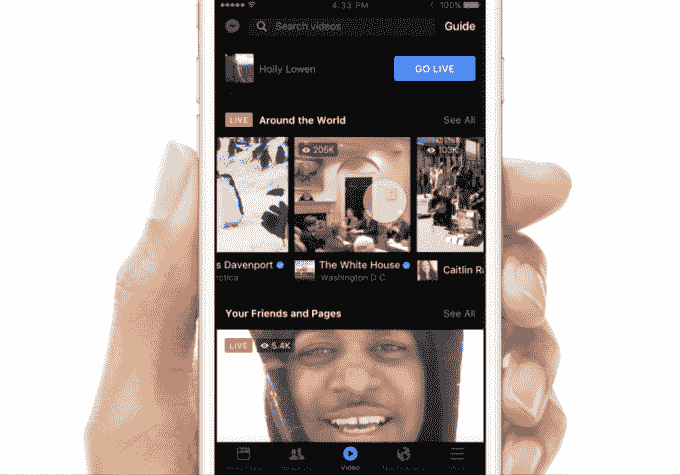
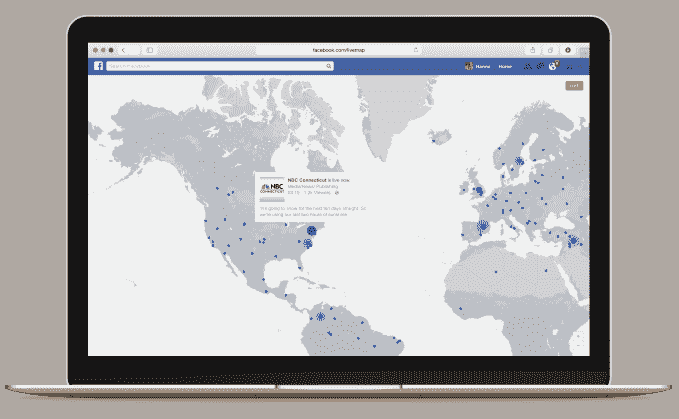
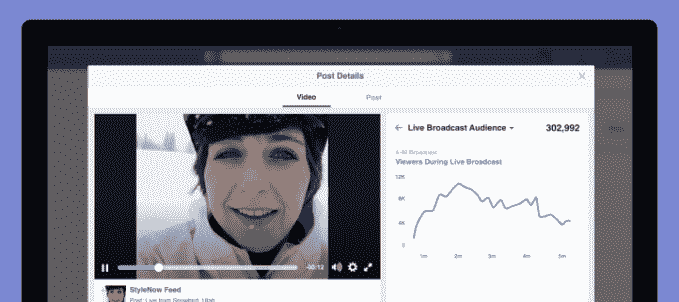
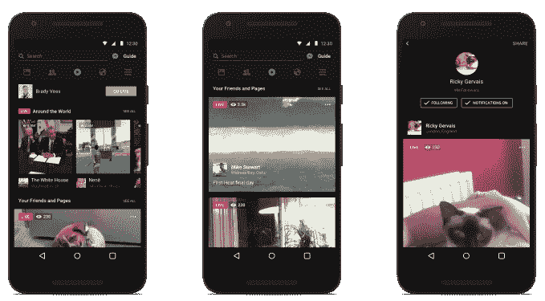

# 脸书在直播上押下重注，推出新的移动视频探索标签 

> 原文：<https://web.archive.org/web/https://techcrunch.com/2016/04/06/facebook-video-tab/>

今天，脸书对 YouTube 发起了全面进攻，在其移动应用程序中提供了一个观看直播和录制视频的专用中心。[一个视频标签](https://web.archive.org/web/20221208035558/http://newsroom.fb.com/news/2016/04/introducing-new-ways-to-create-share-and-discover-live-video-on-facebook/)占据了 Messenger 屏幕底部导航栏的主要中心位置，将脸书变成了一个发现按主题分类的视频的目的地，而不仅仅是在 feed 中偶然发现它们。

该视频中心主要以脸书的直播为特色，并将在未来几周内在 iOS 和 Android 上推出，同时推出一系列直播升级，包括:

*   向选定的新闻出版商合作伙伴付款，以换取直播而不是自己的网站
*   与家人或有特殊兴趣的人一起观看视频直播
*   活动中的实时视频，以便您可以安排问答或向未能前来的受邀者展示派对
*   评论回放，模拟实时观看时反馈是如何弹出的
*   主题标签将您的直播视频放入视频中心的正确发现类别中
*   [脸书的六个反应表情符号](https://web.archive.org/web/20221208035558/https://beta.techcrunch.com/2016/02/24/facebook-reactions/)，飞过屏幕，观众和广播员都能看到，类似于潜望镜的心脏
*   五种可随时更换的彩色滤光片，无需设备即可改善照明
*   病毒性邀请，以便观众可以通知朋友加入观众
*   全球当前广播的实时地图(目前仅在网络上)
*   Snapchat 风格的涂鸦，因此广播公司可以在他们的直播视频上画画(已宣布但尚未推出)
*   [视频直播观众指标](https://web.archive.org/web/20221208035558/http://media.fb.com/2016/04/06/introducing-new-metrics-for-live-video/)包括在视频直播时观看视频的独立观众总数，以及显示在任何给定时刻有多少视频直播观众的图表

这些升级超越了 Twitter 旗下脸书 Live 的竞争对手 Periscope。它们使直播视频更容易制作和保持有趣，更有趣地观看，更容易在直播时发现，脸书说这刺激了 10 倍以上的评论。

脸书的视频产品管理总监 Fidji Simo 说，Live 不是一个附加的外国产品，而是一个“利用了社交网络的许多核心基础”的产品。脸书经常被批评为延续成功剧场，鼓励人们只分享他们生活中的亮点。但生活是原始的，有时凌乱或无聊，真正真实的。

[https://web.archive.org/web/20221208035558if_/https://www.youtube.com/embed/z0LXqz1zxlw?feature=oembed](https://web.archive.org/web/20221208035558if_/https://www.youtube.com/embed/z0LXqz1zxlw?feature=oembed)

视频

然而，最明显的变化是，脸书愿意将经常使用的 Messenger 快捷方式移到屏幕的左上角，以突出视频中心。今年夏天，脸书测试了一个视频目的地，但它被归入了“更多”标签中的一个隐藏书签。

现在，重新设计的标签位于前端和中央，用户可以在一堆类别中水平滑动，包括“全球直播”、“你的朋友和页面”和“直播录制”。还有一个按“美国新闻”、“家庭与花园”或“电视与电影”等主题分类的指南。

该中心的深度和聚光灯证明了脸书将视频视为通信的未来，其应用程序的时间以及如何赚钱。

## 没有灯光，你的相机，行动

去年夏天，脸书开始对公众人物进行现场视频测试，并于去年 12 月向所有人推出。现在普通用户、名人和新闻媒体都在用它来揭示他们周围发生的事情。观众可以留下评论，广播公司可以看到和回应。与 Periscope 不同，脸书直播视频可以永久保存，以便重播，而不是在 24 小时后消失。

但是自从 2015 年 3 月 [Periscope 推出第一款](https://web.archive.org/web/20221208035558/https://beta.techcrunch.com/2015/03/26/abre-los-ojos/)并有了一个更独特的名字，它已经成为实时移动视频广播的代名词。Periscope 上个月播放量达到 2 亿次，自 1 月份以来达到 1 亿次。脸书正在努力成为最好的广播和最多观众观看的地方，考虑到它已经如此受欢迎，这当然是可能的。

脸书实时地图让您发现世界各地正在发生的广播

这就是为什么它出来，并宣布它给了一个[大新闻供稿能见度提高直播视频](https://web.archive.org/web/20221208035558/https://beta.techcrunch.com/2016/03/01/get-it-while-its-hot/)。它希望通过向广播公司提供大量观众来激励它们加入进来。Simo 告诉我“绝对有先发优势。”

最终，随着越来越多的广播公司采用该平台，这种可见性将在竞争中分散开来，类似于页面帖子覆盖范围的缩小。“这就是为什么我们鼓励公众人物和媒体公司尽早介入，并找出可行的方法，”Simo 解释道。

新的直播视频触达指标有助于证明为什么制片人应该青睐脸书。提供 API 也是应该的，这样新闻编辑室就可以使用他们的专业视频设备进行现场直播，[纽约时报](https://web.archive.org/web/20221208035558/http://www.nytimes.com/2016/03/31/business/media/facebooks-live-video-effort-entices-media-companies.html)早些时候报道过，Simo 也向我证实了这一点。

但是脸书走得更远。Simo 告诉我，脸书直接向一小群精选的新闻媒体支付费用，以支付他们在脸书直播视频的费用，而不是在他们的网站上通过广告赚钱。

Simo 说，对于一些主要的出版商来说,“我们提供了非常早期的经济激励，让他们预先确定产品并建立工作室。”。“这实际上是让他们开始使用这种格式，但目标是找到一种适合他们的长期盈利模式。”一种可能性是从制片人现场直播后观看的视频广告中获得收入分成，类似于脸书目前正在对一些录制的视频网络明星进行的支出测试。

脸书希望，reach 和直接现金的结合将吸引高质量的实时视频内容，reach 可以聚集早期收到直播通知的用户。

这对脸书来说可能是一项明智的投资。视频广告是市场营销中最热门的东西。品牌会花大价钱购买网络电视广告，这是影响人们最生动的方式。脸书主持的用户生成的视频越多，越能让人们习惯观看，自然就会有越多的视频广告出现在 feed 和剪辑结束后出现的推荐视频中。

但是互联网充满了娱乐，所以脸书需要最好的。如果新的视频中心能够为直播和录制的视频带来更多的观众，创作者将跟随观众，选择脸书而不是 YouTube、Periscope 和 Snapchat，让脸书征服社交网络的另一部分。

*如果你在旧金山参加脸书的会议，请在周一晚上 [TechCrunch 的 F8 见面会上来见见我们的作家](https://web.archive.org/web/20221208035558/https://beta.techcrunch.com/2016/04/06/f8-meetup/)*