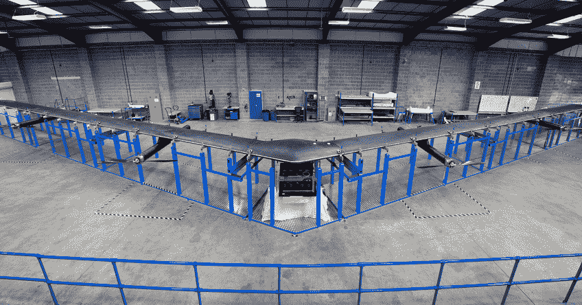

# 脸书希望利用荧光让其激光无人机工作得更好 

> 原文：<https://web.archive.org/web/https://techcrunch.com/2016/07/19/facebook-wants-to-use-fluorescence-to-make-its-laser-drones-work-better/>

# 脸书希望利用荧光让它的激光无人机工作得更好

脸书大学的一组物理学家和电气工程师[发表了](https://web.archive.org/web/20221210065714/https://www.osapublishing.org/optica/fulltext.cfm?uri=optica-3-7-787&id=347888)一个新的想法，利用发光来改善今天自由空间光通信中的信号检测。

在与 Internet.org 的合作中，脸书一直在[开发无人机，为全球偏远地区提供基本的互联网接入](https://web.archive.org/web/20221210065714/https://beta.techcrunch.com/2015/03/26/facebooks-aquila-drone-will-beam-down-internet-access-with-lasers/)。去年，该公司推出了一项代号为 Project Aquila 的计划，利用激光远距离传递信息。

大多数人都知道用于传输互联网信息的光缆。最大的服务公司威瑞森 FIOS 通过光提供高速互联网。这种服务受限于在点与点之间传输需要坚固的电缆。

脸书的无人机将直接通过自由空间发射嵌入光的信号，无需电缆。为了通过光有效地传输数据，终端信号点必须针对信息收集进行优化。

由于干扰、噪音和其他物理及环境因素，光和光学在长距离传输时会变得复杂。

T.Peyronel、K. J. Quirk、S. C. Wang 和 T. G. Tiecke 都是脸书公司的雇员，他们提出了一项在不牺牲响应时间的情况下增加光接收器的有效面积和视野的计划。该团队使用物理结构来引导光线。这种结构被波长转换染料覆盖，这些染料吸收传输的光，并以不同的波长重新发射出去。一部分发射的光被光纤收集，并被引导到一个小的光电二极管，该光电二极管将光转换成在半导体中有用的电流。

该团队指出，具有全向属性的相同过程以前曾被用于收集太阳能。

现在使用脸书的无人机传输互联网的一个问题是闪烁效应，也称为闪烁。大气湍流引起光学波动，最终导致信号衰减。研究人员认为，新技术可能能够抑制这些影响。

这项研究虽然很有希望，但不足以让 Aquila 项目向农村地区提供互联网。飞船的电池寿命仍然是一个问题，新的光学技术仍然需要在现实世界中进行更多的测试。

