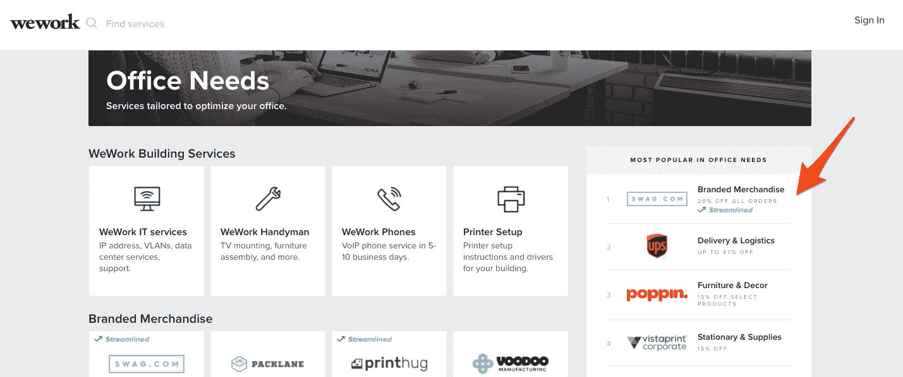

# 脸书、WeWork 和其他人利用这家初创公司制作 swag 

> 原文：<https://web.archive.org/web/https://techcrunch.com/2017/11/06/facebook-wework-and-others-use-this-startup-to-make-swag/>

赃物，尤其是好的赃物，可能很重要。这就是 Swag.com 的[的用武之地。该公司于 15 个月前成立，旨在成为公司获得优质赠品的一种方式，以帮助人们宣传自己的品牌。](https://web.archive.org/web/20221210011409/https://www.swag.com/)

“人们认为 swag 是垃圾，但它不应该是，”Swag 的联合创始人杰里米·帕克告诉 TechCrunch。"如果制作得当，这可能是一个令人惊叹的营销工具。"

Swag.com 提供的产品包括水瓶、雨伞、衬衫、夹克、u 盘、包和其他来自巴塔哥尼亚和 Case Logic 等品牌的商品。一旦你选择了产品，你上传你的设计，指定你想要印刷多少，然后等待 Swag 给你发送产品模型以供批准。

标准生产时间大约需要 15 天，而优先生产需要 10 天，成本稍高。直到客户认可实物模型，生产才开始。因为 Swag 直接与制造商和供应商合作，所以它不需要持有任何库存。

“我们就像巴尼百货，但没有库存，”帕克说。

Swag 目前有大约 1000 名客户，包括脸书、Evernote、WeWork 和 Waze 等。通过 WeWork，Swag 被集成到联合工作空间的服务应用程序中，目前是办公需求的第一大服务。

“我们爱 Swag.com，因为我们知道，每次我们下订单，都会得到完美的结果！”WeWork 账户协调员凯西·卡登在一份声明中说。“Swag.com 的每件产品都经过审查和测试，他们只提供最高质量的产品。此外，它非常容易使用。”

自公司成立以来，Swag 的销售额已经超过了 100 万美元。帕克说，Swag 与 CustomInk 和其他竞争对手的不同之处在于它对细节的关注和易用性。例如，帕克指出，Swag 保证每个品牌的颜色都与 Pantone 一致。不过，CustomInk 似乎也在做同样的事情。

Swag 最近完成了 Techstars Chicago，已经筹集了大约 80 万美元的种子资金。帕克表示，该公司正在完成一轮 100 万美元的融资。