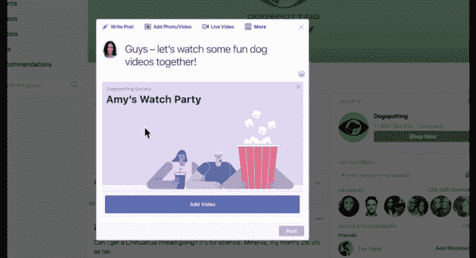
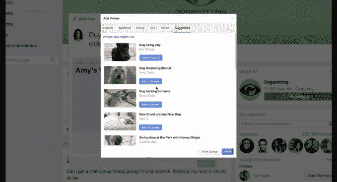

# 脸书的“观看派对”面向所有人，让人们一起观看视频 

> 原文：<https://web.archive.org/web/https://techcrunch.com/2018/07/25/facebook-what-is-a-watch-party/>

# 脸书的“观看派对”面向所有人，让人们一起观看视频

在过去的几个月里，脸书一直在测试一种叫做“观察党”的东西。这项功能可以让脸书群组主持共享视频流会话，群组中的每个人都可以同时观看/评论相同的视频。以脸书直播的概念为例，将一系列预先选择的视频进行交换，形成一个特设的视频频道，这就是一个观看派对。

如今，该公司正在向所有脸书集团推广这一功能。

**它是这样工作的(截图来自脸书的演示视频):**

1)开始观看聚会就像在小组的墙上张贴任何其他内容一样。给它一个标题来吸引人们的注意，也许给它一个图像，然后发布出去。

2)添加几个视频开始填充队列

3)一旦有几个人加入，人流就开始了。该视频将为所有观众同步，主持人可以在视频的时间轴上来回滑动。您可以随时添加更多视频。

对于那些可能在测试模式下就能提前看到 Watch Party 的人来说，他们已经为这个版本添加了一些新功能:

*   观众可以建议视频，建议会出现在主持人的 feed 中，以获得批准(或不批准)。)
*   每个观看方现在可以有多个共同主持人，每个人都可以向队列中添加新的视频

该功能目前仅限于脸书团体；该公司表示，它正在测试对页面的支持，但还没有完全准备好。

当前形式的另一个限制是:它只能处理脸书托管的视频(没有 YouTube、Twitter 等)，大概是由于各种技术/许可问题。(再加上，你知道，竞争。)

(关于这一点……嘿，网飞:如果你能着手正式建造一个这样的东西，这样我就可以和我的妻子一起第 400 次监视办公室，即使是在我旅行的时候，那就太好了。)

我很好奇不同的脸书团体如何使用这个。虽然它有其预期的有趣用途，但在同一视频前用共享评论流吸引大量观众总是有可能适得其反——给互联网上的一群人一个麦克风和一个观众，事情可能会很快变得混乱。至少，脸书在它的盘子已经很满的时候试图缓和是*的又一件事*。