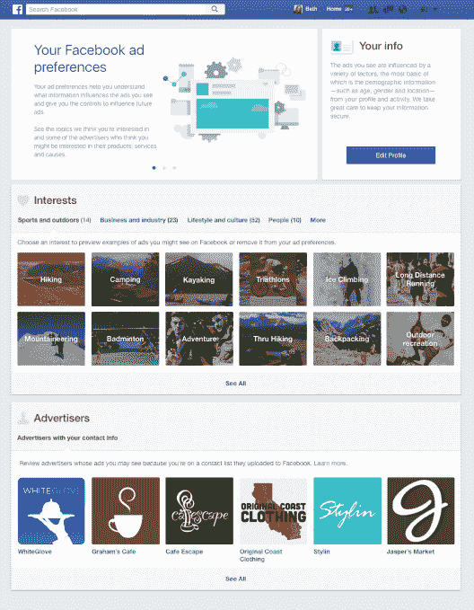
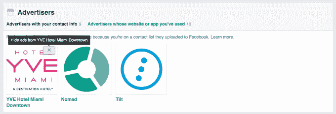

# 脸书将绕过网络广告拦截器，但提供广告定位选择退出

> 原文：<https://web.archive.org/web/https://techcrunch.com/2016/08/09/facebook-will-bypass-web-adblockers-but-offer-ad-targeting-opt-outs/>

脸书正在使其网页广告的 HTML 与有机内容无法区分，这样它就可以躲过广告拦截器。但作为剥夺人们控制广告的选择权的交换，它的[允许他们](https://web.archive.org/web/20230404085228/http://newsroom.fb.com/news/2016/08/a-new-way-to-control-the-ads-you-see-on-facebook-and-an-update-on-ad-blocking/)到[选择退出广告目标类别和广告商上传的定制观众客户名单。今天，所有的桌面用户都会在新闻提要上看到一个声明，解释说虽然网页广告拦截器可能不再有效，但他们可以](https://web.archive.org/web/20230404085228/https://www.facebook.com/ads/preferences)[访问他们的广告偏好设置来拦截来自特定商家的广告](https://web.archive.org/web/20230404085228/https://www.facebook.com/ads/preferences)。

脸书委托研究公司益普索调查为什么[报告](https://web.archive.org/web/20230404085228/https://pagefair.com/blog/2015/ad-blocking-report/)称 7000 万美国人和全球近 2 亿人使用广告拦截器。它发现，“使用广告拦截器的主要原因包括避免破坏性广告(69%)、减缓浏览体验的广告(58%)和安全/恶意软件风险(56%)。”隐私不是最好的答案。所以脸书认为，如果它能让广告不间断、快速、安全，人们就不会介意。

根据脸书广告副总裁 Andrew Bosworth 的说法，这一变化的理由是“公司的部分使命是建立人与企业之间的联系”，这是广告拦截器所阻止的。与此同时，博兹说,“脸书的广告不会为一个人支付脸书的费用。他们为一项全球免费的服务付费。每个人的参与确实有助于全球社区。”

[scribd id = 320647849 key = key-afmmlgxihkzuzpsy 7 ru 6 mode = scroll]

重要的是，脸书拒绝支付大多数广告拦截软件公司愿意接受的赎金，将某些网站列入白名单，并继续显示他们的广告。

相反，由于它提供和衡量自己的广告，而不是使用第三方留下的痕迹广告拦截器可以发现，它可以隐藏证据。广告拦截器将不得不窥探 JavaScript 或脸书显示的实际内容，以检测和删除广告，这将大大降低加载时间。脸书打赌用户宁愿忍受广告。Bosworth 告诉我“我认为广告拦截器的替代品对用户体验非常有害”。

[更新:领先的广告拦截公司 Adblock Plus 发布了一篇名为“哦，看起来脸书已经完全反对用户了”的博文[来回应脸书的行为，其中写道](https://web.archive.org/web/20230404085228/https://adblockplus.org/blog/oh-well-looks-like-facebook-just-got-all-anti-user)

> 这是一个不幸的举动，因为它走了一条违背用户选择的黑暗之路。但这也不是反应过度的理由:只要垃圾邮件发送者试图绕过垃圾邮件过滤器，科技领域的猫捉老鼠游戏就一直存在。
> 
> 但是你不得不怀疑这个决定是出于什么考虑。我的意思是，我们也不要忘记[在他们的博客文章](https://web.archive.org/web/20230404085228/http://newsroom.fb.com/news/2016/08/a-new-way-to-control-the-ads-you-see-on-facebook-and-an-update-on-ad-blocking/)中说:“当我们问人们为什么使用广告拦截软件时，我们听到的主要原因是阻止烦人的破坏性广告。”因此，如果这是真的，脸书显然同意用户使用广告屏蔽软件有一个很好的理由……但是这些用户不应该被赋予决定他们想要屏蔽什么的权力？"

AdBlock Plus 的回应忽略了脸书给予用户更多选择广告的权力。它提到的“猫捉老鼠的游戏”暗示它可能仍然试图绕过脸书的新广告拦截器。]

博兹承认广告业需要改进广告投放的方式，这样它们就不会让网站陷入困境，但他说“我不认为广告拦截器是一个很好的解决方案。他们明确地不为出版商的意愿服务，他们应该为他们的内容得到补偿。但是他们也没有很好地服务顾客。广告拦截者收取展示广告的费用，这意味着他们没有把消费者的最佳利益放在心上。"

脸书更新的广告偏好让用户挑选隐藏哪些广告，而不是全部屏蔽。人们可以看到脸书给他们分类的兴趣，比如徒步旅行或汽车，他们喜欢的页面，以及上传联系信息或网页浏览模式到脸书的广告商，然后选择退出这一定位。

但是快速点击隐藏所有这些来源不会让你看到更少的广告，它们只会更没有针对性和相关性。虽然有些人可能不想接受，但脸书需要广告收入来运行保存他们照片的服务器，并支付开发他们喜欢的新闻供稿等产品的团队。

如果你要看广告，它们也可能是你想买的东西。当然，广告可能会令人讨厌，但我也通过脸书的广告发现了音乐会门票和服装，否则我是不会知道的。

通过解禁广告，脸书可以增加其已经可观的收入。上个季度它在广告上赚了 62 亿美元。虽然一些 adblock 的铁杆粉丝可能会抱怨，但他们要么接受看到广告，要么错过脸书提供的服务。

不可避免地，有些人会问“为什么我不能只支付月费就看不到脸书上的广告？”马克·扎克伯格承诺脸书将永远保持自由。但如果真的有，发展中国家的一些用户肯定负担不起。

广告是消费者互联网的生命线。如果没有广告收入，像谷歌这样的服务无法组织全世界的信息，脸书也无法为每个人提供与远方家人保持联系的方式。

因此，尽管广告业可以更加尊重其受众，但广告本身让一些人需要但永远不会购买的服务变得免费。这使得广告拦截器成为一种自私的选择，而它们是控制你在网上看到的内容的更具合作性的选择。