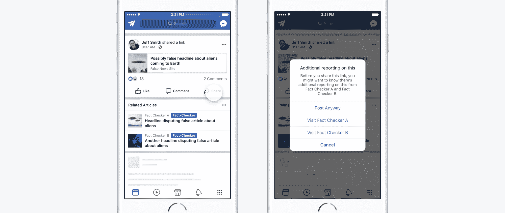

# 脸书将放弃假新闻上有争议的旗帜，转而展示可信文章的链接

> 原文：<https://web.archive.org/web/https://techcrunch.com/2017/12/20/facebook-will-ditch-disputed-flags-on-fake-news-and-display-links-to-trustworthy-articles-instead/>

脸书今天宣布了两项改变，希望能更容易阻止假新闻的传播。第一个变化是新闻订阅，用户将不再看到“有争议的旗帜”，或者显示在脸书第三方事实检查员标记的文章下的红色徽章。相反，他们会看到相关的文章，或者来自知名出版商的内容链接。第二个变化是一项新举措，旨在帮助脸书了解人们如何根据他们使用的新闻来源判断信息的准确性，这不会立即导致新闻提要的任何变化，但旨在帮助该公司评估其阻止错误信息传播的努力有多有效。

与谷歌和推特一样，脸书[目前正面临批评者的压力](https://web.archive.org/web/20230404163622/https://www.bloomberg.com/news/articles/2017-10-30/shareholders-press-twitter-facebook-and-google-on-fake-news)，批评者称其在打击其平台上的假新闻方面做得不够，包括[“巨魔农场”](https://web.archive.org/web/20230404163622/https://www.vanityfair.com/news/2017/10/the-russian-troll-farm-that-weaponized-facebook-had-american-boots-on-the-ground)的文章，这些文章传播错误信息以获利或左右政治和其他热点问题的公众舆论。在总统选举期间，这个问题变得更加紧迫，所有三家公司都被传唤在国会听证会上作证他们的平台是如何被俄罗斯支持的巨魔用来影响美国政治的。

几乎就在一年前，脸书[实施了几项改革来打击假新闻](https://web.archive.org/web/20230404163622/https://newsroom.fb.com/news/2016/12/news-feed-fyi-addressing-hoaxes-and-fake-news/)，包括更容易的报道文章的步骤，与事实核查组织的合作以及一些功能，如有争议的旗帜，当人们将要阅读或分享被事实核查人员认定为假新闻的文章时，这些功能会提醒人们。脸书也开始降级假新闻链接，它说这通常意味着他们失去 80%的流量。

在今天的声明中，脸书产品经理 Tessa Lyons 表示，脸书决定用相关文章取代有争议的旗帜，因为红色徽章实际上有加强信念的作用。

“关于纠正错误信息的学术研究表明，在一篇文章旁边放置一个强烈的图像，比如红旗，实际上可能会巩固人们根深蒂固的信念——这与我们的意图相反，”莱昂斯写道。“相比之下，相关文章只是为了提供更多的背景，我们的研究表明，这是帮助人们了解事实的更有效的方法。事实上，我们发现，当我们在虚假新闻报道旁边展示相关文章时，与展示有争议的旗帜相比，分享率会更低。”

脸书现在将显示链接被识别为“假新闻”的相关文章

相关文章于 2013 年推出，脸书称之为用户读完一篇文章后显示在新闻提要上的链接。相关文章最初是为了提高参与度，防止人们的新闻订阅被愚蠢的迷因淹没，而是将他们引向知名出版商的内容。然后在今年 4 月，脸书[宣布了一项测试](https://web.archive.org/web/20230404163622/https://newsroom.fb.com/news/2017/04/news-feed-fyi-new-test-with-related-articles)，在关于趋势话题的文章之前显示相关文章*，目的是让用户“更容易获得额外的观点和信息”*

领导脸书反假新闻团队的另一篇博客文章——产品设计师杰夫·史密斯、用户体验研究员 Grace Jackson 和内容策略师 Seetha Raj——对今天的声明提供了更多的见解。该团队表示，在过去的一年里，他们访问了不同的国家，研究错误信息在不同背景下的传播方式，以及人们对“旨在告知他们正在阅读的是假新闻的设计”的反应。

因此，他们确定了四个主要的方法来改进有争议的旗帜的功能。

首先，该团队写道，有争议的标志需要立即告诉人们为什么事实检查员对一篇文章有争议，因为大多数用户不会费心点击额外信息的链接。第二，强烈的语言或像红旗一样的图像有时会因为强化信念而适得其反，即使它们被标记为错误的。第三，脸书只是在两个事实核查组织确定它是假的之后才使用有争议的旗帜，但这意味着它有时行动不够迅速，特别是在事实核查人员很少的国家。

最后，脸书的一些事实核查合作伙伴对文章进行了分级(例如，“虚假”、“部分虚假”、“未经证实”或“真实”)，因此当应用有争议的旗帜时，上下文和细微差别就失去了，尤其是在两个组织对同一篇文章进行事实核查，但对其可信度得出不同结论的罕见情况下。

在有人点击链接之前显示相关文章，是为了解决所有这些问题，让人们更容易获得背景信息，只需要一个事实检查员的审查，甚至可以处理得到不同评级的文章，并防止可能导致有人坚持某个信念的反应，即使它是错误的。

此外，尽管相关文章的新应用不会“有意义地改变”点击率，但脸书的反假新闻团队表示，这导致了更少的份额。为了增加透明度，用户现在还可以看到徽章，识别哪些事实审查员审查了一篇文章。

“作为这个产品背后的一些人，设计支持新闻阅读器的解决方案是我们认真对待的责任，”史密斯、杰克逊和拉吉写道。“我们将继续努力，通过测试新的治疗方法，改善现有的治疗方法，并与学术专家合作，解决这个复杂的错误信息问题。”