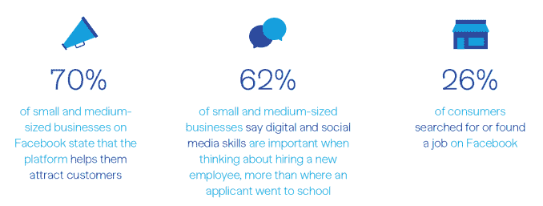

# 脸书将在 30 个城市教授失业者数字/社交媒体技能

> 原文：<https://web.archive.org/web/https://techcrunch.com/2017/11/09/facebook-will-teach-the-unemployed-digital-social-media-skills-in-30-cities/>

无论是为了“让世界更加紧密”还是改善其公众形象，脸书[今天](https://web.archive.org/web/20230330194912/https://newsroom.fb.com/news/2017/11/facebook-community-boost/)宣布了[社区促进](https://web.archive.org/web/20230330194912/https://www.facebook.com/business/m/community-boost)。脸书告诉我，它将向该项目投资数千万美元，该项目将于 2018 年在美国 30 个城市巡回演出。它将向失业者传授数字工作技能，向刚刚上网的人传授互联网知识，向企业家传授创业方法，向小企业主传授客户增长。

毫不奇怪，所有这些技能都围绕着脸书，脸书显然认为这是更好生活的关键。巡回赛的停靠站包括休斯顿、圣路易斯、阿尔伯克基、得梅因和南卡罗来纳州的格林维尔——这些显然都是在 2016 年大选中投票给特朗普的红色州。也许脸书希望减少失业，这导致了对当前政治制度的不满，从而让我们成为川普。

脸书引用了 T4 Morning Consult 的研究，表明“62%使用脸书的美国小企业表示，拥有数字或社交媒体技能是他们招聘决定的一个重要因素——甚至比候选人的学校背景更重要。”休斯顿市长 Sylvester Turner 表示，“我们很高兴欢迎脸书来到休斯顿，以提高我们居民的数字技能，并确保我们充满活力的企业家和小企业社区从互联网中获得更多。"

如果脸书专注于教授网站以外的技能，比如如何制作一份好看的简历或处理工作面试，这个项目可能会被认为不那么自私。因此，尽管脸书社区助推背后的意图可能是诚实的，但很难将其解释为利他主义，因为脸书正在国会就其平台上的选举干预举行听证会，并正在玩弄整个新闻业，因为它吸走了广告美元和就业机会。

以下是脸书对该项目的计划，人们学习如何更好地使用脸书的部分用粗体显示。

*   > 如果你在**找工作**，我们会提供培训帮助你**提高你的数字和社交媒体技能**。根据这项研究，62%使用脸书的美国小企业表示，拥有数字或社交媒体技能是他们招聘决定的一个重要因素——甚至比候选人的学校背景更重要。

*   > 如果你是一名**企业家，**我们会提供培训项目，教你如何利用技术将想法转化为业务，或者**向你展示如何利用脸书**创建免费的在线形象。

*   > 如果你是一名**企业主**，我们将为你的企业提供扩展其数字足迹的方法，并**在世界各地和全球范围内寻找新客户**。
    > 
    > 

*   如果你是第一次上网，或者你想支持你的社区，我们会提供数字素养和网络安全方面的培训。我们还将帮助社区成员利用技术将人们聚集在一起，提供活动和群组等功能。

尽管如此，很难想象谷歌、苹果或亚马逊等其他科技巨头会将资源投入到与改善人们的社会经济流动性如此直接相关的事物中。与今天在密苏里州结束的马克·扎克伯格 2017 年挑战[会见来自美国每个州的人](https://web.archive.org/web/20230330194912/https://techcrunch.com/2017/01/03/zuckerberg-challenge/)类似，你可以把它视为仅仅是宣传，或者脸书合理地希望走出去，听取其选民的意见。用户可以通过[填写这张表格](https://web.archive.org/web/20230330194912/https://www.facebook.com/business/m/community-boost)请求社区助推来他们的城市。

“我最自豪的一件事是，7000 万小企业使用脸书与客户联系，”[扎克伯格](https://web.archive.org/web/20230330194912/https://www.facebook.com/photo.php?fbid=10104177997725861&set=a.612287952871.2204760.4&type=3&theater)写道。“这意味着现在有 7000 万人可以使用大公司拥有的相同工具。现在，我们需要让人们更容易开始和建立新的企业或找到工作和机会，并在这个过程中加强他们的社区。”

脸书告诉我，自 2011 年以来，它已经投资了超过 10 亿美元来支持小企业，通过像 [提升你的企业课程、](https://web.archive.org/web/20230330194912/https://www.facebook.com/business/a/boost-events) 这种教授社交媒体管理的课程，以及 [蓝图](https://web.archive.org/web/20230330194912/https://www.facebook.com/blueprint/) 在线学习中心等项目，100 万家企业都在学习社交营销技能。脸书也正在建立一个数字营销课程，在未来两年内培训 3000 名密歇根人。

[更新:在我发表这篇文章后，脸书联系了我，强调“脸书社区促进会不仅仅提供关于脸书的培训。”它计划这样做的一个方法是通过与成人技术培训学校的合作，以及像密歇根的大马戏团这样的编码训练营。这些可以帮助人们超越基本的社交媒体技能，获得真正的计算机科学教育。]

要让人们相信脸书是世界上的一股慈善力量，还需要付出更多的努力。尽管它的心往往是好的，但脸书已经证明，它没有能力预测其平台的滥用和负面的次级影响，也没有能力先发制人地采取足够的措施来防止这些问题。但如果它想修补美国社会的裂痕，让更多的人就业是一个良好的开端。