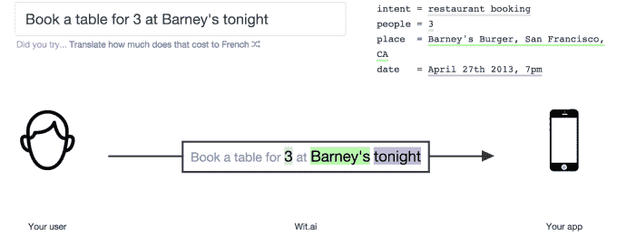

# 脸书收购 Wit.ai，帮助其开发人员开发语音识别和语音界面

> 原文：<https://web.archive.org/web/https://techcrunch.com/2015/01/05/facebook-wit-ai/>

今天，脸书收购了 18 个月前成立的 Y Combinator 初创公司 Wit.ai。 [Wit.ai](https://web.archive.org/web/20230404054414/https://wit.ai/) 平台上已经有 6000 名开发者，他们开发了数百款应用。

Wit.ai 的平台将保持开放和免费，这使得脸书似乎想利用该技术吸引开发者进入其[构建-增长-货币化循环](https://web.archive.org/web/20230404054414/https://techcrunch.com/2014/11/30/like-advertising-a-needle-in-a-haystack/)，他们在那里获得构建应用程序的帮助，但最终会向脸书支付广告增长或通过与脸书分享其广告托管收入来货币化。

作为脸书的一部分，Wit.ai 可以帮助该公司提供语音控制开发工具及其 Parse 开发平台，为 Messenger 提供语音到文本的输入，提高脸书对语音语义的理解，并创建一个可以通过语音导航的脸书应用程序。

“Wit.ai 已经建立了一个令人难以置信但简单的自然语言处理 API，帮助开发人员将语音和文本转化为可操作的数据，”脸书告诉我。“他们的加入让我们非常兴奋。”

## 语音命令 API 的条纹

Wit.ai 产品允许开发人员添加几行代码，以立即内置语音识别和语音控制。没有它，开发人员将需要专业知识、时间和资源来自己建立一个完整的语音识别系统。

“脸书有资源和人才来帮助我们采取下一步行动，”Wit.ai 在[博客帖子](https://web.archive.org/web/20230404054414/https://wit.ai/blog/2015/01/05/wit-ai-facebook)中写道。“脸书的使命是连接每个人，为平台上超过 13 亿人建立令人惊叹的体验——理解自然语言的技术是其中很大一部分，我们认为我们可以提供帮助。”

Wit.ai 的联合创始人 Alexandre Lebrun 此前[将其“Siri for enterprise”语音命令虚拟助理初创公司 VirtuOz 出售给 Nuance](https://web.archive.org/web/20230404054414/https://techcrunch.com/2013/01/10/in-our-inbox-a-memo-that-says-nuance-has-bought-virtuoz-to-ramp-up-its-enterprise-services/) 。然后，他在 2014 年冬季课程中通过 Y Combinator 介绍了 Wit.ai，在那里 [TechCrunch 将其评为该课程](https://web.archive.org/web/20230404054414/https://techcrunch.com/2014/03/25/best-y-combinator-demo-day-startups/)中的八大创业公司之一。10 月，Wit.ai 继续从 Andreessen Horowitz、New Enterprise Associates 和 SV Angel 筹集了 300 万美元的种子资金。

你可以从这个视频中感受一下它的语音接口 API 的功能:

【YouTube = https://www . YouTube . com/watch？v = hxlmhywkfmm]

今年早些时候， [Lebrun 告诉我们](https://web.archive.org/web/20230404054414/https://techcrunch.com/2014/03/17/with-a-voice-interface-api-for-any-app-wit-ai-wants-to-be-the-twilio-for-natural-language/)他们的想法是为电信服务或支付引入“Twilio 或 Stripe 模型”,并将其应用于创建语音接口 API。

## Messenger 的语音转文本功能

脸书也在为其在 T2 的语言技术团队配备人员，我听说他们可能正在为 Messenger 开发语音到文本的输入。想象一下，你可以不用手对 Messenger 说话，它会把你的语音转录成文本，然后让你命令它发送信息。

谷歌和苹果都有自己的语音命令系统，比如 Siri，你可以用它来转录 iOS 应用程序中的文本。但两者都是为人类通过机械的语音命令与机器对话而设计的，比如搜索。相反，脸书可能会专注于解释人类相互交谈时使用的变调和口语。

可穿戴设备是一个快速增长的趋势，大多数设备的屏幕太小，无法打字。这意味着未来几年，语音命令对第三方应用程序来说将变得更加重要。

通过收购 Parse，脸书在移动应用开发热潮上取得了巨大成功。这种移动后端即服务已经从 2013 年 4 月脸书收购时支持的 6 万个应用发展到现在的 50 万个。

脸书现在可能希望像对待 Parse 一样，在工程、招聘和分销方面给予 Wit.ai 帮助。在社交网络的帮助下，Wit.ai 可能会成为第三方开发者为其应用程序添加语音控制的首要方式。