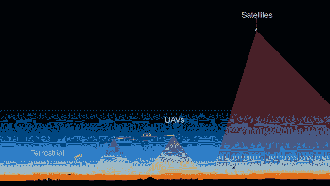
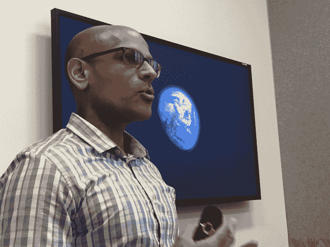
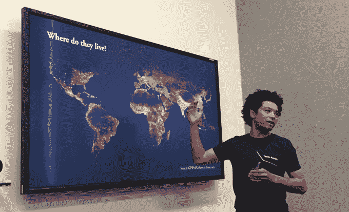

# 脸书不会成为 ISP，但为运营商打造了一款互联网拍摄无人机 

> 原文：<https://web.archive.org/web/https://techcrunch.com/2015/07/30/facebook-wont-be-an-isp-but-is-building-internet-shooting-drones-for-carriers/>

脸书今天[公布了其太阳能、激光连接、互联网发射](https://web.archive.org/web/20221208125932/http://newsroom.fb.com/news/2015/07/new-milestones-in-connectivity-labs-aircraft-and-laser-programs/) [Aquila 无人机](https://web.archive.org/web/20221208125932/https://code.facebook.com/posts/993520160679028/building-communications-networks-in-the-stratosphere/)的详细计划，但证实其不会与互联网服务提供商竞争。“我们的目的不是成为运营商，”脸书的工程副总裁 Jay Parikh 告诉记者。“我们不会成为‘脸书 ISP’"

相反，脸书计划与世界各地的运营商合作，为他们配备这些无人机，以便他们可以向现有移动网络覆盖不到的偏远地区的 10%的人口出售互联网连接。脸书还表示，各国政府也表示有兴趣为他们的国家购买 Aquila 无人机。

Internet.org 项目在很大程度上被脸书标榜为将人们带入知识经济的人道主义努力。但帕里克向我证实，出售或授权太阳能无人机，自由空间光学激光器和其他技术是选项。这意味着脸书可以一边赚钱，一边完成连接全世界的使命。

昨天，在其收益报告中，脸书报告称，每季度的支出从 15 亿美元大幅增加到 27 亿美元，主要用于像这些无人机这样的项目的研发。出售或授权可以收回这些成本。

脸书的工程副总裁 Jay Parikh 在门洛帕克总部详细介绍了 Aquila 的进展

脸书今天还宣布了两大连接里程碑:

*   **脸书的第一架 Aquila 无人机已经完全建成**——这种太阳能无人机可以在空中停留 90 天，飞行在天气和商业空域上方 60，000 到 90，000 英尺之间，可以将互联网分布到印度或尼日利亚等地下方大约 50 英里的区域。它拥有波音 737 飞机 140 英尺的翼展，但只有 880 磅重，大约是普锐斯的三分之一，尽管在高海拔地区寒冷刺骨，它仍然可以工作。脸书现在正在对无人机进行地面测试，并计划明年在美国的某个地方进行测试。

*   **脸书的互联网光束激光器在测试中提供了 10gb 的连接，大约是之前记录的 10 倍**-激光用于从城市地面的光纤电缆传输连接到一架 Aquila 无人机，该无人机拥有自己的激光器，可以将连接中继到其他无人机。激光器上的瞄准系统可以让它在 10 英里外击中一个硬币大小的受体目标，即使它和目标正在飞行。美国宇航局、研究公司和大学之前的尝试仅实现了大约 1 千兆位的激光连接，这使得脸书的进展成为一个巨大的科学飞跃。

这是一段来自脸书的关于 Aquila 无人机的视频:

[https://web.archive.org/web/20221208125932if_/https://www.youtube.com/embed/RQxXf6MYpzw?feature=oembed](https://web.archive.org/web/20221208125932if_/https://www.youtube.com/embed/RQxXf6MYpzw?feature=oembed)

视频

2013 年末宣布成立的由脸书领导的 Internet.org 是由电信公司组成的合作伙伴，旨在为剩余的 50 亿没有互联网的人提供互联网接入。问题是，首次上网的人的比率正在下降，所以脸书决定介入。实现无处不在的连接可以分解为解决三个问题:

*   **负担能力**——数据接入对许多人来说太贵了，所以一年前[脸书推出了 Internet.org 应用](https://web.archive.org/web/20221208125932/https://beta.techcrunch.com/2014/07/31/internet-org-app/)，通过运营商合作伙伴向人们提供免费的基本互联网。如果人们迷上了并想要网络的其余部分，这些合作伙伴就能赚钱。它现在在 17 个国家运营。
*   意识——许多人不知道教育、健康、工作和其他互联网信息的潜在好处。
*   **可访问性**–10%的世界人口处于现有数据网络的覆盖范围之外。脸书已经建造了能够远距离传送互联网的地面卫星，以及能够从太空传送互联网的卫星。但今天它详细介绍了其 Aquila 太阳能无人机，该无人机最近取得了很多进展。

脸书不是唯一一个试图解决最后一个问题的人。谷歌的 Project Loon 使用比空气轻的气球将互联网传送给偏远地区的人们。昨天，谷歌宣布，它与斯里兰卡政府合作，将连接覆盖整个国家。脸书和谷歌正在竞争，因为他们都希望人们记住他们是给他们提供互联网的公司。

脸书大学的耶鲁·马奎尔详细介绍了脸书对没有联系的人住在哪里的研究

为什么不用传统的手机信号塔呢？购买土地、建造、运营和保护这些塔的费用极其昂贵。这并不划算，因为信号塔只能到达人口稀少、购买力低的有限区域，所以价格也需要如此。一旦科技成熟，飞行器会便宜得多。

脸书希望其地面、无人机和卫星项目结合起来，能够确保地球上的每个人都能接入互联网。由于脸书是人们在网上做的最受欢迎的事情之一，如果它能让他们上网，它将赢得更多的用户。

[马克·扎克伯格发布了](https://web.archive.org/web/20221208125932/https://www.facebook.com/zuck/videos/10102274951725301/)关于今天的新闻，他说“用飞机连接使用激光的社区可能看起来像科幻小说。但科幻小说往往只是超前的科学。”