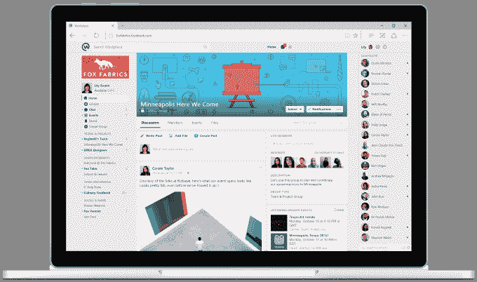
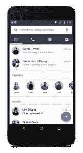

# 脸书的 Workplace 开始向大众出售企业社交网络

> 原文：<https://web.archive.org/web/https://techcrunch.com/2016/10/10/facebook-workplace/>

在 [20 个月](https://web.archive.org/web/20230405002019/https://techcrunch.com/2015/01/14/facebook-at-work-ios-android/)的封闭测试后，工作名称为[工作中的脸书](https://web.archive.org/web/20230405002019/https://techcrunch.com/2014/06/25/facebook-at-work/)(正如我们[在几周前](https://web.archive.org/web/20230405002019/https://techcrunch.com/2016/09/29/facebook-at-work-will-launch-on-october-10-in-london/)预测的那样)今天，脸书终于以新的名称 [Workplace](https://web.archive.org/web/20230405002019/https://workplace.fb.com/) 将其专注于企业的消息和社交网络服务推向市场。

它不仅拥有一个新的品牌:Workplace 推出了一种新的定价模式，这种模式基于脸书式的月度活跃用户指标；在获得 1000 家仍处于免费试点模式的组织客户后(一年前只有 100 家)，一些公司雄心勃勃。

 Workplace 是一款桌面和移动应用，提供新闻订阅、自己公司和他人的群组、聊天直接消息、实时视频、反应、翻译功能以及视频和音频通话，现已向任何人开放，这里的关键词是“任何人”。

为了真正获得产品的关键质量，并帮助它在市场上脱颖而出，脸书不仅吸引了公司的白领、坐在办公桌前的“知识工人”，他们通常购买和使用企业通讯软件。

它还希望在全球范围内吸引更广泛的员工，他们服务于客户、维护机器或以其他方式漫游，这是他们工作的一部分——这些人可能已经在非工作生活中使用脸书，但他们在过去很少被纳入组织更广泛的数字协作努力。

## “我们想以脸书的方式构建企业软件”

在许多竞争服务取得成功并获得巨大吸引力之后，Workplace 很久才开始营业——在企业通信和消息领域受欢迎的竞争软件包括像 [Slack](https://web.archive.org/web/20230405002019/http://slack.com/) 、 [Yammer](https://web.archive.org/web/20230405002019/http://yammer.com/) (现在是微软的一部分)、Salesforce 的 [Chatter](https://web.archive.org/web/20230405002019/http://chatter.com/) 、 Hipchat 和 [Jive](https://web.archive.org/web/20230405002019/http://jivesoftware.com/) 等等。

甚至还有一系列鲜为人知的专门为“非办公桌”工作者打造的商业信息应用，包括 [Zinc](https://web.archive.org/web/20230405002019/https://www.zinc.it/) (原名 [Cotap](https://web.archive.org/web/20230405002019/https://techcrunch.com/2014/08/27/whatsapp-for-the-workplace-cotap-adds-box-dropbox-google-onedrive-and-a-desktop-app/) )、 [Beekeeper](https://web.archive.org/web/20230405002019/https://beekeeper.io/) 等等。

为什么耽搁了？Workplace 的主管 Julien Codorniou 在该产品开发的总部伦敦接受采访时解释道:“我们必须完全独立于脸书来建造这个系统，我们必须测试并获得所有可能的认证，才能成为 SaaS 的供应商。”。这些发展仍在发生。他告诉我，从上周起，Workplace 加入了美国/欧盟隐私保护计划。

另一个原因与它瞄准的公司和非传统 SaaS 买家有关。“我们想看看它在非常保守的行业和政府机构中是如何运作的，”他说。“我们必须在每一个可能的地区和行业测试产品，尤其是最保守的地区和行业。我们觉得现在已经为黄金时间做好了准备。”

Workplace 可能不是第一个进入市场的，但它希望通过一些曲折来吸引人们。

其中之一就是定价。企业软件公司通常遵循几个标准的商业模式:它们包括基于你公司一定数量的用户按座位收费；在基于相同用户数量原则的较大层级中；基于特征集；在免费增值模式下，你可以为一小群人获得少量的基本功能，并理解你很快会在付费层增加更多的功能。

脸书已经将这些大部分抛之脑后，转而选择借鉴自己的衡量标准。

它将为每个人提供相同的功能，并按月活跃用户对 Workplace 收费——在这种情况下，定义为每月至少打开和使用 Workplace 一次。脸书将对前 1000 名用户收取每月 3 美元的费用；接下来 1001-10000 的 2 美元；超过这个数就要 1 美元。

(作为一个价格比较点， [Slack 对两层功能的每个活跃用户每月收费](https://web.archive.org/web/20230405002019/https://www.slack.com/pricing)8 美元和 15 美元，如果你按年付费，价格会更低。它还没有为超大型组织推出企业级。)

MAUs 的定价以及这些有竞争力的价格有几个原因。首先，这意味着购买的东西对顾客来说变得更加透明。

但同时，脸书也认为自己对这项服务负有更大的责任。你只需为你实际使用的东西付费，而脸书基本上只需为其提供服务的参与度付费，就像在平台上运行的广告一样。

“我们想以脸书的方式构建企业软件，”Codorniou 说。

定价的另一个有趣方面是脸书抛出的数字层级。该公司不会给我们一个工作场所的 mau 总数。但很明显，我们的目标是用这种产品瞄准非常大的公司和其他组织。

脸书已经签约的一些早期客户包括 Telenor 运营商的 36，000 名员工[和皇家银行的 100，000 名员工](https://web.archive.org/web/20230405002019/https://techcrunch.com/2016/03/02/facebook-adds-36k-telenor-employees-to-facebook-at-work-as-it-gears-up-for-global-launch/)[以及今天脸书宣布的更多客户，如达能(100，000 名员工)、星巴克(238，000 名员工)和 Booking.com](https://web.archive.org/web/20230405002019/https://techcrunch.com/2015/10/25/facebook-at-work-signs-up-its-biggest-business-yet-100000-workers-from-the-royal-bank-of-scotland/)(13，000 名员工)。

它也有像皇家国家盲人学院、牛津饥荒救济委员会和新加坡政府技术局这样的组织。

虽然脸书对 Workplace 收费，但从它身上赚很多钱似乎并不是它的实际目标——至少一开始不是。Codorniou 说，目标是为产品获得一些临界质量。

“我们将发展 Instagram 和 Messenger 这样的工作场所，”他说。“在你考虑货币化之前，我们希望用最初几年来发展它。我们痴迷于增长。”

另一种方法是，脸书可能会成功，至少让人们试用 Workplace，如果不是转换到永久使用它，这是基于这样一个事实，即它就像脸书本身一样工作。

随着主要消费者服务的月活跃用户突破 17 亿，很可能一家公司的大部分员工要么已经知道这项服务，要么还没有使用它。

这将意味着人们将立即熟悉产品的外观和工作方式，这在封闭测试版中转化为对产品的高度参与。在使用 Workplace 封闭测试版的 1，000 家公司和其他组织中，已经创建了不少于 100，000 个用户组。

## “使用比 Workday 集成更重要”

正如我们在过去写的关于工作中的脸书的文章一样，大部分工作场所本质上看起来就像你已经知道并可能在今天使用的脸书。

有一个新闻提要。你可以在自己的公司内部建立小组，也可以和其他组织的同事一起建立小组。有一个信使等价物，脸书称之为“聊天”。

有视频直播，也有群组视频和音频通话。你可以评论带有多种情绪反应的帖子，还有自动翻译功能。

也有一些伙伴关系从第一天起就以与可能已经在使用其他服务的大企业合作为目标。它们包括 Okta、OneLogin 和 Ping 等登录和身份服务，Box 等存储服务，以及德勤(Deloitte)和 Sada Systems 等集成商。

但一般来说，从一开始就没有一个长长的集成列表可以与 Workplace 一起工作，la Slack 可以让你通过快捷的命令从数百个其他应用程序中引入工作和数据。

Codorniou 说这是故意的。

“我们希望与客户讨论易于使用的产品和民主定价，”他说。“当我与达能的首席执行官交谈时，他的 10 万名员工中包括许多没有电脑和办公桌的人，使用和参与比工作场所是否与 Workday 或 Quip 集成更重要。”

(有趣的补充说明:目前，Cordorniou 告诉我，脸书要求所有潜在的销售合作伙伴和集成商在被允许使用 Workplace 之前注册并使用它。“我不明白你怎么能不先使用就卖掉它，”他说。)

据我所知，Slack 风格的集成，以及机器人等其他花哨功能和入侵 Messenger 的众多其他功能，很可能很快就会出现，其中第一个将于今年春天在脸书的 F8 会议上亮相。

就目前而言，给市场的信息可能足够大:脸书已经成为全球数十亿消费者在数字世界中相互交流的事实上的*平台，现在它正在积极地向工作世界转变。*