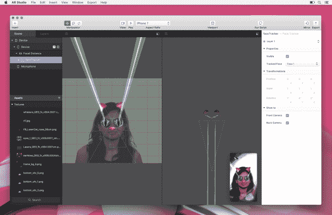

# 脸书向所有开发者开放 AR 平台和“世界特效”

> 原文：<https://web.archive.org/web/https://techcrunch.com/2017/12/12/facebook-world-effects/>

脸书正试图在一大批第三方开发者的帮助下，缩小与 Snapchat 在增强现实方面的差距。今天，在 F8 首次亮相其增强现实相机效果平台和 AR 工作室工具八个月后，脸书[允许所有开发者](https://web.archive.org/web/20230326023436/https://developers.facebook.com/blog/post/2017/12/12/ARStudio-now-in-open-beta/)开始为其脸书相机构建 AR 体验。这包括“世界效果”——脸书的 Snapchat 世界镜头的副本——用 3D 物体而不仅仅是你的自拍来增强你的环境。

AR Studio 今天对所有开发者开放，世界特效将在未来几天开放，供脸书和 Messenger 使用。例如，在 Messenger 上，你可以添加一个漂浮在某人头顶的 3D 心脏，添加一个指向全景图中某个物体的箭头，或者添加一个播放音乐的庆祝机器人，为单调的视频增添活力。

脸书的新世界效应

“我们希望艺术家、开发者、品牌和更多的创作者能够建立和分享令人惊叹的 AR 体验，”脸书导演 Ficus Kirkpatrick 写道。“通过向所有创作者开放 AR Studio，我们正在采取措施让 AR 更多地成为日常生活的一部分。”

脸书的机会在于利用 [Snapchat 的反开发者态度。除了一些基本的图像帧提交，Snapchat 还没有完全接受第三方 AR 内容，并与杰弗·昆斯等少数优秀艺术家合作。与此同时，脸书运营开发者平台已经超过十年，并培养了一个庞大的程序员社区，他们希望将自己的内容呈现在脸书 20 亿用户面前。](https://web.archive.org/web/20230326023436/https://techcrunch.com/2017/04/19/no-snapplat/)

自从推出相机效果平台以来，脸书已经与 2000 多家品牌、出版商和艺术家合作制作 AR 体验。这可能为赞助世界效应奠定基础，这可能会让企业付费在脸书提供品牌 AR 玩具。

脸书的 AR 工作室可以很容易地将动画和图像与某些线索联系起来，比如有人扬起眉毛

“我们一直在不断提升该平台的功能，包括改进的面部跟踪、新的图形功能、更好的脚本以及现在的世界特效。这只是一个开始，我们已经迫不及待地想看到创作者如何通过 AR 工作室将艺术带入生活。”

用户可以打开脸书或信使相机，滚动浏览世界效果，并点击添加一个到他们所看到的。其他一些启动体验包括你可以玩的独角兽，或者添加浮动 3D 单词气泡的能力，如“爱”、“bae”、“心”和“想你”。

脸书在寻求 AR 的过程中遇到了一些绊脚石。脸书故事(Camera Effects 内容通常在这里分享)并没有像 Instagram Stories 那样迅速发展。现在，它允许用户从 Instagram 或 Messenger 交叉发布脸书的故事，但他们仍然没有太多的浏览量。与此同时，苹果的 ARKit 和谷歌的 ARCore 为开发人员提供了一种在操作系统层面将 AR 构建到自己的应用程序中的替代方式，而不是必须依赖脸书。

从本质上说，脸书对开发商最大的吸引力在于其固有的影响力，这要归功于其庞大的固定受众。但如果脸书的故事不受欢迎，观众就不容易接近。它的最佳选择可能是向 Instagram 开放 Camera Effects 平台和 World Lenses，在 insta gram 上有成千上万的人观看故事。

现实世界太大了，单个公司无法用增强现实来增添趣味。但通过众包开发，脸书最终可以提供与任何地点、现实世界物体、假期或活动相关的 AR 体验。这种广泛的提供将成为人们探索 AR 世界的默认方式的关键。无论哪个应用程序提供了最多和最好的体验，都将是人们在空中挥舞以查看隐藏在视野之外的东西。