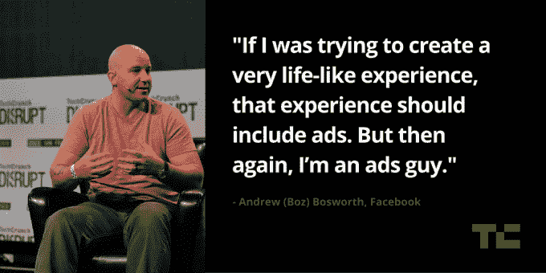

# 脸书的广告主管博兹宣布“点击发送商业信息”广告

> 原文：<https://web.archive.org/web/https://techcrunch.com/2015/09/22/facebooks-ad-chief-boz-announces-click-to-message-a-business-ads/>

# 脸书的广告主管博兹宣布“点击发送商业信息”广告

今天在 TechCrunch Disrupt SF 2015 上，脸书广告主管 Andrew“Boz”Bosworth 与 Josh Constine 坐下来讨论社交网络上的广告状况。

Boz 从讨论即时文章开始，并强调如何构建该功能来改善传统上需要等待 6-8 秒才能加载内容的用户体验。

当被问及该服务是否真的会增加回头客时，他说该产品仍处于早期阶段，这是他们未来有可能改进的领域。他提到了像增加循环这样的事情，这将有助于保持收视率。

然后话题转移到了手机上。博兹说，向移动的“转移”已经结束，脸书现在正处于移动的增长时代。然而，该公司现在实际上看到了桌面趋势在某些市场的增长，并且仍然坚持自己作为一个平台的绝对地位。

在讨论消息时，Boz 说在美国以外有一些有趣的移动使用趋势，比如西班牙的用户使用 WhatsApp 预订餐厅。他说，这对消息领域的人来说是一个巨大的机会，尤其是在简化移动商务方面。

具体到脸书，Boz 说，通过 Pages 发送的消息逐年增加了一倍，一些公司告诉脸书，它现在是他们接收客户服务请求的主要场所。

有趣的是，Boz 还表示，该公司已经推出了“点击信息”广告，让企业创建一个可以吸引客户开始对话的广告。

Constine 最后向 Boz 询问了脸书过去如何鼓励企业购买“赞”，现在已经被该公司试图直接推送新闻订阅广告所取代。

Boz 表示，在过去的五年中，监控参与度的环境和技术已经发生了变化，该公司认为，企业仍然可以从这些额外的喜欢中受益。

他最后讨论了虚拟现实广告，表示这可能是迄今为止创造最逼真的广告体验的方式。

