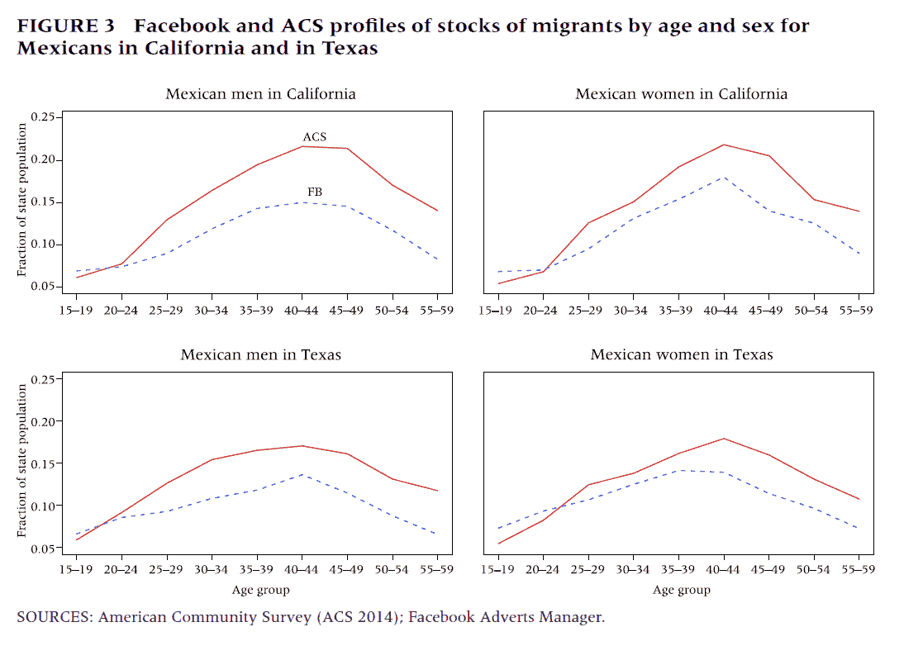

# 脸书的广告定位工具可能是人口普查数据的宝贵补充 

> 原文：<https://web.archive.org/web/https://techcrunch.com/2017/10/12/facebooks-ad-targeting-tools-could-be-a-valuable-supplement-to-census-data/>

官方人口普查表格是全国人口统计数据的宝贵来源，但对于发生在几周或几个月而不是几年的趋势，它们有点缺乏。但是一项新的研究表明，脸书用于定向广告的类似数据可以帮助填补这个盲点。

华盛顿大学的社会学家 Emilio Zagheni 研究了这种可能性，在这种情况下，特别是关于美国的移民以及他们在各州之间的流动。他之前使用 Google+和其他基于互联网的指标研究过这个话题。

假设您想知道东非移民人口是否倾向于在城市、郊区或农村地区定居。人口普查过程每十年完成一次，这对于观察短期趋势来说实在是太长了，例如，经济复苏或重要法案。

但是，通过使用，或者更确切地说是战略性地使用脸书的广告管理工具，人们可以找到相当准确和最新的信息，例如，索马里移民到芝加哥市区和城外的信息。脸书已经提取了所有这些数据——为什么不用呢？

当然，这些数据并不是全貌。你不会在芝加哥地区找到所有的索马里人，只有脸书用户选择准确地报告他们的原籍国和当前位置。和人口普查局美国社区调查的数据相比，不太靠谱。但是它仍然是有价值的，Zagheni 认为。

"有偏倚的大样本好，还是无偏倚的小样本好？"他在 [UW 新闻发布会上问道。“美国社区调查是一个更能代表底层人群的小样本；脸书是一个非常大的样本，但不具有代表性。这个想法是，在某些情况下，美国社区调查的样本太小，不能说明什么重要的事情。在其他情况下，脸书样本过于偏颇。”](https://web.archive.org/web/20221025223024/http://www.washington.edu/news/2017/10/12/using-facebook-data-as-a-real-time-census/)

“通过这个项目，我们的目标是两全其美，”他继续说道。“通过用美国社区调查校准脸书数据，我们可以纠正偏差并获得更好的估计。”

脸书趋势反映了人口普查数据，但倾向于低估数字。

有了可靠但稀缺的基本事实数据和嘈杂但大量的补充数据，你可以拼凑出比以前更精确的画面——只要你小心控制这些偏差。来自其他社交网络的数据也可以被引入，以平衡事情。

Zagheni 和他的团队希望完善论文中展示的观点，以便它们可以应用于发展中国家等地方，在这些地方，像脸书这样的自我报告数据很容易获得，但可靠的政府数据却不容易获得。一份“足够好”的人口和近期趋势草图可能有助于优先考虑基础设施投资或指导援助。

不幸的是，整个事情需要研究人员滥用广告系统来暴露数据——当然脸书可以为研究目的提供更好的访问。我问该公司这是否有可能。扎格尼似乎喜欢这个主意。

他在给 TechCrunch 的一封电子邮件中写道，“我当然希望将来有机会在这一研究领域与脸书直接合作。”。

描述该小组工作的论文发表在最新一期的《人口与发展评论》杂志上。