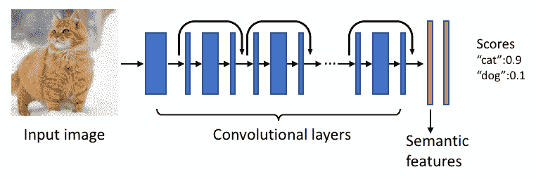

# 脸书的人工智能开启了根据照片内容搜索照片的能力

> 原文：<https://web.archive.org/web/https://techcrunch.com/2017/02/02/facebooks-ai-unlocks-the-ability-to-search-photos-by-whats-in-them/>

该公司的 Lumos 计算机视觉平台最初用于改善脸书社区视觉障碍成员的体验，现在为所有用户提供图像内容搜索。这意味着你现在可以用描述照片内容的关键词在脸书上搜索图片，而不是受标签和说明的限制。

为了完成这项任务，脸书对数千万张照片训练了一个永远流行的深度神经网络。在这方面，脸书是幸运的，因为它的平台已经容纳了数十亿张带标题的图片。该模型本质上以一定的概率将搜索描述符与从照片中提取的特征进行匹配。

在将术语与图像进行匹配之后，该模型使用来自图像和原始搜索的信息对其输出进行排序。脸书还增加了权重，以优先考虑照片结果的多样性，这样你就不会因为变焦和角度的微小变化而得到 50 张相同的照片。实际上，所有这些应该会产生更令人满意和相关的结果。

最终，脸书将把这项技术应用到其不断增长的视频语料库中。这既可以用于搜索朋友的视频以找到她吹灭生日蛋糕上蜡烛的确切时刻的个人环境，也可以用于商业环境。后者可能有助于提高脸书来自新闻源的潜在广告收入上限。

从照片和视频中提取内容为提高针对性提供了一个原始的载体。最终，看到一个完全集成的系统会很好，在这个系统中，人们可以提取信息，比如在视频中搜索你真正喜欢的衣服，并将其与市场上的某样东西联系起来，甚至直接将你与广告合作伙伴联系起来，以改善客户体验，同时保持收入增长。

物体识别工作的基本结构

## 应用 Lumos 帮助视障人士

随着今天新的图像内容搜索功能，脸书正在更新其原有的[自动替代文本](https://web.archive.org/web/20230315211555/http://newsroom.fb.com/news/2016/04/using-artificial-intelligence-to-help-blind-people-see-facebook/)工具。当脸书去年 4 月发布该工具时，视障用户第一次可以利用现有的文本到语音转换工具来理解照片的内容。该系统可以告诉你一张照片包含一个舞台和灯光，但它不太擅长将动作与物体联系起来。

一个脸书团队通过煞费苦心地给从平台上下载的 13 万张照片贴上标签，解决了这个问题。该公司能够训练一个计算机视觉模型来识别照片中发生的动作。现在你可能会听到“人们在舞台上跳舞”，这是一个更好的，有语境的描述。

## 应用计算机视觉竞赛

脸书并不是唯一一个将最新的计算机视觉技术应用于现有产品的人。Pinterest 的视觉搜索功能不断得到改进，用户可以通过图片中的物体来搜索图片。这使得照片具有互动性，更重要的是，这使得照片可以商业化。

另一方面，谷歌[去年秋天开放了自己的图像字幕模型](https://web.archive.org/web/20230315211555/https://techcrunch.com/2016/09/22/google-open-sources-image-captioning-model-in-tensorflow/)，该模型既能识别物体，又能对动作进行分类，准确率超过 90%。围绕 TensorFlow 的开源活动帮助该框架获得了突出地位，并在机器学习开发者中非常受欢迎。

脸书专注于让机器学习易于整个公司的团队整合到他们的项目中。这意味着改进公司通用学习流程的使用。

“我们目前每月在 FBLearner Flow 上运行 120 万次人工智能实验，这是我们一年前运行的六倍，”脸书应用机器学习总监华金·基诺内罗·坎德拉说。

Lumos 建立在 FBLearner Flow 之上。它已经被用于 200 多个视觉模型。除了图像内容搜索，工程师们还使用这个工具来对抗垃圾邮件。