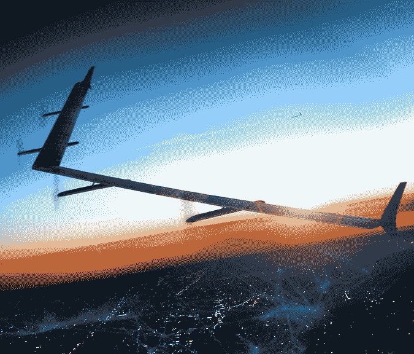

# 脸书的 Aquila 无人机将用激光传输互联网接入技术

> 原文：<https://web.archive.org/web/https://techcrunch.com/2015/03/26/facebooks-aquila-drone-will-beam-down-internet-access-with-lasers/>

# 脸书的 Aquila 无人机将用激光传输互联网接入

在旧金山梅森堡举行的 F8 会议的第二天，脸书宣布了它计划用来向全世界数十亿人传送互联网的第一个硬件。

该无人机代号为 Aquila，翼展与波音 767 相当，但使用轻质材料，重量轻于一辆汽车。

在今天的主题演讲中，脸书还宣布开源其开发工具 [React Native](https://web.archive.org/web/20230209175714/https://techcrunch.com/2015/03/26/facebook-open-sources-react-native/) ，并展示了能够识别和理解视频和文本内容含义的[新人工智能系统](https://web.archive.org/web/20230209175714/https://techcrunch.com/2015/03/26/a-i-book)。

Aquila 必须非常轻，因为它将利用太阳能一次在空中保持长达三个月的时间。仅仅在空中停留那么长时间是一个挑战，但脸书也将使用激光将互联网接入推广到 6 万到 9 万英尺以下的人，并保持无人机之间的通信，以维持更广泛的区域覆盖。

Aquila 是我们看到的第一个完整的概念，来自脸书从英国 Ascenta 招聘的工程师，大约一年前的今天公布。脸书表示，它将于今年夏天开始试飞，并在未来几年内进行更广泛的推广。

