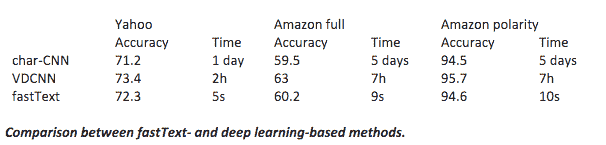

# 脸书人工智能研究实验室在 GitHub TechCrunch 上发布开源 fastText

> 原文：<https://web.archive.org/web/https://techcrunch.com/2016/08/18/facebooks-artificial-intelligence-research-lab-releases-open-source-fasttext-on-github/>

# 脸书人工智能研究实验室在 GitHub 上发布开源 fastText

每天，数十亿条内容在脸书上被分享。为了跟上数据，脸书一直在使用各种工具对文本进行分类。传统的分类方法，如深度神经网络是准确的，但有严格的训练要求。

为了既准确又容易地分类，脸书的人工智能研究(FAIR)实验室开发了 fastText。今天，fastText 正在开源，因此开发者可以在任何地方实现它的库。

FastText 通过单词包[和子单词信息](https://web.archive.org/web/20230210113918/https://arxiv.org/pdf/1607.04606v1.pdf)等技术支持文本分类和学习单词向量表示。基于 skip-gram 模型，单词被表示为字符 n-gram 的包，向量表示每个字符 n-gram。

脸书大学的作者 Armand Joulin、Edouard Grave、Piotr Bojanowski 和 Tomas Mikolov 在一篇文章中说:“为了有效处理具有大量类别的数据集，fastText 使用了分层分类器，其中不同的类别被组织在一棵树中，而不是一个平面结构(想想二叉树而不是列表)。”

对于那些人工智能较低的人来说，单词包过程很快，因为它本质上忽略了词序，而是专注于单词的出现。“单词”[在多维空间](https://web.archive.org/web/20230210113918/https://www.youtube.com/watch?v=dkPZXMonTLA)中表示，线性代数用于计算查询和单词分类集之间的关系。请记住，当我们输入计算机文本时，我们是从零开始。对成年人来说，语法是直观的——我们知道单词是什么，它们在哪里结束，从哪里开始。计算机可以处理最复杂的计算挑战，但却很难区分“我爱 TechCrunch”和“CrunchLove iTech”。像这样的方法本质上采取了一个定性分析问题，并通过添加统计数据迫使其定量化。

这些技术使得 fastText 比传统的深度学习方法更快。脸书制作了这张漂亮的对比图表，向我们展示了并排的准确性。

FastText 不仅限于英语，还可以使用其他语言，包括德语、西班牙语、法语和捷克语。

本月早些时候，脸书[在其新闻订阅中实现了一个反点击诱饵算法](https://web.archive.org/web/20230210113918/https://techcrunch.com/2016/08/04/facebook-clickbait/)。虽然该算法非常复杂，并且专注于行为标识符和语言，但 fastText 使开发人员能够自己创建类似的工具。

不是吹牛，但脸书说新的开源技术可以“使用标准的多核 CPU 在不到 10 分钟内训练超过 10 亿个单词。fastText 还可以在不到五分钟的时间内对 30 多万个类别中的 50 万个句子进行分类。”#亨伯拉格

从今天开始，脸书的快速文本将可以从他们的 GitHub 获得[。](https://web.archive.org/web/20230210113918/https://github.com/facebookresearch/fastText)