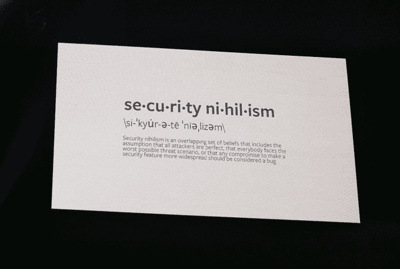
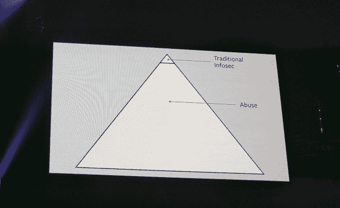

# 脸书首席安全官:安全行业需要变革 

> 原文：<https://web.archive.org/web/https://techcrunch.com/2017/07/26/facebooks-cso-the-security-industry-needs-to-change/>

每年夏天，西装革履和/或身着黑衣的安全极客都会成群结队地来到阳光普照的超现实主义城市拉斯维加斯参加“黑客夏令营”:为期一周的各种安全和黑客会议，其中最有趣的一个叫做“黑帽”(Black Hat)，门票 2800 美元。今天，脸书的民间社会组织阿历克斯·斯塔莫斯发表了主题演讲。他开始称信息安全社区为一个“家庭”——然后发表了一个感觉有点像干预的演讲。

他在这件事上非常圆滑。他实际上从未说过，信息安全社区作为一个郁郁寡欢、虚无主义的青少年，已经集体度过了足够长的时间，对世界其他地方充满了被误导的愤怒的蔑视，现在是它成长、走出地下室并最终开始与他人友好相处并至少培养出一丝同情、同情和谦逊的时候了。但那确实是我的收获。

这一点尤其重要，因为当然，信息安全*事关*。数据泄露。电子邮件黑客。关键基础设施中的漏洞。民主受到政治“信息操作”的威胁，至少可以想象，受到妥协的投票系统的威胁。信息安全至少每周都会成为头条新闻，有新闻价值的违规事件的频率和规模都在增加。事实证明，我们轻蔑的虚无主义信息安全青少年拥有一种超能力，我们整个社会的相互关联的方面都依赖于这种超能力。成长不仅对他们和他们的家庭有好处，对*每个人都很重要。*

这种青少年时代在今天是如何表现的？顺便提一下，斯塔莫斯——一个著名的长期隐私和安全倡导者——很好地总结了这一点:

最重要的是，他观察到安全社区花费了大量的时间和精力来找出复杂的、错综复杂的漏洞，而对实际伤害用户的东西往往只是口头上说说而已。其中绝大多数是滥用，即以技术上正确的方式使用系统造成的损害，如垃圾邮件、doxxing、DDoSing、dogpiling 等。—

—即使是由行业目前认为的漏洞造成的各种伤害，也大多是由简单直接的问题造成的，例如重复使用的密码、未打补丁的系统、引诱用户点击附件，而不是电影《吉布森》中的概念，即一些蒙面黑客或有组织的国家团队利用零日漏洞通过网络安全层。

他还呼吁行业内更大的同理心和多样性，脸书正在尽最大努力实现斯塔莫斯所说的:脸书的安全管理/领导团队中几乎有一半是女性，他们正在与 CodePath 合作，在六所机构提供网络安全课程——纽约城市学院、霍夫斯特拉大学、梅里特学院、密西西比州立大学、加州州立大学圣贝纳迪诺分校和弗吉尼亚理工大学——这些机构的学生群体比信息安全行业更加多样化(诚然这并不难。)

“安全人员并不聪明，我们也不比其他任何人聪明……我们不会用病毒来摆脱目前的局面，”斯塔莫斯说。(基本上被业内所有人当成了现在的情况并不好。)“我希望我们像在舞台上进行精彩的演示一样，在如何消除整个类别的漏洞方面投入更多的思考。”希望未来成熟的 infosec 社区能够做到这一点。

* * *

当然，这当然是因为我自己的偏见，也可能是因为黑帽本身已经不再是青少年了——这已经是它的第 20 个年头了。