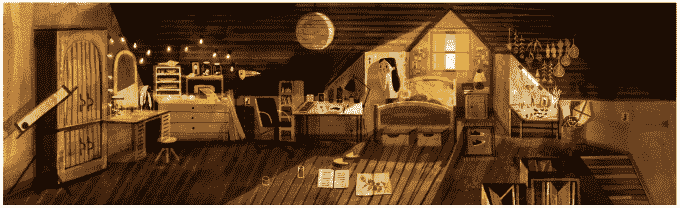

# 脸书的前 Oculus Story Studio 团队还没有完成

> 原文：<https://web.archive.org/web/https://techcrunch.com/2017/12/06/facebooks-former-oculus-story-studio-team-isnt-done-quite-yet/>

今天，圣丹斯电影节公布了下个月的阵容。再次入选的还有电影节的新前沿项目(New Frontiers program)，该项目提供虚拟现实内容，一部不太可能的电影《墙中之狼》(T0)也榜上有名。

虚拟现实可能不像过去几年那样是硅谷的热门技术，但在电影虚拟现实社区中仍然有许多里程碑，他们仍然认为虚拟现实在未来娱乐中的主导地位是一个何时而不是如果的问题。

今年早些时候，脸书的 Oculus Story 工作室宣布将在[突然关闭](https://web.archive.org/web/20221025222644/https://beta.techcrunch.com/2017/05/04/facebook-shutters-oculus-story-studio-original-vr-content-division/)，50 名员工将被解雇，他们的主要项目*墙里的狼*将被关闭。

这对于 VR 社区中的许多人来说是一个重大的打击，他们钦佩艾美奖获奖工作室所建立的许多开创性工作。工作室的最新项目*《亲爱的安吉丽卡*，是我看过的媒体中最感人的电影之一，感人的叙事和艺术风格的产物，只有在虚拟现实中才有可能。

所有这一切都没有阻止 Oculus Story Studio 的核心员工团队继续追求他们投入如此多工作的项目最终会重见天日的希望。在 Oculus 的支持下，该团队在过去的几个月里一直躲在旧金山 Mission 社区的工作室里，为圣丹斯电影节做准备。

这部由皮特·比灵顿执导的电影是根据尼尔·盖曼的故事改编的，讲述了一个小女孩发现藏在她房间墙壁里的东西的故事。你可以在这里看到这部电影的设计。

Oculus Story Studio 一直希望做的不仅仅是创造美丽的东西，他们在 VR 领域所做的工作似乎总是走在曲线的前面，并且特别善于预测将分散在 VR 创作中的趋势。与*亲爱的安吉丽卡*一起，团队建立了一个管道，允许视觉效果完全在虚拟现实中设计；随着*狼在墙内，*工作室正在仔细研究虚拟现实电影制作如何与人工智能技术互动，以使角色和观众建立更紧密的关系。他们正在与一家沉浸式戏剧公司合作，设计他们如何与空间互动。

> 在电影中，观众第一次被塑造成一个角色，并将帮助露西克服她面前的障碍。这是一个关于恐惧本质的 VR 寓言。这也是一个关于家庭的故事。我们族群中最年轻的成员往往对事物看得最清楚，但他们也最容易被忽视。露西需要我们的帮助来说服她的家人，房子里有很大的问题。

目前还不清楚没有 Oculus 的 Oculus Story Studio 中才华横溢的乌合之众创作者的未来会是什么样子，但该团队详细介绍了他们将很快分享更多内容。《墙里的狼》将于下月晚些时候在圣丹斯首映。