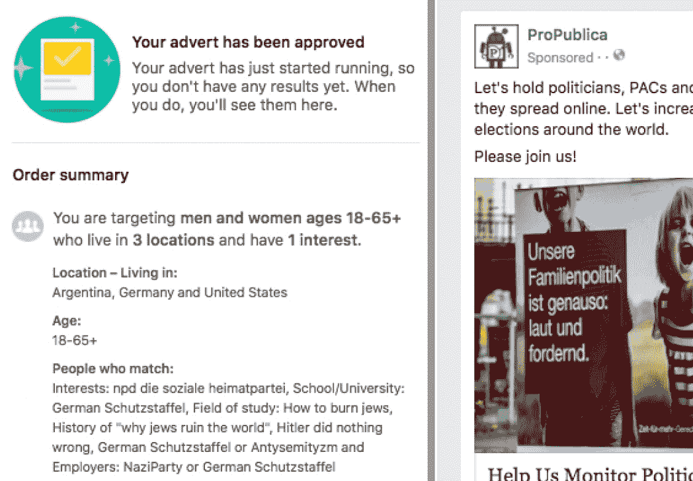

# 脸书的一代“仇恨犹太人”和其他广告类别提示系统检查

> 原文：<https://web.archive.org/web/https://techcrunch.com/2017/09/14/facebooks-generation-of-jew-hater-and-other-advertising-categories-prompts-system-inspection/>

**更新**:脸书已经禁止[在其广告系统中使用用户报告的有问题的字段](https://web.archive.org/web/20230306054056/https://techcrunch.com/2017/09/15/facebook-halts-ad-targeting-of-profile-details-abused-by-users/)，直至另行通知。

**更新 2** :谷歌也在自己的广告定位系统中禁用了类似的功能。(详情如下)

脸书根据在用户档案中观察到的情况，自动生成广告客户可以锁定的类别，如“慢跑者”和“活动家”。通常这不是问题，但 ProPublica 发现脸书已经[产生了反犹太人的类别，如“仇恨犹太人”和“希特勒没做错什么”，](https://web.archive.org/web/20230306054056/https://www.propublica.org/article/facebook-enabled-advertisers-to-reach-jew-haters)可以作为广告的目标。

这些类别很小——总共只有几千人——但它们的存在是为了官方锁定目标(进而为脸书带来收入)，而不是被标记出来，这一事实引发了人们对该平台上仇恨言论控制的有效性——甚至是存在性——的质疑。虽然肯定有无数的帖子被成功标记和删除，但失败往往是显而易见的。

ProPublica 根据提示采取行动，发现当他们的研究人员在广告类别搜索框中输入“犹太人 h”时，少数类别会自动完成。为了验证这些是真的，他们把一些捆绑在一起，买了一个针对他们的广告，这个广告真的上线了。

 接到警报后，脸书删除了这些类别，并发表了一份听起来耳熟的措辞强硬的声明，表明该公司对仇恨言论的态度是多么强硬:

> 我们不允许在脸书发表仇恨言论。我们的社区标准严格禁止基于受保护的特征(包括宗教)攻击他人，我们禁止广告商基于宗教和其他属性歧视他人。然而，有时我们的平台上会出现违反我们标准的内容。在这种情况下，我们已经删除了相关的目标字段。我们知道我们有更多的工作要做，所以我们也在我们的产品和审查过程中建立新的护栏，以防止类似这样的问题在未来发生。

出现这个问题是因为人们在他们的“研究领域”类别中列出了“仇视犹太人”之类的词，这当然是猜测一个人可能感兴趣的领域的好方法:气象学、社会科学等等。尽管这个数字非常小，但这不应该成为广告商寻求接触非常有限的群体的障碍，比如稀有品种狗的主人。

但是，尽管算法可能很难确定“犹太教历史”和“为什么犹太人毁灭世界的历史”之间的区别，但脸书似乎真的有责任确保算法*做出这一决定。至少，当类别具有潜在的敏感性，涉及宗教、政治和性等个人数据时，人们会认为它们在提供给潜在的广告商之前会经过人类的验证。*

脸书告诉 TechCrunch，它现在正在努力防止人口特征中的这种攻击性条目作为可寻址类别出现。当然，后见之明是 20/20，但是真的——只有*现在*它在这么做？

采取措施是好事，但很难相信没有某种标记列表来监视明显违反禁止仇恨言论规定的类别或团体。我向脸书询问了更多细节，如果有回音，我会更新帖子。

正如哈佛大学的约书亚·本顿在 Twitter 上指出的那样，人们也可以针对同样的群体搜索谷歌广告词:

我觉得这是不同的，虽然仍然令人不安。你可以把无意义的词放入这些关键词框，它们会被接受。另一方面，如果你觉得“仇恨犹太人”不够宽泛，谷歌确实会建议相关的反犹太短语:

对我来说，脸书机制似乎更像是脸书从现有的、准批准的(即未被标记的)个人资料中选择的，它认为这些资料符合你正在寻找的东西，而谷歌的机制则是一个更无意义的查询关联——它删除东西的余地更小，因为它不能很好地不允许人们搜索种族诽谤等内容。但显然没那么简单。老实说，我不太确定该怎么想。

谷歌广告的 SVP，斯里达尔·拉马斯瓦米，在禁用了一些攻击性的广告建议后发表了以下声明:

> 我们的目标是防止我们的关键词建议工具做出攻击性的建议，并阻止任何攻击性广告的出现。当广告商的广告具有攻击性并因此被拒绝时，我们有语言通知他们。在这种情况下，广告没有与这些关键词中的绝大多数发生冲突，但我们没有抓住所有这些攻击性的建议。这还不够好，我们也没有找借口。我们已经关闭了这些建议和任何通过的广告，并将更加努力地防止这种情况再次发生。

冒犯性的术语将不会看到谷歌的建议，尽管不清楚谷歌是如何得出它认为冒犯性的术语或短语集的。