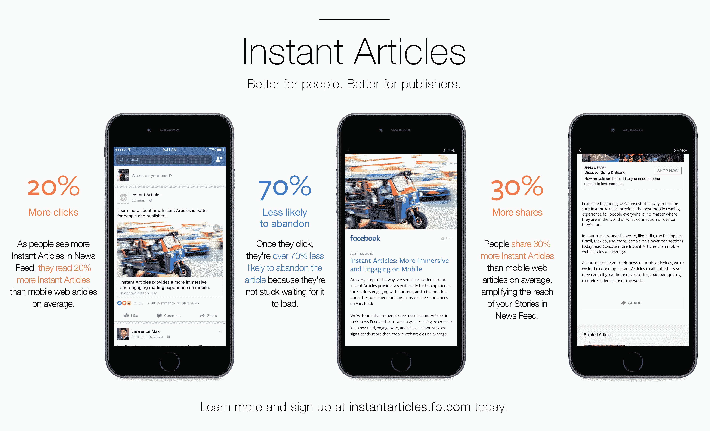

# 脸书的即时文章现在对所有出版商开放

> 原文：<https://web.archive.org/web/https://techcrunch.com/2016/04/12/facebooks-instant-articles-is-now-open-to-all-publishers/>

# 脸书的即时文章现在对所有出版商开放

正如之前[宣布](https://web.archive.org/web/20230323205430/https://media.fb.com/2016/02/17/opening-up-instant-articles/)一样，脸书[今天](https://web.archive.org/web/20230323205430/https://media.fb.com/2016/04/12/instant-articles-now-open/)向所有开发者开放其[即时文章](https://web.archive.org/web/20230323205430/http://instantarticles.fb.com/)格式。通过使用即时文章，出版商可以向脸书移动用户展示快速加载且几乎不受干扰的帖子视图，同时还可以向他们展示少量自己的广告(或使用脸书的观众网络将内容货币化)，并通过 Adobe Analytics、Chartbeat、comScore 等工具来衡量浏览量。

到目前为止,《即时通讯》只对少数几家出版商开放。

像谷歌的 AMP 一样，即时文章本质上是一个 HTML5 文档，它使用了几个特定的标签[。发布者可以添加文本和图像，还可以添加幻灯片、音频字幕、地图、视频，当然还有对脸书赞和评论的支持。](https://web.archive.org/web/20230323205430/https://developers.facebook.com/docs/instant-articles/guides/articlecreate)

“脸书的目标是将人们与他们最关心的故事、帖子、视频或照片联系起来，”该公司表示。“开放即时文章将允许任何出版商向世界各地的人们讲述精彩的故事，这些故事可以快速下载。有了即时文章，他们可以做到这一点，同时保持对体验、广告和数据的控制。”

现在已经有一些用于 [WordPress](https://web.archive.org/web/20230323205430/https://github.com/whyisjake/Simple-Instant-Articles-for-Facebook) 和 Drupal 等其他 CMS 系统的插件可以自动生成正确的即时文章提要。

出版商现在也可以将原生广告作为即时文章发布，并通过应用不同的样式选项和添加赞助商标志，在视觉上将其与常规内容区分开来。

对于想要更深入地研究即时文章的出版商来说，ShareThis 今天宣布，它现在为即时文章标题提供 [A/B 测试](https://web.archive.org/web/20230323205430/http://www.sharethis.com/SocialAB/index.html)。