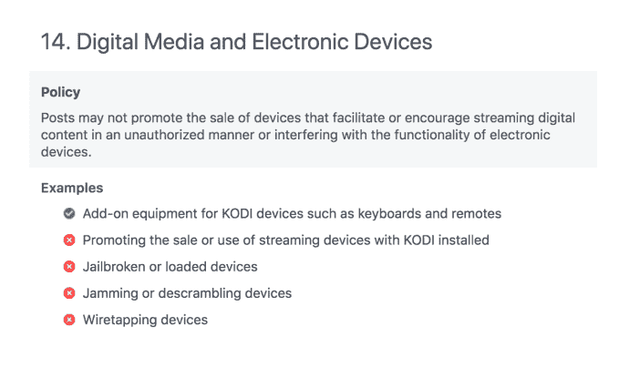
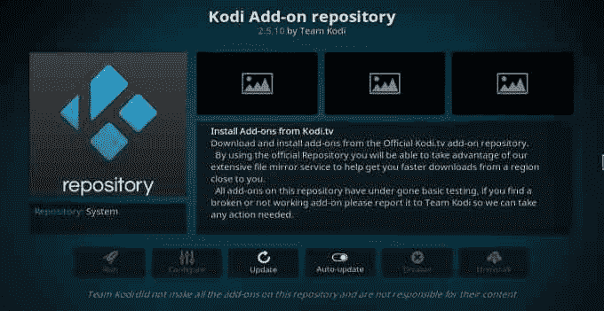
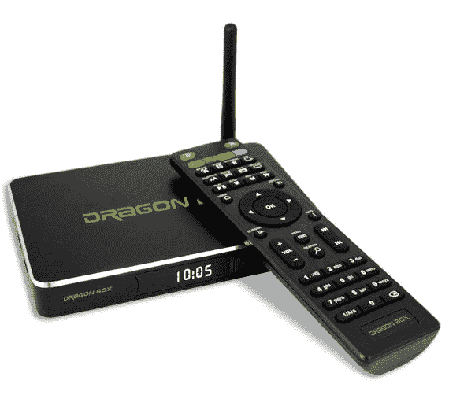

# 脸书的 Kodi box 禁令并不新鲜

> 原文：<https://web.archive.org/web/https://techcrunch.com/2018/08/17/facebooks-kodi-box-ban-is-nothing-new/>

[根据](https://web.archive.org/web/20230217185339/https://www.techdirt.com/articles/20180814/07250740423/facebook-bans-promotion-kodi-boxes-even-if-theyre-perfectly-legal.shtml)最近[的报道](https://web.archive.org/web/20230217185339/https://www.cordcuttersnews.com/facebook-bans-the-sale-of-kodi-boxes-jailbroken-streaming-players/)，脸书已经更新了其商业政策，明确禁止在其网站上销售 Kodi 盒子——即预装 Kodi 软件的设备，这些设备通常用于非法播放数字内容。然而，这项禁令并不是新的——脸书证实，自去年夏天以来，其 Kodi 盒子销售政策一直没有改变，其对外政策页面——被援引为新禁令的证据——在去年 12 月进行了更新。

不过，到目前为止，这些变化确实没有引起人们的注意。

这一政策变化最早由[脐带钳新闻](https://web.archive.org/web/20230217185339/https://www.cordcuttersnews.com/facebook-bans-the-sale-of-kodi-boxes-jailbroken-streaming-players/)报道，随后由 [TorrentFreak](https://web.archive.org/web/20230217185339/https://torrentfreak.com/facebook-bans-the-sale-of-all-kodi-boxes-legal-or-not-180813/) 和 [Techdirt](https://web.archive.org/web/20230217185339/https://www.techdirt.com/articles/20180814/07250740423/facebook-bans-promotion-kodi-boxes-even-if-theyre-perfectly-legal.shtml) 报道。

最初的报告声称，脸书在“禁止内容”下的“数字媒体和电子设备”列表中添加了一条新规则，特别提到了 Kodi 盒子。它说，脸书邮政“不得推销以授权方式促进或鼓励数字内容流动或干扰电子设备功能的设备。”

政策页面列举了几个例子来说明这意味着什么，包括窃听设备、干扰或解扰设备、越狱或加载设备，以及*“促进安装了 Kodi 的流媒体设备的销售或使用。”*(唯一允许的项目是“Kodi 设备的附加设备，如键盘和遥控器。”)

但是脸书说，禁止 Kodi 盒子并不是最近才实施的政策。

据脸书发言人表示，该公司去年夏天推出了一项新政策，禁止销售有助于或旨在用于未经授权的流媒体或数字内容访问的电子设备，包括 Kodi 盒子。这项政策自去年夏天以来一直没有改变，但其外部政策页面—[被各种报道的](https://web.archive.org/web/20230217185339/https://www.facebook.com/policies/commerce/prohibited_content/unauthorized_access_to_digital_media_or_interference_with_electronic_devices)引用——在 2017 年 12 月进行了更新，以提供更多说明性示例和有关其所有政策的更详细信息，包括与未经授权的流媒体设备相关的政策。

换句话说，自去年决定打击未经授权的流媒体设备以来，脸书一直在禁止 Kodi 盒子。只是现在才被注意到。

这一禁令影响了市场、买卖群和页面上商店区的所有帖子。

脸书解释说，当销售产品提到“Kodi”时，需要采取非常强有力的强制措施。

正如 Techdirt [指出的](https://web.archive.org/web/20230217185339/https://www.techdirt.com/articles/20180814/07250740423/facebook-bans-promotion-kodi-boxes-even-if-theyre-perfectly-legal.shtml)，这是有问题的，因为 Kodi 软件本身实际上是合法的。

然而，像 Dragon Box 或 SetTV 这样的设备制造商一直在使用开源的 Kodi 平台和其他插件，让消费者更容易侵犯版权。

脸书似乎明白 Kodi 软件并不违法，但它知道当“Kodi”出现在产品(如设备)列表中时，它通常是一种旨在规避版权的产品。该公司告诉我们，它的意图不是完全禁止 Kodi 软件，但是，它正在审查其指导方针和这些例子，以更密切地针对鼓励未经授权的流媒体设备。

这可能意味着，在某个时候，它不会完全禁止一款包含 Kodi 软件的设备，而是更多地关注销售中使用的其他术语，比如“完全加载”或对盒子提供的非法访问的某种描述。(脸书没有说可能会有什么变化。)

至于 Kodi，该公司表示脸书的举动不会影响他们。

“这对我们没有影响，因为我们不卖设备，”XBMC 基金会(Kodi)负责商业关系的基思·赫灵顿(Keith Herrington)说。

他说他的组织很想和脸书的人谈谈——因为他们从未接触过——以确保符合 Kodi 商标政策的设备不会被禁止。他补充说，亚马逊和易贝都曾在类似的政策上与 Kodi 合作。

“我们已经从易贝移除了数千台违反我们商标政策的设备，”Herrington 说。

目前还不清楚脸书的禁令执行得有多好——我自己也在脸书的一些团体中，那里的人们谈论如何越狱“火刑棒”,还包括越狱前出售这些火刑棒的人的帖子。(出于研究目的。*咳咳*。)

**行业严打不止脸书**

脸书不是唯一一家试图打击这些设备的公司。[网飞、亚马逊和主要电影公司正在起诉龙盒子](https://web.archive.org/web/20230217185339/https://variety.com/2018/digital/news/dragon-box-sued-netflix-amazon-universal-warner-bros-disney-paramount-1202660358/)，称其为盗版提供便利，让消费者可以轻松访问非法的电影和电视节目流。

2018 年 1 月，美国地方法院法官[对总部位于佐治亚州的机顶盒制造商 TickBox TV 下达了初步禁令](https://web.archive.org/web/20230217185339/http://www.latimes.com/business/hollywood/la-fi-ct-tickbox-studios-20180130-story.html)，该公司被主要工作室以及流媒体服务网飞和亚马逊起诉，罪名是从销售“Kodi boxes”中获利

谷歌已经从搜索的自动完成功能中移除了单词“kodi ”,以及其他与盗版相关的词汇。

最近，联邦通信委员会要求亚马逊和易贝停止销售假冒的付费电视盒子。联邦通信委员会在给亚马逊首席执行官杰夫·贝索斯和易贝首席执行官德文·维尼格的封[信中表示，这些盒子经常虚假地印有联邦通信委员会的标志，以使它们看起来合法，但实际上是用来延续“知识产权盗窃和消费者欺诈”。](https://web.archive.org/web/20230217185339/https://www.fcc.gov/document/comm-oriellys-52518-letter-ebay-and-amazon-re-set-top-boxes)

**为什么流媒体盗版越来越多**

Kodi 设备如此受欢迎是有原因的，这不仅仅是因为每个人都在为访问内容付费。

首先，非法播放流媒体的消费者没有什么后果——这不像以前 RIAA 起诉个人盗版音乐的时候。虽然有一些活动——例如，康卡斯特几年前[向 Kodi 用户发出版权侵权通知](https://web.archive.org/web/20230217185339/https://www.cordcuttersnews.com/comcast-starts-issuing-copyright-infringement-notices-to-kodi-users/)——但今天你基本上可以逃脱非法流媒体的惩罚。版权所有者目前专注于从源头上切断盗版——盒子制造商和实现销售的平台——而不是个人层面。

脐带切割的兴起也造成了一个高度分散的流媒体生态系统，从而加剧了这一问题。过去可以在单一有线电视或卫星电视订阅下获得的节目，现在分散在网飞、亚马逊、Hulu、Sling TV、HBO NOW 和其他脐带切割者使用的服务中。

客户显然愿意为其中的一些服务付费(主要是网飞，也可能是一两个其他的)，但大多数人无法负担每一项服务的订阅费用。当他们所追求的只是从一个电视网获得一个单一的节目时，他们肯定不想这样做。这是他们转向盗版的另一个原因。

最后，事实是，电影发行商几个月来一直不让他们的电影获得流媒体服务，从而产生了对非法下载和流媒体的需求。尽管最近几年上映窗口已经缩小了一些，但电影公司还没有完全接受[的想法](https://web.archive.org/web/20230217185339/http://fortune.com/2017/08/18/warner-bros-universal-apple-comcast-movie-theaters/)更小的窗口来迎合那些永远不会去电影院看电影的观众。当这些观众被挤出市场时，他们也会转向盗版。

最终，唱片行业适应了消费者对流媒体的渴望，Spotify 和 Apple Music 等服务应运而生。最终，流媒体服务可能也会降低盗版的吸引力。如果亚马逊渠道扩展到包括更多的附加产品，它可能会成为这里的一个关键角色。今天，它是唯一真正的单点电视服务。或许，这才是人们真正想要的，而不是薄薄的包裹。