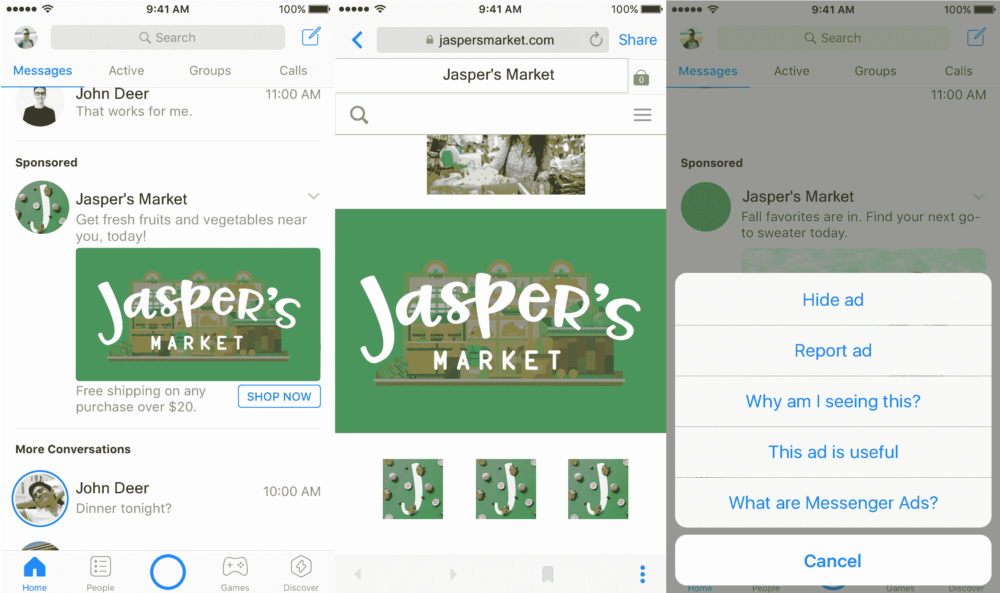

# 脸书的信使广告很糟糕，必须被销毁

> 原文：<https://web.archive.org/web/https://techcrunch.com/2017/07/11/facebooks-messenger-ads-are-bad-and-must-be-destroyed/>

当脸书从主应用程序中删除消息时，我当时就发誓再也不下载 Messenger 了。这是一个很容易兑现的承诺，尤其是当你试图使用这项服务时，他们引入了巨大广告占据你一半屏幕的可爱想法。

今天，脸书重新设计了它们，作为一个更大的展示活动的一部分——但是没有解决这些广告是不好的，应该被销毁的原因。

## 它们很大

广告可能像 FB 告诉我的那样是“动态的”，但是该死的，看看这些东西的*大小*。对于他们入侵的界面来说，它们实在是太大了，图像比设计中的任何其他元素都要大。即使在官方发布的视频和图片中，赞助部分也占据了三分之二的屏幕，你最好相信这是最好的情况。

 为什么这么大？广告部有没有说他们不能卖任何没有完全接管 app 的东西？在一开始就要求这么大的资产后，他们不想要求更小的资产吗？他们认为人们和广告人一样喜欢广告吗？

至少现在只有一个广告，而不是邀请你探索的一系列广告。我猜与旋转木马的互动糟透了——谁会认为，嗯，我的聊天订阅里广告不够多？

## 它们会中断用户体验

平心而论，再好的广告也会稍微打断用户的体验。但这太过分了。一打开应用程序，就在最常用的主界面中间轻拍一下:广告占据的屏幕比你打开应用程序访问的内容还要多。那是不能容忍的。

我问脸书的测试用户对这些广告有什么看法。一位代表告诉我，“在最初的测试中，我们密切关注人们的参与度，结果令人鼓舞……”并且“自从我们在澳大利亚和泰国开始测试以来，我们一直将人们的体验放在第一位，随着我们进一步推出 Messenger ads 测试，我们将继续优先考虑这一点。”

认为这些广告是把人们的体验放在第一位的想法当然是荒谬的。如果脸书这样做了，它就不会一开始就把 Messenger 从主应用程序中分离出来，更不用说让它背负巨大的广告负担了。

当我再次询问用户的反馈时，我没有得到任何回应。我还问用户是否可以期待只看一次广告，或者每隔几个线程看一次，或者其他——但是也没有这方面的信息。我们很快就会知道了，但我猜他们在这一点上保留了选择权。

有没有可能让广告与你的信息内容一起出现在手机屏幕上？当然可以！事实上，我敢打赌，脸书看了几个这样的设计，然后拒绝了它们。

## 它们无关紧要

当你在网上访问零售商时，你会看到一个弹出窗口，上面写着注册我们的电子邮件列表，你可以在首次购买时享受 10%的折扣。我没意见。当我在谷歌上搜索“充气床垫”时，我看到沃尔玛商品的赞助结果排在其他商品之前。我也没意见。当我在 Anandtech 上阅读一篇文章时，我看到了电源(嗯，还有烹饪频道)之类的广告。当然可以！

嗯，也许我可以用一个新的 NUC…

相对而言，所有这些广告都很好，因为它们有上下文。它们实际上与我正在寻找或感兴趣的东西有关，不需要令人毛骨悚然的跟踪！(尽管这很可能已经发生了。)

Messenger 的广告没有上下文。它们是大横幅广告，无论你打开应用程序做什么都会显示出来——无论如何，什么广告可能对“询问朋友他们在做什么”的用例有意义？一个也没有！

这些广告使用与其他脸书广告相同的目标定位——还没有窥探你的信息内容。因此，如果你喜欢一些零售商的网页，你可能会看到这些，以及相同类别的东西。我想这是一件好事，但是谁会突然决定浏览 Timberland 的男鞋，而不是回复一条消息，他们打开应用程序就是为了这样做的？

Messenger 并不像脸书那样是一种真正的“自由时间”体验——你有目的地使用前者，而无所事事地使用后者。广告必须迎合这一点，就像世界上任何其他地方一样:你在地铁墙上(你不得不坐着盯着看)看不到与广告牌上(你最多有两三秒钟，注意力在其他地方)相同的广告。

## 毁灭他们和/或让他们毁灭自己

脸书靠广告收入生存，但它也对不起作用的东西做出反应。这些广告还在测试中，尽管像这样的公开声明通常意味着他们已经走了很远——而不是公司可能会或可能不会遵循的随机玩笑。我的意思是，在这一点上，广告是一个保证，你不能逃避:

但是如果你不想让*巨大的、侵扰性的*广告*在你的 Messenger 应用中占据显著位置*，就不要碰它们。使用右上角的小圆点菜单隐藏广告。不要通过选择“这个广告是有用的”来鼓励他们谁会这么做？！

广告是互联网上的付费方式，包括 TechCrunch，所以我并不主张消除它或完全屏蔽它。但是糟糕的广告体验会破坏一个像 Messenger 这样完美的应用程序。消息传递是一种个人的、有目的的使用案例，这些广告是一种糟糕的赚钱方式。