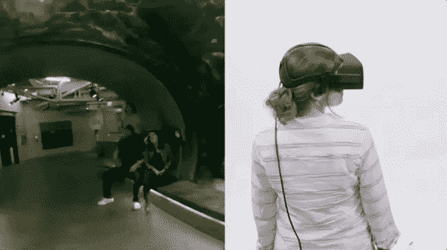
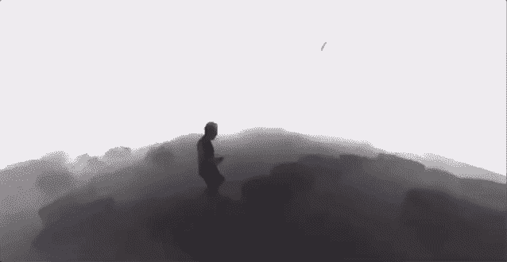

# 脸书将授权其新的 360 摄像机在六个自由度内进行拍摄 

> 原文：<https://web.archive.org/web/https://techcrunch.com/2017/04/19/facebooks-new-360-cameras-that-capture-in-six-degrees-of-freedom-will-be-licensed/>

# 脸书将授权其新的 360 摄像机，捕捉六个自由度

在脸书 F8 会议的第二天，脸书首席技术官迈克·斯科洛普夫展示了两款新的 360 摄像机的设计，该公司将帮助推向市场。x24 有 24 个摄像头，它的弟弟 x6 有 6 个摄像头，每个摄像头都可以在 6 个自由度上捕捉更身临其境的 360°内容。脸书计划授权这两款相机的设计，以选择商业合作伙伴，并在今年晚些时候上市。

x24 的原型在脸书的 404 区，结合了前视红外相机系统和脸书的专有架构。能够以六个自由度(6DoF)拍摄减少了传统上创建 360°视频所需的大量工作，观看者可以向各个方向倾斜他们的头部，而不会牺牲给定镜头的可信度。

这个概念的想法，有时被称为体积捕捉，一段时间以来被认为是虚拟现实的一个重要里程碑。像 [Lytro](https://web.archive.org/web/20221013005451/https://beta.techcrunch.com/2017/02/15/lytro-pursues-360-degree-video-and-cinematic-tools-with-60m-series-d/) 这样的初创公司一直押注于光场来完成这项工作，而 [8i](https://web.archive.org/web/20221013005451/https://beta.techcrunch.com/2015/10/14/8i-raises-13-5m-to-chase-the-human-side-of-virtual-reality/) 则采取了软件方法。相反，脸书采取了一种稀疏镜头定向的方法，避免了复杂的钻机在一起。

“不幸的是，捕捉完整的 6-DoF 360 视频需要更复杂的硬件设置，如相机阵列或光场相机，这对于新手用户来说是负担不起的，也不容易使用，”Adobe 的一个研究小组在最近的一篇论文中说。

在像素级别捕捉深度信息的好处是，它可以实现有趣的后期制作视频掩蔽，创作者可以将视频背景中的山脉替换为海滩。

这些新相机建立在最初的环绕声 360 的基础上，看起来也很棒。旧的环绕似乎从《盗梦空间》结尾的旋转顶部获得了灵感，但 x24 和 x6 更小、简单的球形设计正是你想要的未来科技的熟悉和受欢迎的外观。

脸书的工程总监布莱恩·卡布拉尔(Brian Cabral)解释说:“我们对生态系统和相机本身所做的一部分工作是，向内容创作者提供这些工具，以便他们可以开始开发这种艺术语言。”。

启动一个社区是一项艰巨的工作，但脸书意识到，从 News Feed 360 视频到 Oculus 本身，一切的成功都取决于内容创作者的生态系统。为此，脸书正在与后期制作公司和 VFX 公司合作，包括 Adobe、Otoy、Foundry、Mettle、DXO、Here Be Dragons、Framestore、Magnopus 和 The Mill。