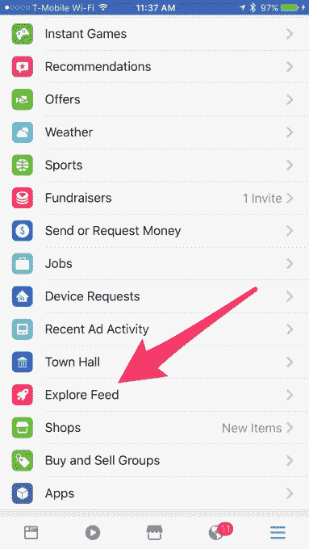

# 脸书的新“探索订阅”进入了应用程序的主导航 

> 原文：<https://web.archive.org/web/https://techcrunch.com/2017/07/14/facebooks-new-explore-feed-makes-its-way-to-the-apps-main-navigation/>

今年早些时候，[脸书被发现在测试一种新的新闻源](https://web.archive.org/web/20221205130813/https://beta.techcrunch.com/2017/03/29/facebook-tries-a-second-news-feed-headed-by-a-rocket-ship-icon/)——这种新闻源旨在帮助你发现社交网络上的内容，而不仅仅是朋友的帖子和你已经关注的页面。在测试期间，可以通过“火箭船”图标下的脸书应用程序获得该提要——这似乎让用户感到困惑，他们不明白该提要的目的。

现在，这种替代提要出现在脸书的“更多”菜单下，简单地命名为“探索提要”(早在今年年初，iOS 上的一个[早期测试](https://web.archive.org/web/20221205130813/https://geek.ng/2017/01/facebook-adds-explore-tab-ios-app.html)就给这个 feed 贴上了“探索”的标签，显然这个名字已经被沿用下来了。)

“更多”菜单是今天脸书稳步推出新功能的地方，随着社交网络扩大到更像一个在线门户，将你连接到自己墙内的资源，这样你就不会转向谷歌、网络或其他移动应用程序。

例如，这个菜单现在是像[天气](https://web.archive.org/web/20221205130813/https://beta.techcrunch.com/2017/02/08/facebook-can-now-replace-your-weather-app/)，工作，游戏，体育，筹款，一个“寻找 Wi-Fi”实用程序等等的家。这里也是脸书推出其政府关注的市政厅特色节目以及其新的 Uber Eats 和无缝竞争对手[订餐](https://web.archive.org/web/20221205130813/https://beta.techcrunch.com/2017/05/19/facebook-rolls-out-a-new-order-food-option-in-its-main-navigation/)(我们应该注意的是，棒约翰本周刚刚加入)的地方。)

探索频道出现在这一部分暗示了脸书更大范围的展示计划，而不是一个小实验。

但是脸书说，尽管这个位置在脸书的主要航道上，它仍然被认为是一次测试。

一位发言人告诉 TechCrunch:“我们正在测试流行文章、视频和照片的补充内容，根据每个人可能感兴趣的内容为他们定制。”“我们听到人们说，他们想要一种简单的方式来探索他们尚未接触的新内容。”

Explore Feed 的目标是将用户与脸书更广泛的新闻和信息网络联系起来。feed 本身由你尚未关注的来源的帖子、文章、照片和视频组成，比如脸书页面或新闻机构的帖子。

然而，这不仅仅是一个随机的选择。

Explore Feed 由来自脸书页面的内容组成，这些内容与你已经喜欢的内容相似，也包括受朋友欢迎的内容，例如，你网络中的许多人正在观看的视频。

一段时间以来，脸书一直在研究一种方法，以更好地利用其对用户不同方式的喜好和兴趣的深刻理解，这在很大程度上有助于增加用户在网站上的时间，从而提高脸书的底线。

甚至早在 2010 年，该网络就在尝试帮助会员整理兴趣的方法，以便找到他们喜欢的页面。2014 年，[尝试了一款名为 Rooms](https://web.archive.org/web/20221205130813/https://beta.techcrunch.com/2014/10/23/facebook-rooms/) 的独立应用，旨在帮助人们联系共同的兴趣爱好，即使他们不是朋友。(该应用程序后来被关闭)。

但是脸书的用户仍然被他们的新闻源所吸引。

随着 Explore Feed 转向“更多”菜单，现在也有了针对首次用户的 Feed 介绍，这应该有助于澄清一些早期的困惑。

点击菜单选项后，你会被引导到一个单独的页面，上面有一个巨大的插图——带着一个火箭——解释道，“欢迎探索 Feed”，还有副标题:“脸书各地给你的热门帖子。”

在我自己的测试中，我发现 Explore Feed 是一个相当可靠的新内容来源，尽管它并不完全由我认为“信息丰富”的帖子组成。(但是我讨厌第一眼看到的是小狗视频吗？不，不是真的。)除此之外，脸书还展示了与我的政治观点相匹配的内容，以及我对科技、育儿、媒体和娱乐的兴趣。

探索频道出现在脸书的移动应用上，但据我们所知，还没有显示在桌面上。不是每个人都会在这个时候在他们的应用程序中有提要，但是你一定要检查。