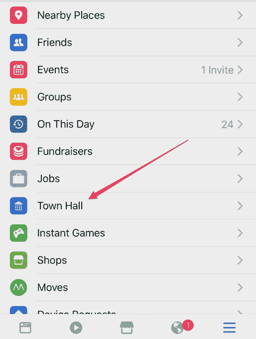
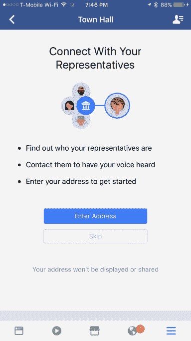
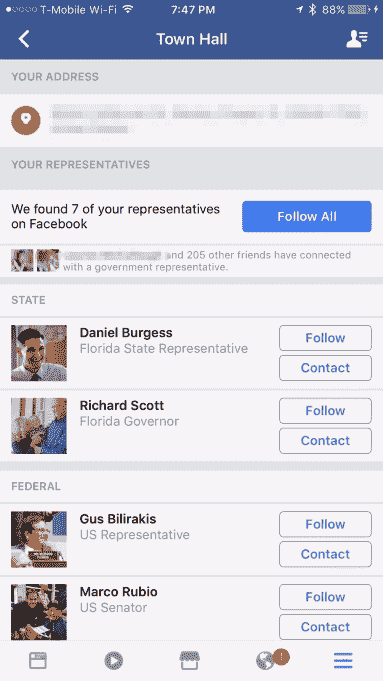
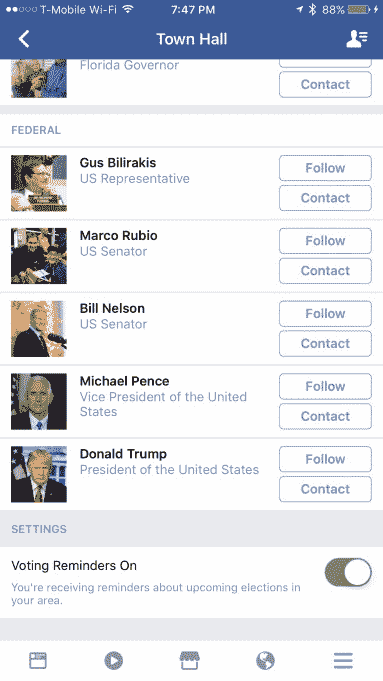

# 脸书的新“市政厅”功能可以帮助您找到并联系您的政府代表

> 原文：<https://web.archive.org/web/https://techcrunch.com/2017/03/14/facebooks-new-town-hall-feature-helps-you-find-and-contact-your-government-reps/>

在脸书首席执行官马克·扎克伯格上个月发表的近 6000 字的宣言中，[他列出了未来几天他对社交网络的一些全球雄心](https://web.archive.org/web/20220813003529/https://beta.techcrunch.com/2017/02/16/building-the-world-we-all-want/)——包括它的用户变得更“公民参与”和更经常投票。现在，脸书似乎已经为实现这一目标迈出了第一步，推出了一项新功能，名为“市政厅”

这一最新功能刚刚出现在脸书手机应用程序的“更多”菜单上，为用户提供了一种简单的方式来找到并联系他们在地方、州和联邦各级的政府代表。

要使用市政厅，你只需输入你的地址——脸书说这不会被显示或共享(尽管它没有说它没有被“保存”，所以请注意)。我们知道，这些信息将用于推动未来的公民参与产品，如寻找投票地点或预览投票。

这些信息将有助于在随后的屏幕上显示您的代表列表，您只需点击一个按钮就可以跟踪所有代表。这份名单不仅包括在美国众议院和参议院代表你们的人，还包括你们的州议会和州长、地方议会成员和市长，以及其他联邦职位的人，如副总统迈克·彭斯和总统川普。

您将看到的列表将基于您的位置，这意味着您可能没有本地代表出现，例如，如果您生活在当地官员没有脸书代表的较小城镇。

除了能够关注他们的脸书页面以便在您的新闻订阅源中接收他们的更新，每个代表的姓名旁边还有一个“联系”按钮。

点击后，你可以选择给他们“发信息”、“发电子邮件”，或者访问他们的脸书页面。当然，并不是所有的代表都像其他人一样有空。在许多情况下，除了访问脸书页面，可能没有其他联系方式。

在他们的网页上，你也许能找到一个电话号码或邮寄地址，如果它碰巧被公布的话。然而，这肯定不如一些只需点击几下就能为你提供这些信息的独立网站方便，包括更新的专注于抵抗运动的服务[如号召行动](https://web.archive.org/web/20220813003529/https://beta.techcrunch.com/2016/11/22/call-to-action-lets-you-phone-your-congressperson-with-just-a-tap/)或 [5 呼叫，例如](https://web.archive.org/web/20220813003529/https://beta.techcrunch.com/2017/01/25/5-calls-debuts-what-may-be-the-easiest-way-to-call-your-reps-yet/)，甚至其他移动应用程序，如[可计数](https://web.archive.org/web/20220813003529/https://www.countable.us/)。

很高兴看到脸书加强其市政厅资源，提供所有官员的完整联系方式，特别是考虑到这是公开信息，而且[很容易找到](https://web.archive.org/web/20220813003529/https://www.senate.gov/senators/contact/)，甚至[在官方政府网站上](https://web.archive.org/web/20220813003529/http://www.house.gov/representatives/find/)。

除了关注你的代表并与他们取得联系，市政厅功能还通过记录你有多少朋友通过脸书与政府代表取得了联系，施加一点同行压力让你参与进来。除了对用户的潜在心理影响之外，这并没有什么用处，因为它让用户不想被遗漏。

在页面底部，你还可以打开或关闭投票提醒，这样当你所在的地区即将举行选举时，你就会收到提醒。

市政厅并不是脸书首次涉足政治。该社交网络定期通过多种方式提示用户注册和投票，包括推送通知、新闻提要中的横幅、Messenger 集成、投票地图、社交共享功能(如“我投票了”)等——包括在过去的总统选举中，在网络和移动用户的收藏夹中的“选举 2016”快捷方式[。它还出版了一份选民指南](https://web.archive.org/web/20220813003529/https://beta.techcrunch.com/2016/11/04/facebook-gives-its-election-2016-hub-top-billing-by-pinning-it-to-your-favorites/)，其中包括向下投票的提议和地方选举。

我们已经向脸书询问了更多关于市政厅功能推出状态的细节，脸书回复了以下声明:

“市政厅是我们持续工作的一部分，以支持公民在选举日和每天的参与。这是一个专门为想要了解和参与政治进程的人提供的空间。”

该功能的到来是在最近几个月脸书侧边栏的其他几个新增功能之后，包括其新的[城市指南](https://web.archive.org/web/20220813003529/https://beta.techcrunch.com/2017/03/03/facebook-adds-a-travel-planning-feature-called-city-guides/)、 [Wi-Fi Finder、](https://web.archive.org/web/20220813003529/https://www.engadget.com/2016/11/22/facebook-testing-public-wifi/)、[发现人物](https://web.archive.org/web/20220813003529/https://beta.techcrunch.com/2017/02/01/facebooks-new-discover-people-section-wants-to-help-you-make-friends/)部分和[天气](https://web.archive.org/web/20220813003529/https://beta.techcrunch.com/2017/02/08/facebook-can-now-replace-your-weather-app/)指南。

*Image credit，top: Marcbela (Marc N. Belanger)(自有作品)【公共领域】，via[Wikimedia Commons](https://web.archive.org/web/20220813003529/https://commons.wikimedia.org/wiki/File%3ARandolph_Town_Hall.JPG)；其他形象:脸书；H/T: [何塞·古铁雷斯](https://web.archive.org/web/20220813003529/https://twitter.com/nastybadhombre)*