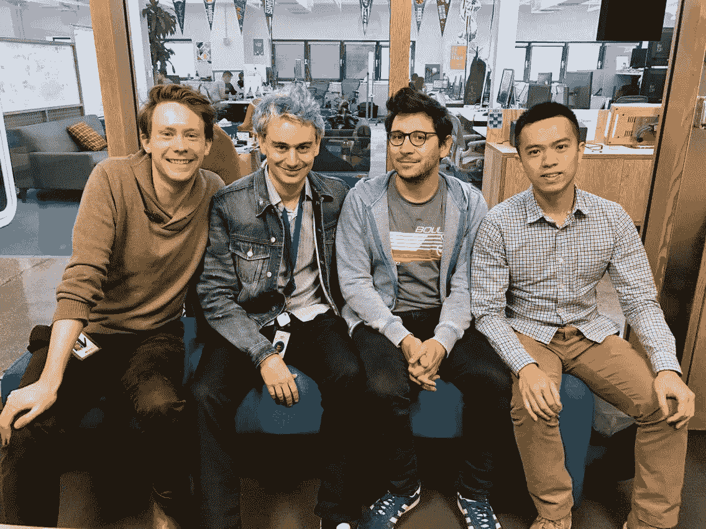

# 研究人员将在脸书的 ParlAI 拓展对话式人工智能 TechCrunch 的边界

> 原文：<https://web.archive.org/web/https://techcrunch.com/2017/05/15/facebooks-parlai-is-where-researchers-will-push-the-boundaries-of-conversational-ai/>

# 脸书的 ParlAI 是研究人员将推动对话式人工智能边界的地方

对我们大多数人来说，交流是一项单一的任务。但在现实中，事实并非如此。如果你是一台试图复制对话的机器，你需要擅长许多任务，比如回答问题、完成句子，甚至闲聊。这些领域的研究通常都是独立完成的，这不利于任何试图将这些碎片放在一起创建一个对话式人工智能的人。脸书人工智能研究(FAIR)实验室的[开源 ParlAI](https://web.archive.org/web/20230205204256/https://github.com/facebookresearch/ParlAI) 作为对话研究的家园，通过使训练模型使用各种常用数据集完成多项任务变得容易来解决这一不足。

使用 ParlAI 将数据集拉入工作流就像使用命令行一样简单。这使得研究人员可以快速访问基准数据集，如[小队](https://web.archive.org/web/20230205204256/https://rajpurkar.github.io/SQuAD-explorer/)、[巴比任务](https://web.archive.org/web/20230205204256/https://github.com/facebook/bAbI-tasks)和[网络问题](https://web.archive.org/web/20230205204256/https://github.com/brmson/dataset-factoid-webquestions)。这并不是说人工智能研究社区以前不能做这项工作，而是 FAIR 正在试图激励团队定期将更多数据集纳入他们的工作。ParlAI 还连接到亚马逊土耳其机械公司，因此研究人员可以无缝地收集新数据。

ParlAI 背后的纽约 FAIR 团队。

脸书人工智能研究(FAIR)实验室的研究员 Jason Weston 在一次采访中告诉我，ParlAI 的一些灵感来自于观察研究人员在 WebQuestions 数据集上取得的进展，但当它变得过于专业并且不适用于其他任务时，却看到这项工作在很大程度上被忽略了。

跟踪人工智能研究的一个挑战是，真的很难从表面价值来阅读论文。在几乎每篇论文中，研究人员都声称，在将他们的奇特模型与常用测试进行基准测试后，他们已经达到了一个新的艺术水平。

问题在于，导致特定结果的因素太多了，以至于成就只有在可以复制的情况下才真正有价值。ParlAI 将一些复制研究的工作拿出来，为 AI 社区灌输更健康的习惯。FAIR 团队希望在未来加入自己的排行榜，以帮助了解生态系统的进展。

ParlAI 在形式上类似于其他培训和测试解决方案，如 [OpenAI 的健身房](https://web.archive.org/web/20230205204256/https://gym.openai.com/)和 [DeepMind 的实验室。](https://web.archive.org/web/20230205204256/https://deepmind.com/blog/open-sourcing-deepmind-lab/)虽然 Gym 和 Lab 针对强化学习进行了优化，但 ParlAI 完全专注于对话。一些支撑对话空间工作的监督学习不如流行的强化学习性感，但它对机器学习领域非常重要。

FAIR 计划在内部使用自己的 ParlAI 进行研究。脸书在 dialog 的工作支撑了它的许多服务，最明显的一个是[“M”，它的人类+人工智能助手](https://web.archive.org/web/20230205204256/https://techcrunch.com/2015/08/26/facebook-is-adding-a-personal-assistant-called-m-to-your-messenger-app/)。最终，韦斯顿告诉我，像 M 这样的服务可能能够通过与人交谈和接收反馈来学习，就像婴儿和幼儿如何学习一样。

但是，实现这一目标的唯一途径是打破人为的孤岛，联合研究来解决大规模的问题。你可以在 GitHub 上找到 ParlAI——FAIR 团队将会在可预见的未来维护它。