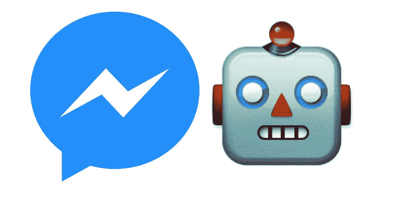
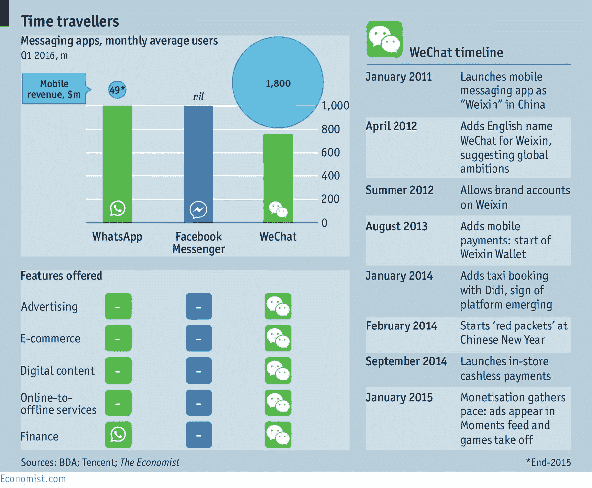

# 脸书通向信息未来的道路 

> 原文：<https://web.archive.org/web/https://techcrunch.com/2016/09/07/facebooks-path-into-the-messaging-future/>

Ha Duong 是的商业伙伴

[Techstars](https://web.archive.org/web/20230219212811/http://www.techstars.com/)

.

最近脸书的 Messenger 平台上有很多传言。这还不是全部。几乎每天，你都可以读到关于聊天机器人、对话界面、数字助理、人工智能和消息平台的新文章。聊天是我们如何与互联网连接和互动的下一代吗？脸书的 Messenger 最终能成为连接消费者需要的所有服务的平台吗？

自 4 月份推出带有聊天机器人 的信使平台 [以来，脸书已经允许企业在聊天机器人的帮助下提供自动化的互动体验、电子商务指导和客户支持。由于新的发送/接收 API，这些聊天机器人不仅可以发送文本，还可以在其客户交互中发送结构化消息，包括图像、超链接和 CTA 按钮。](https://web.archive.org/web/20230219212811/https://techcrunch.com/2016/04/12/agents-on-messenger/)

用户可以浏览产品传送带以发现选项，并被引导至网络以完成购买。最近，脸书 宣布 聊天机器人现在可以发送促销和基于订阅的消息，使重新定位、追加销售和交叉销售成为可能。

企业表现出极大的兴趣，希望利用 Messenger 的功能来加强客户关系、树立品牌并获得更多利润。

但是，尽管现在有这么多新闻和趋势讨论，聊天机器人兑现承诺了吗？从长远来看，它们真的有潜力取代原生应用吗？

## 聊天机器人——炒作还是现实？

当前人们对聊天机器人的兴趣显而易见。它们可以是一种全新的吸引客户的方式，提供个性化的互动交流，类似于与人交谈，同时能够面向大众。他们有潜力增加用户对品牌的参与度和满意度。最终，他们可以执行比请求出租车或预订航班更复杂的任务。

> 在科技领域之外，大多数人甚至不知道聊天机器人是什么，它有什么用。

人们对 颠覆 议论纷纷，因为他们可以通过整合营销改变整个广告业。最棒的是，它们无需安装应用程序就能访问数字服务。但是他们现在在哪里？

为 Facebook Messenger 打造了超过[18000 个 bot](https://web.archive.org/web/20230219212811/https://techcrunch.com/2016/07/20/one-billion-messengers/)。虽然有些吸引并取悦了消费者，但大多数还没有向大众证明它们的价值。事实上，在科技领域之外，大多数人甚至不知道聊天机器人是什么，它有什么用。这表明，在创建下一个半智能聊天机器人时，不应该忘记一个核心的基本原则:**实际上没有人想和一个机器人说话**。

用户想要他们问题的解决方案。他们想要问题的答案。他们希望自己的需求以最有效、最自然的方式得到满足。他们不想在他们小巧的智能手机键盘上输入信息，却看到机器人一遍又一遍地不理解它。

要让聊天机器人正常工作，开发者必须停止把它们当成机器人。这是一个新的渠道，可用于通过自动化流程吸引受众。没有人指望自动化的电子邮件活动能解决所有问题，但它有自己的好处:分发内容和教育用户。

聊天机器人也应该这样使用:而不是作为所有商业服务的通用解决方案。只有当它成为客户通过问答方式进行实际交流的最有效渠道时，它才是有价值的。如果客户想知道一些具体的东西，对话式的交互方式比搜索、浏览或点击按钮更好，这可能会很好。

但是，当我想浏览所有可用的选项，或者当我确切地知道该做什么，并且一个按钮比文本输入快 5 倍的时候，聊天机器人目前感觉不太好。并不是每个服务都应该作为原生 app 提供，聊天机器人也是如此。

然而，随着时间的推移，一旦技术更加成熟，机器学习被大众接受，我可以看到对话式交互方法可能确实是解决问题的最佳方式。最终将有可能像与朋友交谈一样与你的手机交谈，虚拟数字助理将自动组合不同的聊天机器人，以编制你的最佳解决方案。这导致了人机交互的下一步:人性化的用户界面。

## 更大的图景:创造人性化的用户体验

聊天机器人是更智能的解决方案出现之前的临时解决方案:在未来，一个或多或少通用的人工智能将能够处理我们的大多数问题、难题或询问。相反，聊天机器人(即使是智能的)可以被认为是狭义的人工智能，它可以处理的问题有限。

聊天机器人将很快能够整合来自我们的社交媒体档案、浏览和购物历史、地理位置、可用的智能手机传感器甚至我们的行为生物特征的信息。但是，它们仍然会被用来解决一个特定的问题；一旦一项调查超出了它所训练的情境范围，这种互动就会变得很奇怪。最终目标永远是创造一种感觉像人类的人机交互方式。

“人类”并不意味着问一些不必要的问题，也不意味着在人工智能中包含缺陷；这意味着我们可以在不知道具体语法的情况下得到问题的解决方案。自然语言处理(NLP)将使我们能够与为语音设计的系统进行对话。并且通过 AI 的其他领域，像推理和知识表示，系统的响应会感觉智能和人性化。

> 我们是否有一个能完成我们要求的总助理呢？

一旦机器变得更加智能，传统的用户界面可以被简化、抽象甚至隐藏。 [完美的用户界面是没有可见的用户界面](https://web.archive.org/web/20230219212811/https://techcrunch.com/2016/08/15/using-artificial-intelligence-to-create-invisible-ui/)， 因为这样用户就可以与系统交互而不需要知道操作规则和模式。而且不应该只是界面。整个用户体验应该是人性化的。与人类互动是不同的，因为人类有上下文意识。人类感同身受。在你明确表达之前，人类可以思考你和你的问题。也许有一天，一个通用的人工智能将能够“感觉到”并“提前思考”来解决你的问题。

我们离拥有一个能满足我们要求的通用助手有多远？所有大型科技公司都创造了某种数字助理。脸书 [一年前公布了 M](https://web.archive.org/web/20230219212811/http://www.wired.com/2015/08/facebook-launches-m-new-kind-virtual-assistant/) ，它自己的数字助手类似于 Siri、Cortana 或 Google Now。与其他助手相反，它由人工智能和人共同驱动，以便使其交互更加人性化。马克·扎克伯格表示，通过 NLP 和 AI，结合人类的帮助，用户将与信使机器人交谈，就像与他们的朋友交谈一样。

M 是一个更大游戏的一部分，让人们更习惯于通过 Messenger 完成事情(购物、预订、日程安排、订购等)。).此外，脸书很想更多地了解消费者的需求(他们希望 Messenger 提供什么类型的服务)。但是我们还没有从 M .脸书的信使首领大卫·马库斯那里听到太多的消息，他证实了 M 在几年内都不会准备好。但是，仍然希望有一天它可以成为将所有独立聊天机器人结合成一个智能服务系统的缺失环节。

脸书的 Messenger 定位良好，未来将成为托管各种不同服务的整体平台。如上所述，虽然，他们不是唯一的。不是已经有另一个领先几步的消息平台了吗？

## 脸书的 Messenger 落后于其他消息平台的地方

如果你放眼西方科技领域之外，显然有一个消息平台已经想出了如何从聊天应用转型为更强大的平台、门户和操作系统:微信。

微信在中国是所有通讯平台都渴望成为的:它伴随着用户日常生活的方方面面——这使得它在人们的心目中不可或缺。通过微信，中国人可以做任何事情，从与朋友、团体或陌生人聊天到开展业务或电子商务，访问金融科技应用程序，玩游戏，甚至连接到各种物联网设备。

微信的做法与 Messenger 类似——在其生态系统中整合第三方应用。由于每位用户的平均收入极高，达到每年 7 美元[多](https://web.archive.org/web/20230219212811/http://a16z.com/2015/08/06/wechat-china-mobile-first/)，它已经找到了其他消息平台可望而不可及的利用其庞大用户群的方法。微信已经完成了 Messenger 刚刚开始建立的东西。

当询问人们使用微信的体验时，你只会听到热情。通过提供与人见面和互动的新可能性，微信满足了一个孤独是普遍现象的社会的需求(整整一代人都是独生子女)。微信在为目标群体量身定制应用体验方面取得了极大的成功，同时提供了对每个人都必不可少的服务。

不仅如此，微信不断推出领先于其他通讯平台的创新功能，为用户带来惊喜。例如，语音信息在微信中的应用比 WhatsApp 或 Messenger 早了几年。微信如何吸引用户参与的另一个例子是春节期间的一个噱头，用户可以互相发送随机金额的压岁钱——这是中国文化的重要组成部分。脸书的 Messenger 是一个强大的通用通信平台，但迄今为止，它未能让其个人用户群感到惊喜和愉悦。

一个很大的区别是，微信实际上不仅仅是一个消息平台。它具有社交网络的元素，人们可以更新自己的状态或关注名人或品牌的官方账户。中国的品牌往往把微信作为公关、内容营销、获客、品牌营销的主要渠道。脸书显然也以此为目标，但它不像微信那样在与用户的潜在接触点上占据主导地位。

最终的游戏规则改变者是微信对支付的整合。他们让给朋友寄钱变得不仅简单，而且有趣。线下和线上支付商户也很方便，人们还可以通过使用微信支付获得折扣。这使得大都市的中国人完全放弃现金成为可能。微信支付促进了其电子商务功能，并吸引了数百万在线商店加入该平台。

> 来自东方的灵感肯定会对信使号的路线图产生重大影响。

Facebook Messenger 具有 P2P 支付的功能，但是支付并没有集成到 bot 功能中(到目前为止)。与微信不同，小企业很难在 Messenger 中建立一个电子商务机器人，即使有像 wit.ai(被脸书收购)这样的选项。

所有这些只是微信伟大之处的几个例子。重点是，为什么 Messenger 这么落后？为什么连它的 UI/UX 都不如微信？为什么 Messenger 没有以创新的功能在全球范围内获得惊人的成功？(注:在欧洲，我们甚至经常多年看不到很多像 P2P 支付这样很酷的功能。)

复制微信显然不是正确的做法，因为微信通过根据中国市场的需求定制其应用体验取得了成功。但是肯定有来自东方的灵感会对信使号的路线图产生重大影响。来自其他消息应用的灵感不止于此。

有更多的消息应用试图建立一个平台。Slack 是第一批不仅彻底改变了商业消息传递，还参与了一个大规模开发生态系统，在 Slack 中创建了有用的第三方应用程序。去 Slack 的 bot store(应用程序目录)上发现新的 bot 是一件超级有趣的事情，可以为团队交流增加价值。为什么脸书没有一个直观且可搜索的机器人商店？为什么脸书仍然完全忽视专业/商业环境中的交流空间？

在将脸书人添加为朋友之前，与他们交流仍然非常困难。如果我只想和某人说几次话，或者只是保持联系而不分享私人身份，那么友谊似乎是一个非常私人的概念。看起来脸书甚至想让人们转而去推特或领英与专业联系人联系。

> 对脸书的生态系统来说，仍然有很多事情要做。

脸书可以学习的另一个竞争对手是 Snapchat。与 Messenger 相反，Snapchat 是年轻人认为酷的东西，它通过全新的方式与同龄人甚至品牌互动，让人们更有吸引力。Snapchat 意识到需求在不断变化，人们希望分享生活中的瞬间，而不会在万维网上留下任何痕迹。此外，人们能够通过应用有趣的照片和视频过滤器来表达他们的创造力。因为有些过滤器每周都会更换，用户会被激励一次又一次地重新访问应用程序，与他们的朋友分享更多有趣和尴尬的图片。

自从[用户在脸书分享越来越少的](https://web.archive.org/web/20230219212811/https://www.theguardian.com/technology/2016/apr/19/facebook-users-sharing-less-personal-data-zuckerberg)内容以来，该平台从未真正找到一种新的方式来扭转这种负面趋势。Messenger 作为一个个人交流平台，难道不能激励人们再次分享图片和视频吗？

很明显，信使仍然需要努力工作来实现它的目标并超越它的高期望。Messenger 凭借其在世界各地的庞大用户群占据了有利地位。但它需要不断创新，以新的方式不断吸引和取悦这一用户群。为此，它需要保持以用户为中心，始终站在用户一边，而不是专注于如何从业务中赚更多的钱。下面是一些选择，说明 Messenger 如何通过从竞争对手那里获得灵感来提高自己，同时坚持自己并塑造自己的道路。

## 塑造信使未来的机会

我认为，Messenger 需要在更多领域更进一步地发展，才能在未来占据主导地位。在战略层面，它可以投资于这三大支柱来重塑自己:

*   Messenger 应该将其用例扩展到私人通信部门之外，以便捕获业务关系。如果人们越来越习惯在专业环境中使用信使，与品牌互动，进行电子商务交易和指导数字助理应用程序将不再那么罕见。
*   Messenger 应该通过开发一个创意生态系统来提高用户参与度。它应该让用户以新的方式相互交流。用户应该能够定义交互的外观。它应该让用户共同创造他们自己的信息体验，让他们发挥创造力，做他们以前不能做的事情。
*   Messenger 应该通过对话界面向大众提供有价值的服务，而不仅仅局限于技术领域。如果机器人的用户仅仅是硅谷的技术人员，那么它们永远不会起飞，因为这是一个广泛的用户群，它将品牌吸引到平台上。它应该让机器人在在线和离线世界中更容易被发现和出现。

这些战略方面反映了其他竞争对手在哪些方面做得很好。微信在个人*和*商业语境下运营。Snapchat 通过一次又一次的新产品吸引用户。Slack 使得寻找新的应用程序/机器人并将其集成到其平台上变得容易。Kik 让朋友们在群聊或私信中分享机器人，这造成了一些病毒式传播。

如果 Messenger 在这些领域成功赶上，它真的可以成为连接新一波应用程序的基础平台——将苹果和谷歌从其 iOS 和 Android 宝座上挤走。那么，在不久的将来，Messenger 可以改进哪些方面来更进一步实现这一愿景呢？

**小增量改进** **:** 这些都是让消息传递体验本身不逊于其他消息传递 app 的改进。Messenger 可以从允许多人视频通话开始，使语音消息超过 1 分钟，并在小的 UI/UX 元素上工作，使应用程序变得更好。它可以通过取消对话开始时的“开始”按钮来加快与机器人的交互。它可以让群体与机器人的互动成为可能。机器人有两个发现问题:用户需要首先找到机器人，然后需要弄清楚机器人可以问什么。在 Messenger 中拥有一个直观且可搜索的机器人商店将是让人们发现和了解更多关于机器人的第一步。

**更大的实质性改进** **:** 这些都是需要更多投入的改进，可能会让品牌走出一点舒适区。Messenger 可以包含一些每日或每周的功能变化，以积极的方式不断给用户带来惊喜。我们已经进行了第一次尝试，比如生日气球，但是我们需要更多这样的气球！我们需要的功能不仅要美观，还要能让我们与他人互动和交流。就像人们喜欢发现和玩新的谷歌涂鸦或 Snapchat 过滤器一样，Messenger 可以以新的方式建立类似的东西。脸书已经走上正轨。通过最近推出的 Lifestage ，该公司表示希望用新的方式来吸引年轻观众。在不久的将来，脸书可以在 Messenger 中集成 FB Live，或者更进一步，在 Messenger 中集成实时 VR 内容，为用户提供新的交互方式。

**大胆而全新的功能** **:** 这些是在 Messenger 环境中可能不常想到的新发展。脸书可以开发出一种新的 B2B 产品，将 Messenger 及其机器人直接集成到网站上，通过实时聊天提供更好的客户支持。它甚至可以超越自己的 bot 生态系统，建立一个开发框架，允许轻松跨平台开发 bot，类似于 React Native for native apps。通过这种方式，开发人员将受到激励，为 Messenger 开发新的机器人，这些机器人也可以在其他消息平台上启动。也许脸书甚至可以想出一种新的方法，在 Messenger 中集成 Android 或类似功能的即时应用程序，使在最小化的网络视图中执行小应用程序功能成为可能。

所有这些方面都表明，脸书的生态系统还有很多事情要做。愚蠢的聊天机器人目前的幻灭只是暂时的；假以时日，一些类型的狭义或更通用的 AI 助手可以被带到大众面前。Messenger 具有实现这一目标的巨大潜力。我钦佩脸书作为一家文化底蕴深厚的公司已经取得的成就，我相信它有能力重塑沟通方式。我很高兴看到我们如何让世界变得更加开放，更加紧密地联系在一起。

这篇文章旨在展示脸书和信使现在所处的位置以及未来的机遇。让我们期待接下来发生的一切能够让全世界的企业家创造创新服务，解决大问题。我总是欢迎讨论，所以请给我发邮件，告诉我你对这篇文章的想法！

*特别感谢我的朋友 [Michael Ortolano](https://web.archive.org/web/20230219212811/https://www.linkedin.com/in/michael-ortolano-b72a449b) (专注于人工智能和亚洲的加速器 zeroth.ai 的项目经理) [Ellen Hoeven](https://web.archive.org/web/20230219212811/https://www.linkedin.com/in/ellen-hoeven-054b07125) (设计思想家)[Nick helle Berg](https://web.archive.org/web/20230219212811/https://www.linkedin.com/in/helleberg)(Dormando 的运营主管) [Ivy Dai](https://web.archive.org/web/20230219212811/https://www.linkedin.com/in/ivy-dai-83607b93) (中国业务自由顾问)和[Amy Ly](https://web.archive.org/web/20230219212811/https://www.linkedin.com/in/amyly)(IDEO 的业务设计师)对微信消息平台的投入。*