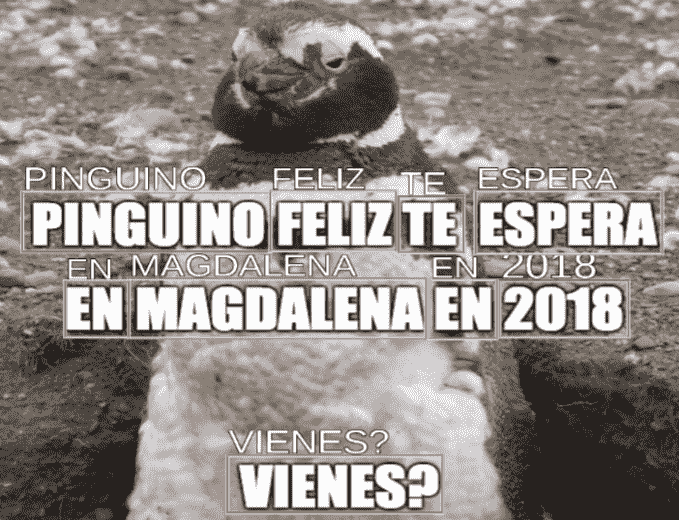

# 脸书的“罗塞塔”系统帮助公司理解迷因 

> 原文：<https://web.archive.org/web/https://techcrunch.com/2018/09/11/facebooks-rosetta-system-helps-the-company-understand-memes/>

# 脸书的“罗塞塔”系统有助于公司理解迷因

模因是网络语言，脸书希望更好地理解它们。

多年来，脸书的人工智能团队在计算机视觉和自然语言识别方面都取得了长足的进步。今天，他们宣布了他们的一些最新工作，旨在结合这两个领域的进展。一个代号为“罗塞塔”的新系统帮助脸书和 Instagram 的团队识别图像中的文本，以更好地理解它们的主题，并更容易地对它们进行分类以进行搜索或标记滥用内容。

不全是迷因；根据该公司的一篇博客文章，该工具每天实时扫描超过 10 亿张多语言的图像和视频帧。

Rosetta 利用光学字符识别(OCR)的最新进展，首先扫描图像并检测存在的文本，此时字符被放置在一个边界框内，然后由卷积神经网络进行分析，该网络试图识别字符并确定正在交流的内容。

经由脸书

这项技术已经实践了一段时间——脸书自 2015 年以来一直与 OCR 合作——但在该公司的庞大网络中实施这项技术提供了疯狂的规模，这促使该公司围绕字符检测和识别开发了一些新策略。

如果你对他们在这里所做的一些更技术性的细节感兴趣，可以看看这个团队关于这个主题的[研究论文](https://web.archive.org/web/20230206092426/http://www.kdd.org/kdd2018/accepted-papers/view/rosetta-large-scale-system-for-text-detection-and-recognition-in-images)。

脸书有很多理由对视频或照片附带的文字感兴趣，特别是当涉及到他们的内容审核需求时。

当一张照片的文字描述是“Bruh！！！🤣🤣🤣或者“1 赞= 1 祷”，但随着脸书调整其算法以宣传“时间花得值”，采用类似技术的视频和照片似乎在时间线中出现得更多仇恨言论也是如此，当所有信息都封装在一个图像或视频中时，分享起来会容易得多，这使得文本叠加成为一个有用的工具。

该公司表示，该系统在多语言支持方面给他们带来了新的挑战，因为它目前正在运行一个统一的语言模型，并且大部分可用的训练数据目前都是拉丁字母。在该公司的研究论文中，该团队详细介绍了通过重新利用现有数据库来创造新语言支持的一些策略。

由于脸书希望减轻人类内容管理员的工作，并允许其新闻订阅算法根据指定的分类对内容进行分类，像这样的工具有很大的潜力来塑造脸书如何识别有害内容，但也会将更多有趣的内容放在你面前。