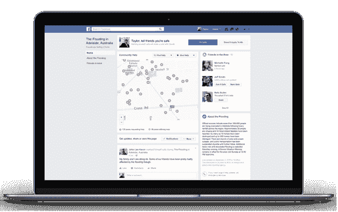

# 脸书的安全检查将整合资金筹集者，以及其他升级

> 原文：<https://web.archive.org/web/https://techcrunch.com/2017/06/14/facebooks-safety-check-will-integrate-fundraisers-among-other-upgrades/>

脸书今天宣布对其安全检查功能进行一系列改进，该服务允许脸书用户在危机期间向朋友和家人传达他们的安全信息。最值得注意的是，人们现在可以选择从安全检查开始筹款，以便立即将对危机或自然灾害受害者的关注转化为具体行动。此外，该服务正在扩展，以包括更多关于危机的信息，以及在他们的安全检查新闻报道中留下个人注释的选项。

此外，[社区帮助](https://web.archive.org/web/20230323074812/https://newsroom.fb.com/news/2017/02/empowering-people-to-help-one-another-within-safety-check/)功能，[今年早些时候在手机](https://web.archive.org/web/20230323074812/https://techcrunch.com/2017/02/08/community-help/)上推出，作为人们寻找和提供食物、住所和交通等帮助的一种方式，现在正走向桌面。

在过去的几个月里，脸书一直在稳步扩大筹资者的准入，因此现在将这项服务纳入安全检查是有道理的。今年 3 月，该公司推出了让[人创建个人筹资者](https://web.archive.org/web/20230323074812/https://techcrunch.com/2017/03/30/facebook-introduces-personal-fundraising-tools-donate-buttons-in-facebook-live/)的功能——这一举措使该功能与 GoFundMe 形成了直接竞争。脸书的个人筹款服务[于 5 月](https://web.archive.org/web/20230323074812/https://techcrunch.com/2017/05/24/facebooks-personal-fundraisers-exit-beta-now-support-raising-money-for-sports-teams-communities/)退出测试，同时还增加了对运动队和社区筹款的支持。

根据脸书的说法，募捐者融入安全检查将允许人们在危机发生后创建和捐赠慈善和个人事业，以帮助那些有需要的人。这意味着那些不在受影响地区的人可以做出贡献。

但是，该功能不能立即使用。该公司表示，它最初将于“未来几周”在美国推出。换句话说，它不会成为帮助伦敦那些受[格伦费尔大厦](https://web.archive.org/web/20230323074812/https://www.facebook.com/safetycheck/london-united-kingdom-fire-jun14-2017/home/)大型高层火灾影响的人的当前主动安全检查的选项，这场火灾造成至少 6 人死亡(截至本文撰写时)，74 人受伤。

如果脸书能够将 GoFundMe 上的更多活动转移到自己的社交网络上，筹款活动对它来说是一项潜在的大业务——这是一个很大的可能性，因为它降低了 GoFundMe 的费用。脸书的个人筹款人收取 6.9%的+. 30 美元的费用，用于支付处理、筹款人审查以及安全和欺诈保护。相比之下，GoFundMe 为个人或慈善活动收取 7.9%的+. 30 美元。(与此同时，脸书的非营利募捐者收取 5%至 5.75%的费用。)

通过安全检查将募捐者与大型活动联系起来，脸书募捐者将获得更多的关注，并看到未来更多的使用。

围绕危机的筹款活动已经在脸书展开。例如，在 5 月曼彻斯特袭击事件后，[人们通过脸书捐赠了超过 45 万美元](https://web.archive.org/web/20230323074812/https://medium.com/@preethichethan/designing-beyond-a-product-launch-32c6202e0ddf)来帮助社区。

这将有助于推出危机描述，也是今天新宣布的。这些描述将有助于人们更好地了解情况，从而进一步激发他们提供帮助。脸书表示，它正在与 NC4 合作，这是一家值得信赖的第三方全球危机报告机构，目的是在安全检查通知中添加关于危机的描述。

最后，安全检查现在也将成为人们与朋友和家人分享自己故事的一种方式，而不是像过去那样简单地用于标记自己的安全。

从现在开始，当人们使用安全检查工具时，他们可以选择通过个人笔记来分享更多信息。当人们将自己标记为安全时，该注释及其安全检查状态会自动共享到新闻订阅源。

这就解决了安全检查的一个问题——它有时会引起亲人的恐惧，而不是减轻他们的担忧。脸书的产品设计师普瑞蒂·陈安[解释了这个问题](https://web.archive.org/web/20230323074812/https://medium.com/@preethichethan/designing-beyond-a-product-launch-32c6202e0ddf)，他指出，仅仅通过标记自己“安全”，一些人就让他们的家人和朋友担心，他们认为他们受到了危机更直接的影响。现在，用户可以添加一个说明，以增加他们没有任何危险的保证。

脸书说，在过去的两年里，安全检查已经启动了 600 多次。自去年夏天引入社区激活的安全检查功能以来，这一数字可能会继续攀升。该公司表示，当时它正在努力将这一功能引入更多的活动，当一定数量的人开始在脸书发布可以由第三方来源证实的危机时，网络会自动触发安全检查。

募捐者和对社区帮助的桌面支持将在未来几周到来。安全检查的个人笔记和危机描述正在推出。