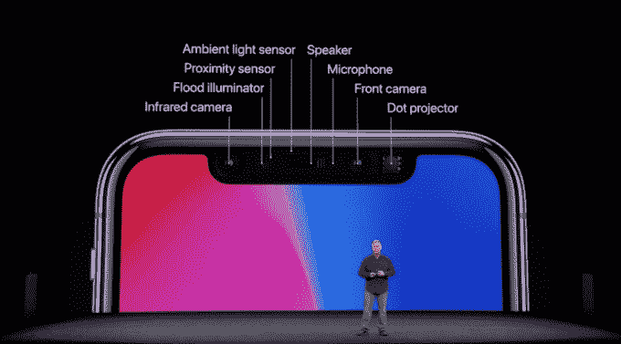
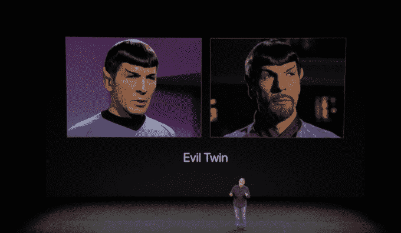
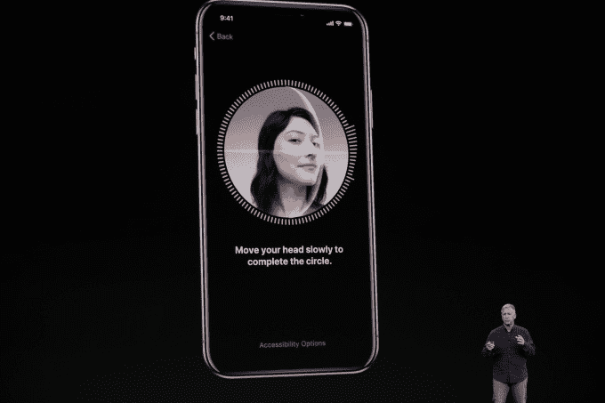

# Face ID 将与 Apple Pay、第三方应用程序 合作

> 原文：<https://web.archive.org/web/https://techcrunch.com/2017/09/12/faceid-will-work-with-apple-pay-third-party-apps/>

再见手指，你好面孔。随着[Face ID](https://web.archive.org/web/20230326064547/https://techcrunch.com/2017/09/12/face-id-is-replacing-touch-id-on-the-new-iphone-x/)的推出，以及触控 ID 按钮的移除，苹果今天证实了[关于其下一代设备上身份验证的猜测](https://web.archive.org/web/20230326064547/http://bgr.com/2017/08/10/iphone-8-facial-recognition-features/)，当谈到支付时:你现在可以使用你的新 iPhone X 购买商品，通过面部识别来验证你的身份。

苹果公司在今天的苹果新闻发布会上详细介绍了[新 iPhone X](https://web.archive.org/web/20230326064547/https://techcrunch.com/2017/09/12/iphone-x/) ，包括其突出的功能之一， [Face ID](https://web.archive.org/web/20230326064547/https://techcrunch.com/2017/09/12/face-id-is-replacing-touch-id-on-the-new-iphone-x/) 。从本质上来说，Face ID 触控 ID 是苹果触摸认证系统的替代品，它将解锁你的 iPhone，并让你进入你的受保护应用程序——比如你的金融应用程序，例如银行应用程序或 Mint——只需看着你的 iPhone。

Face ID 通过各种传感器工作。iPhone X 的“真实深度”相机系统包括一个红外相机，泛光照明器，点投影仪等等，都在 iPhone 的顶部。

这些传感器与神经网络和机器学习技术相结合，有助于建立你面部的数学模型。这将作为您解锁设备的唯一身份验证机制。(除非你有一个邪恶的双胞胎，就是今天的笑话)。

该系统将通过照亮你的脸在黑暗中工作，它会随着时间的推移适应你不断变化的脸——也就是说，你可以留胡子，它不会混淆。

苹果还表示，戴帽子、戴眼镜或新发型都不会愚弄 Face ID，也不会被一张照片所欺骗。

此外，菲尔·席勒指出，该团队甚至与好莱坞面具制造商合作，以防止 Face ID 被假货愚弄。当然，在 iPhone X 拿到安全研究人员手中进行测试之前，我们不会知道它的坚固程度。但值得指出的是，Face ID 的系统在设备上本地工作，并将数据存储在一个安全的地方——它不会将数据发送到服务器。

这个面部识别系统的一个更显著的优势是——我的意思是，除了支持 [animoji 的](https://web.archive.org/web/20230326064547/https://techcrunch.com/2017/09/12/iphone-x-animoji/)——它还可以与 Apple Pay 配合使用。

这意味着你可以看着你的手机在一个支持的终端上进行支付。这不需要零售商升级他们的终端，明确地说，如果他们支持 Apple Pay (NFC 支付)，它就可以工作。区别在于你如何开始支付过程本身——不是触摸，而是一个眼神。

要使用这项功能，只需几个步骤:双击 iPhone 侧面的按钮，看着 iPhone X，让它识别你，然后将设备放在支付终端附近，完成交易。

因为 Face ID 利用了 iPhone X 的先进相机系统，所以它只会出现在 iPhone X 上。虽然一个简化的面部识别系统可以在较小的 iPhone 上工作，比如动画表情符号(animojis)，但苹果正在阻止 Face ID 推动对 iPhone X 的需求

iPhone X 的预购从 10 月 27 日开始，11 月 3 日开始发货。起始价格高达 999 美元。