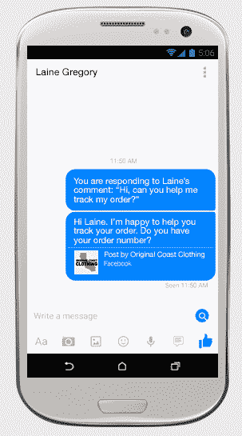
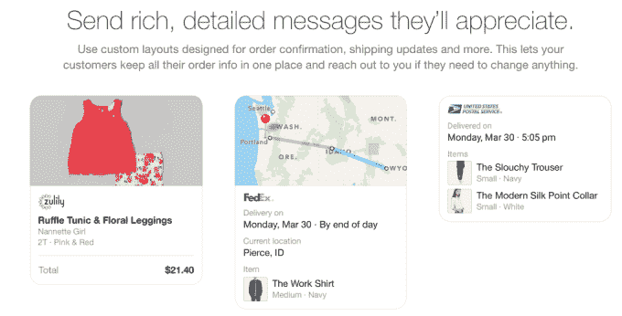

# 脸书授权 Pages 通过私人消息提供客户支持

> 原文：<https://web.archive.org/web/https://techcrunch.com/2015/08/05/facestomer-support/>

# 脸书授权页面通过私人信息提供客户支持

一家企业在脸书主页的墙上公开讨论客户问题是一场公关灾难的原因。所以今天脸书给抱怨的人发私信提供了更多的选择。除了在信使项目上的[业务，脸书正瞄准](https://web.archive.org/web/20230404163644/https://www.messenger.com/business)[取代电话](https://web.archive.org/web/20230404163644/https://techcrunch.com/2015/06/02/facebook-tests-saved-replies-a-tool-that-lets-pages-respond-to-customers-with-canned-messages/#.c09dfs:OJwl)成为客户支持的渠道。

从今天开始，商业页面将可以私下给那些在墙上留言或评论的用户发信息。以前，他们只能在客户开始对话的同一渠道回复。用户将能够直接从脸书新闻源广告中给企业发送信息，企业可以回复预先保存的支持信息以节省时间(我们在 6 月份发现了这一点)。

也许最有趣的是，脸书正在创建客户支持响应时间的新标准。回复 90%的邮件并且平均在五分钟内回复的企业将在他们的页面上被授予“非常响应邮件”徽章。

这是一个很高的标准，可能会促使公司雇佣专门回应脸书信息的支持人员。但是，如果他们还没有准备好处理负载，Pages 可以关闭接受消息的选项。

有了这些新功能，小企业可以获得一些大品牌通过第三方页面管理工具购买的社交客户支持能力。

Facebook Messenger 的负责人大卫·马库斯(David Marcus)过去曾表示，他认为按键式电话客户支持即将被颠覆。如果你不得不费力地通过电话树，并在等待中打滚，同步聊天就不方便了。异步即时消息传递提供了令人满意的接近即时性，而没有麻烦。

与此同时，通过使用可以同时处理多个愤怒客户的即时消息支持人员，企业可以节省昂贵的呼叫中心员工，这些员工一次只能处理一个查询。

这就是为什么脸书在 F8 的 Messenger 上展示了[业务。它让一些网站上的电子商务客户通过 Facebook Messenger 请求支持，而不必打电话或发电子邮件来更改订单或寻求帮助。](https://web.archive.org/web/20230404163644/https://techcrunch.com/2015/03/25/facebook-launches-messenger-platform-with-content-tools-and-chat-with-businesses/#.c09dfs:Lae7)

有了保存的响应，五分钟的通话可以变成 15 秒钟重新发送预先准备好的支持答案。脸书已经在 Messenger partners 上开展业务，让他们使用人工智能系统来自动化一些响应过程，这样人类只有在人工智能感到困惑的时候才会介入。

企业已经在脸书占据了很大的份额，团队成员也在那里发布内容。社区经理可能很快会有新角色的员工加入:“社区支持”