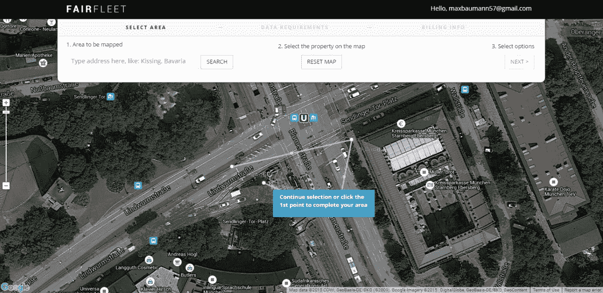
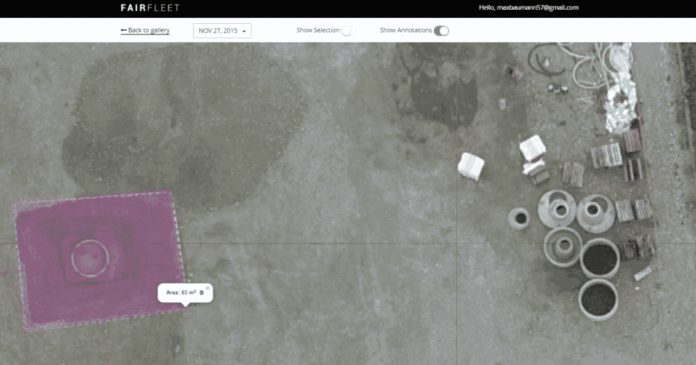

# FairFleet 将无人机飞行员与建筑公司和营销人员联系起来

> 原文：<https://web.archive.org/web/https://techcrunch.com/2015/12/07/fairfleet-connects-drone-pilots-with-construction-firms-and-marketers/>

商用无人机市场开始获得牵引力。无人机的使用有一些明显的市场，包括房地产营销、媒体和检查。总部位于德国慕尼黑的初创公司 FairFleet 今天在 Disrupt London 推出了私人测试版，它将无人机飞行员和企业聚集在一起，正是为了这些用例。

[安联数字加速器](https://web.archive.org/web/20230316075202/https://digital-accelerator.com/)常驻企业家[埃尔达·吉扎托夫](https://web.archive.org/web/20230316075202/https://www.linkedin.com/in/dr-eldar-gizzatov-7b04395)创立费尔弗里特。作为一家保险公司，安联显然对无人机技术感兴趣，因为它可以改善灾难后的索赔流程，所以 Gizzatov 和他的团队，包括联合创始人 Alex Kostitsyn 和 Dario Manns，将保险业视为其第一个用例。

“这只是第一步，”吉萨托夫告诉我。“如果你只是坐等洪水发生，这不是一项可行的业务。我的目标是建立一家不太依赖安联的企业。”有鉴于此，这个项目发展成一个更广阔的市场也就不足为奇了。

作为一名飞行员，FairFleet 要通过一个非常严格的审查过程。飞行员必须填写一份申请表，其中包括他们的无人机图像和视频组合的链接。之后，该公司会通过电话采访飞行员，以更好地了解他们可以从事的工作类型以及他们的风险状况。毕竟，你不会想雇佣一个公然无视基本无人机安全规则的飞行员。

想要雇用飞行员的客户标记他们想要获取图像的位置或区域，然后 FairFleet 联系该区域的飞行员以提供工作报价。然后，它编辑一份想要这份工作并拥有合适设备的前三名飞行员的名单，并将其交给客户。

Gizzatov 告诉我，仅安联保险公司就已经在德国售出了近 25，000 份无人机保单，因此 FairFleet 显然有可用的无人机飞行员供应。他还认为需求正在增长，尽管他承认该行业在教育潜在用户方面仍有一些工作要做。

Gizzatov 之前在 Rocket Internet 的点对点贷款平台 Lendico 工作。他告诉我，这让他有了建设市场的背景，但他也认为自己作为实习生在 Autodesk 的 ReCap 现实捕捉和 3D 扫描项目中的工作是这个新项目的灵感来源。

FairFleet 目前的重点是德国市场的建筑、房地产营销和媒体，在德国获得商业无人机许可相对容易。

从今天开始，FairFleet 开始营业，任何想在这个平台上工作的德国飞行员都可以注册，尽管还不能保证 FairFleet 能够为他们找到工作。

[gallery ids="1248361，1248360，1248358"]