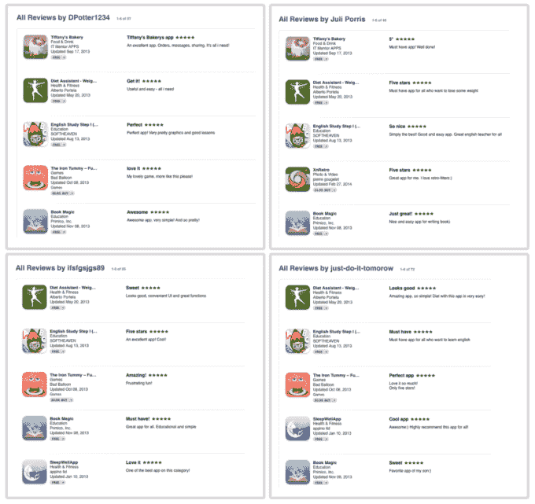
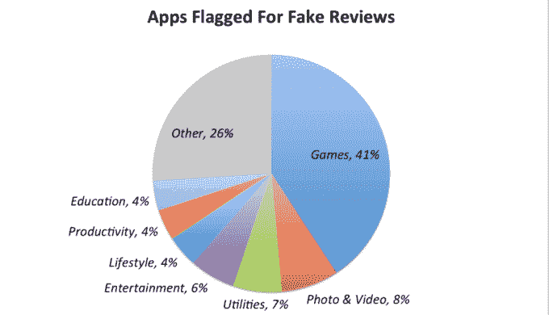

# 虚假应用评论在 iTunes 上更常见，但 Google Play 有“最坏的”罪犯

> 原文：<https://web.archive.org/web/https://techcrunch.com/2014/05/27/fake-app-reviews-are-more-common-on-itunes-but-google-play-has-the-worst-offenders/>

与流行的观点相反，iOS 应用程序比 Android 上的应用程序有更多的假评论。

根据来自为开发者提供反馈和保留工具的 [Apptentive](https://web.archive.org/web/20230407084239/http://www.apptentive.com/) 公司对两家应用商店的[新分析](https://web.archive.org/web/20230407084239/http://www.apptentive.com/blog/fake-reviews-google-play-apple-app-store/)，55%包含虚假评论的应用在 iTunes 上，而 45%在 Google Play 上发现。该公司推测，Google Play 对 Google+用户账户的要求可能有助于减少虚假评论问题，因为它需要更清晰的身份概念。

然而，公平地指出，iTunes 应用商店仍然是许多开发者[选择首先](https://web.archive.org/web/20230407084239/https://techcrunch.com/2013/08/27/forrester-ios-first/) [发布](https://web.archive.org/web/20230407084239/https://techcrunch.com/2013/04/18/wheres-twitter-music-for-android-why-todays-tech-companies-are-still-going-ios-first/)的市场，以努力在将这些应用移植到 Android 之前为他们的应用建立一些初始牵引力——由于硬件和软件碎片问题，这个过程仍然更具挑战性。

同样值得注意的是，虽然 iOS 应用程序比 Android 应用程序有更多的虚假评论，但 Android 应用程序实际上是“*最差*”的违规者，这是由在追求这一分析时创建的一个度量 Apptentive 确定的，它被称为“评论者质量”分数。当谈到 100 个评论质量绝对最差的应用时，其中 80%都是在 Android 上。

该公司在开发其最近为应用程序开发者增加的“[喜爱分数](https://web.archive.org/web/20230407084239/http://www.apptentive.com/blog/announcing-apptentive-love-score/)”指标时得出了这些发现，该指标旨在帮助出版商了解客户对他们使用的应用程序的真实想法，以及他们真正“喜爱”的应用程序

首席执行官 Robi Ganguly 表示，为了找到这两个应用商店的应用程序“喜爱分数”和“评论质量”分数，Apptentive 首先将它分析的应用程序范围限制在评论超过 50 条的应用程序，因为低于这一水平的数量是不够的。“这代表了美国应用商店中 6%的应用，”他解释道。“然后，我们将这项更深入的研究缩小到 1000 个评论质量分数最差的应用程序，因为这是我们信号最强的地方，”他补充道。

识别这些虚假评论也是一门艺术。首先，有虚假评论的应用往往有更高的评论与评级比率。平均而言，app store 整体约有 20%的评分包含评论。但平均而言，35%的标记应用评级包含评论，比应用商店的平均水平高出 75%。

如今，有许多服务可以满足对这些假冒应用审查者大军日益增长的需求，以提高应用的评级，例如，包括 BuyAppStoreReviews、BestReviewApp 和 AppRebates 等公司，以及 Fiverr 等更通用的市场，现在有成千上万的人提供 5 美元的评论。此外，当你在每个评论者的基础上查看应用评论时，你可以发现那些都在使用相同服务的应用，因为它们在应用商店中有来自同一组人的类似评论。

例如，上图显示了一组精选的 iOS 应用程序在简洁和措辞方面的相似性。

虚假评论也很常见，其中的评论文本完全相同，这通常表明人们在应用程序商店中创建了多个帐户，以便一遍又一遍地复制和粘贴相同的文本，以完成他们的任务。(而买这些假评论的，不一定关心质量！)

在某些情况下，虚假评论也会针对应用程序的竞争对手，留下负面评论和一星评级，以降低其在排行榜和搜索中的排名。然而，这并不常见。前 1，000 款虚假评论应用中，约 60%的评分为 5 星。

在所有被分析的应用中，无论是 iOS 还是 Android，游戏类都很容易成为虚假评论最多的应用，41%被标记为虚假评论的应用是游戏。这是有道理的，因为它也是竞争最激烈的类别。除了“其他”(26%)，第二大虚假评论最多的类别是“照片和视频”(8%)，其次是公用事业(7%)，娱乐(6%)，然后是生活方式，生产力和教育，均为 4%。

这个问题变得越来越糟糕，因为 iTunes 应用商店和 Google Play 在过去的一年里都改变了他们的排名算法，其中一些[增加了应用评级的重要性](https://web.archive.org/web/20230407084239/https://techcrunch.com/2013/08/23/apples-app-store-rankings-algorithm-changed-to-favor-ratings-and-possibly-engagement/)。

平均而言，评论者质量分数最差的前 1000 个应用程序有 409 个评级和 143 个评论。

“我们认为，当游戏发生时，它的发生量相当大，”Ganguly 说。