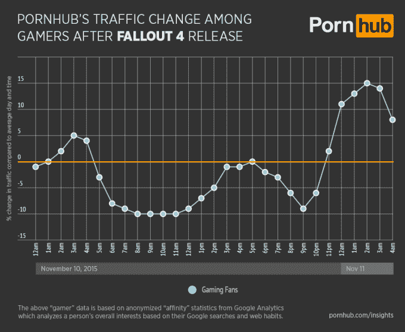

# 辐射 4 比色情片更强大

> 原文：<https://web.archive.org/web/https://techcrunch.com/2015/11/13/fallout-4-is-more-powerful-than-porn/>

# 辐射 4 比色情片更强大

Pornhub，一个互联网门户网站，提供人们裸体做事情的视频，我从来没有访问过，分享了一些有趣的流量。说到我不做的事，一款名为辐射 4 的[游戏 10 号出了。这就是 Pornhub 的故事开始的地方…](https://web.archive.org/web/20230306040230/https://techcrunch.com/2015/06/03/heres-your-first-look-at-fallout-4/)

根据 ~~smutwranglers~~ 网站，游戏玩家选择玩新游戏，而不是……在他们的 dirtysockportal 上消费内容:

> 就像观看一个好的 Pornhub 视频一样，对发布的期待一直在增加，一旦这一时刻到来，专注的游戏玩家很少想到其他事情——包括访问 Pornhub。

叹气。但是数据很有趣，对吧？[porn hub 发现了什么](https://web.archive.org/web/20230306040230/http://www.pornhub.com/insights/fallout-4-release-traffic)？当天交通流量的大幅下降。

一些事情一些事情一些事情没有得到它一些事情，无论如何。

> 与平日相比，我们发现在凌晨 3-4 点游戏玩家的流量略有 5%的增长。在这一点上，我们假设每个人的下载完成，游戏开始。从早上 5 点开始，交通流量开始下降，从早上 7 点到中午下降了 10%。下午，交通恢复正常，但下午 6 点后，当我们假设 9-5 名工人回家并开始玩游戏时，交通又下降了。午夜过后，似乎每个人都终于休息了，交通流量比日常标准高出 15%。

所以是的。我甚至不知道该说些什么，除了过一个愉快的周末，做你们这些天做的事情。如果你想阅读更多 Pornhub 的见解… [请点击这里](https://web.archive.org/web/20230306040230/http://www.pornhub.com/insights)。